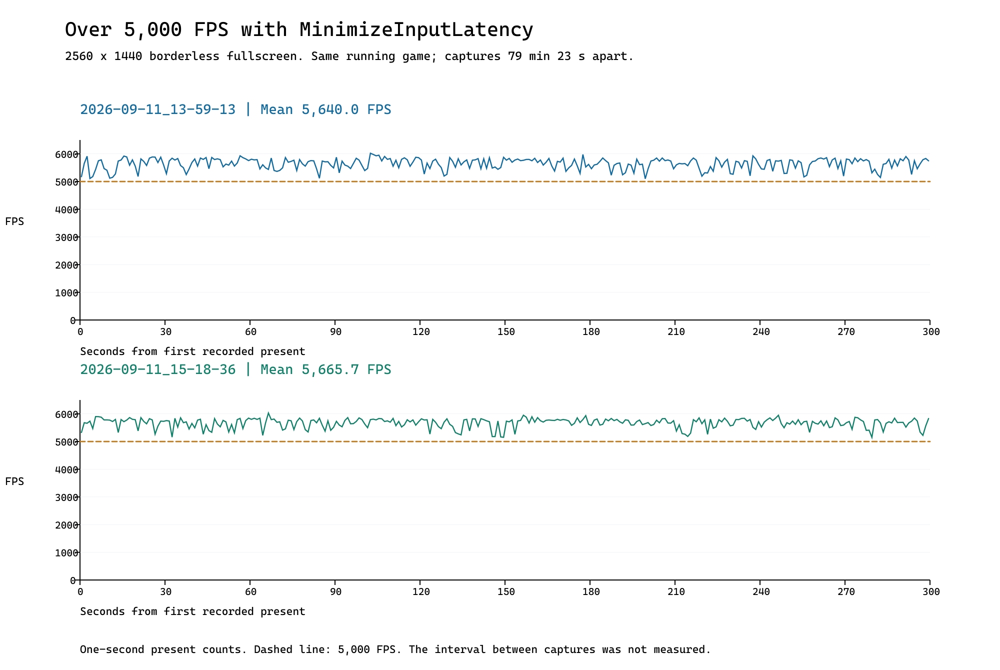

# More than 5,000 FPS with the minimum-latency configuration

Project rename on 2026-09-12: application labels in the saved captures and
supporting files now use Veehiicuul, and saved checkout paths are relative
to the repository root. All measurement fields are unchanged. Input and
snapshot byte counts and SHA-256 hashes describe the renamed files; capture
timestamps and executable fingerprints still describe the original run.
Git history retains the original capture bytes.

Formatting normalization on 2026-09-18: saved text follows the repository's
`.editorconfig`. Snapshot sizes and hashes and capture-log hashes describe
the normalized files. CSV bytes and all measurement values are unchanged.

**This native C++/DirectX 12 application sustained approximately 5,600 FPS at
2560 x 1440 while using its `MinimizeInputLatency` preset.** Two approximately
five-minute PresentMon captures averaged **5,640.0 FPS** and
**5,665.7 FPS**. Every one of the **600 complete one-second windows**
across both captures exceeded 5,000 presents per second.

This result was achieved with **one GPU frame in flight, a DXGI presentation
limit of one, two back buffers, and spin waits**. It establishes that this
small, purpose-built scene can sustain extremely high throughput while keeping
its configured frame backlog small. This is direct evidence supporting the
performance motivation for exploring a C++/DirectX 12 rewrite of ZoomTracks.

The captures came from the **same continuously running game**, with directory
timestamps **79 minutes 23 seconds apart**. The second capture's average FPS
was **0.46% higher**. High throughput was
observed both near the start of the run and about 80 minutes later.
Only the two captured periods were measured.

Report date: 2026-09-11. FPS throughout means application **presentation
throughput**, calculated from recorded `Present()` timestamps. It does not
mean the monitor displayed 5,600 complete images each second, and the preset
name is not a measurement of physical input latency.

| Metric                                      | Capture A: 13:59:13 | Capture B: 15:18:36 |
| ------------------------------------------- | ------------------- | ------------------- |
| Recorded frame rows                         | 1,692,056           | 1,699,754           |
| Measured first-to-last duration             | 300.008912 s        | 300.005088 s        |
| Average presentation rate                   | 5,640.02 FPS        | 5,665.75 FPS        |
| Mean present interval                       | 0.177304 ms         | 0.176499 ms         |
| Median present interval                     | 0.1776 ms           | 0.1775 ms           |
| Slowest complete one-second window          | 5,100 FPS           | 5,150 FPS           |
| Fastest complete one-second window          | 6,022 FPS           | 6,029 FPS           |
| Complete one-second windows above 5,000 FPS | 300 / 300           | 300 / 300           |

Across both captures, **3,391,810 frame rows** cover
**600.014 seconds** of measured first-to-last
time. The combined time-weighted rate is **5,652.88 FPS**.
Both averages exceed 5,000 FPS by more than 12%. Sustained windows support
the claim; it does not depend on an isolated fast frame or peak counter.



[Scalable chart](FrameRateTimeline.svg) · [One-second measurements](OneSecondWindows.csv)
· [Full analysis results](AnalysisResults.json)

**Capture conditions and the continuous run**

The user confirmed **2560 x 1440**, the application's fullscreen mode, and
**Armoury Crate Turbo mode** for both captures. The F11 implementation removes
the window border and covers the monitor: this is borderless fullscreen.
The exact confirmation is preserved in [CaptureContext.json](CaptureContext.json).

Both CSV sets contain only `Veehiicuul.exe`, process ID `2132`,
and swap chain `0x2011A689F50`. Their identities agree with the user's statement
that this was one uninterrupted game session. The preserved
[launcher transcript](Context/Launcher.log) starts at **13:59:05** and ends at
**15:24:07**, a span of **85 minutes 2 seconds**. The
[application log](Context/Application.log) reports a successful settings load
and exit code 0. These logs do not record the game PID, so the transcript's
association is based on timing, path, and the user's account.

The directory names identify 13:59:13 and 15:18:36 on 2026-09-11 in the local
Pacific time context (PDT, UTC-07:00 on this date). They are capture-folder
labels, not precision wall-clock timestamps for individual frames. Each CSV
has its own time origin and begins around 5 seconds into it, consistent with
the repository's five-second delayed capture recipe. Each approximately
300-second duration is measured directly from the CSV.

The unmeasured gap between the end of A and beginning of B is approximately
74 minutes. The later sample shows that high throughput remained achievable
after prolonged running. These files cannot prove that FPS stayed above
5,000 throughout the gap or establish thermal stability from temperature
measurements.

**The effective minimum-latency configuration**

The [saved runtime settings](Context/Settings.json) select
`RenderPipeline.Preset = "MinimizeInputLatency"` and `VSync = false`.
The staged settings file's recorded modification time is 11:57:36, before
launch, and the 13:59 launcher transcript shows the normal asset-staging step.
The effective preset values are defined in
[RenderPreparation.h](../../Source/RenderPreparation.h) and documented in
[RenderPipeline.md](../../Documentation/RenderPipeline.md).

| Control                 | Effective value      | Meaning                                                  |
| ----------------------- | -------------------- | -------------------------------------------------------- |
| Preset                  | MinimizeInputLatency | Small configured frame backlog                           |
| MaxGpuFramesInFlight    | 1                    | Wait for previous GPU frame before preparing another     |
| MaxPresentLatency       | 1                    | DXGI presentation queue limit                            |
| WaitForPresentation     | true                 | Wait for DXGI admission before preparing another frame   |
| BackBufferCount         | 2                    | Two swap-chain image buffers                             |
| WaitStrategy            | Spin                 | Poll resource readiness instead of sleeping for an event |
| AllowTearing            | true                 | Permit tearing when VSync is off and supported           |
| VSync                   | false                | Present with SyncInterval = 0                            |
| Application FPS limiter | None                 | No app-owned frame cap or pacing delay                   |

The six Custom values also present in `Settings.json` are inactive when a
named preset is selected. In particular, its Custom
`MaxGpuFramesInFlight = 2` and `WaitStrategy = "Event"` do **not** describe this
run's effective configuration. Reading them without resolving the preset
would mischaracterize this evidence.

The app waits for GPU completion and presentation admission, processes
window messages again, and then computes the next animation state. These
are synchronization waits for available resources. Spin waits trade CPU
time and power for quick readiness detection. The selected configuration
was `MinimizeInputLatency`; `MaximizeFps` is a different preset permitting
three GPU frames in flight and four back buffers.

Every CSV row directly confirms `SyncInterval = 0`, `PresentFlags = 512`,
`AllowsTearing = 1`, and `Hardware: Independent Flip`, with no transitions.
Queue limits and preset names are not CSV columns. Their evidence comes
from saved settings, launch context, and source. An embedded build/configuration
record would make that attribution stronger.

This is evidence of high throughput with the application's minimum-latency
configuration. It does not establish that this preset achieves the lowest
physical latency possible, or quantify input-to-photon latency.

**System specifications and provenance**

The inventory was collected after the game exited, at
**2026-09-11T15:45:16.6494668-07:00**. This is a snapshot of the same local computer,
not capture-time telemetry. Full locally reported details, including devices,
audio, input peripherals, and drivers, are saved in
[SystemSpecs.json](SystemSpecs.json) and
[DirectXDiagnostics.txt](DirectXDiagnostics.txt).

| Component or setting          | Details and evidence                                                                                        |
| ----------------------------- | ----------------------------------------------------------------------------------------------------------- |
| Computer                      | ASUSTeK ROG Strix G18 G815LR_G815LR; Windows x64 laptop                                                     |
| Motherboard                   | ASUSTeK G815LR, revision 1.0                                                                                |
| Firmware                      | American Megatrends G815LR.338; UEFI; SMBIOS 3.8; firmware date 2026-06-04 UTC                              |
| CPU                           | Intel Core Ultra 9 275HX; 24 cores / 24 threads; 8 performance + 16 efficient cores                         |
| CPU rated frequencies         | P-core base 2.7 GHz / max turbo 5.4 GHz; E-core base 2.1 GHz / max turbo 4.6 GHz                            |
| CPU cache and rated power     | 40 MB L2, 36 MB L3; Intel base power 55 W, maximum turbo power 160 W                                        |
| Installed memory              | 32 GiB: 2 x 16 GiB Samsung M425R2GA3EB0-CWMOL DDR5; configured 5600 MT/s, 1.1 V; channels A and B populated |
| OS-visible memory             | 32,898,076 KiB (about 31.37 GiB); installed RAM is 32 GiB                                                   |
| Discrete GPU                  | NVIDIA GeForce RTX 5070 Ti Laptop GPU; nominal 12 GB GDDR7; DxDiag: 11,944 MB dedicated                     |
| GPU model power specification | ASUS G815LR family: up to 140 W (115 W + 25 W Dynamic Boost); capture wattage not recorded                  |
| Discrete GPU driver           | 32.0.15.9649; WDDM 3.2; Direct3D feature levels through 12_2                                                |
| Integrated GPU                | Intel Graphics; driver 32.0.101.8826; WDDM 3.2; DxDiag: 128 MB dedicated plus shared memory                 |
| Graphics scheduling           | DxDiag hardware scheduling Enabled:True on NVIDIA; Enabled:False on Intel                                   |
| Display outputs               | Two ASUS PA278QGV external DisplayPort displays; each 2560 x 1440, 32-bit, 120 Hz                           |
| Other panel identity          | WMI also enumerates BOE NE180QDM-NZC (0CE4); capture-time use and scanout mode not established              |
| Display color / scaling       | RGB full-range G22 P709 (SDR color space) on external outputs; HDR capability present; 96 DPI / 100%        |
| Storage                       | WD PC SN5000S SDEQNSJ-2T00-1002 NVMe SSD; about 2.048 TB decimal (1.86 TiB); firmware 34230100              |
| NPU                           | Intel AI Boost; driver 32.0.100.4512; MCDM 3.2                                                              |
| Operating system              | Windows 11 Pro 25H2, 64-bit, build 26200.9445; DirectX 12                                                   |
| Power profile                 | User: Armoury Crate Turbo during both captures; later Windows power scheme: Turbo                           |
| Processor power policy        | Minimum state 5%, maximum 100%, both AC and DC (later snapshot)                                             |
| Virtualization                | Hypervisor present; DeviceGuard VirtualizationBasedSecurityStatus = 2 (running)                             |
| Game capture settings         | Later registry: GameDVR_Enabled = 1; does not prove active recording                                        |
| Game Mode                     | Queried registry overrides absent; effective state not established                                          |
| Last OS boot                  | 2026-09-09 00:37:56 PDT; game had exited before inventory collection                                        |

CPU layout, rated frequencies, cache, and rated power are supplemented from
[Intel's 275HX specifications](https://www.intel.com/content/www/us/en/products/sku/242293/intel-core-ultra-9-processor-275hx-36m-cache-up-to-5-40-ghz/specifications.html).
Nominal GPU memory and the model-family power ceiling come from
[ASUS's G815 specifications](https://rog.asus.com/uk/laptops/rog-strix/rog-strix-g18-2025/spec/).
These are specifications, not measured clocks or wattage during the game.
WMI's 2700 MHz CPU field does not establish a sustained game frequency.

DxDiag's dedicated GPU memory value is used instead of WMI `AdapterRAM`,
which reports approximately 4 GiB for this GPU and is unsuitable for identifying
its physical VRAM. Shared graphics memory is not added to dedicated VRAM.
DxDiag reports 120 Hz external outputs; WMI reports 119 as an integer.
The exact capture-time monitor and its scanout timing were not recorded.

The renderer enumerates high-performance DXGI adapters first, so the RTX GPU
is the expected rendering adapter on this machine and drives the reported
external displays. However, neither these CSVs nor the application log records
the chosen adapter identity. That selection is an inference from source and
system configuration.

Actual CPU/GPU clocks, temperatures, power, fan speed, battery/AC state,
memory timings beyond transfer speed, manual overclock settings, driver
overrides, VRR state, and other programs' activity were not captured.
The installed power-adapter wattage and cooling condition were not inventoried.
These omissions limit causal explanations and exact reproduction; they do not
change the observed presentation counts.

**Build and scene workload**

| Item                                   | Recorded or inspected context                                                  |
| -------------------------------------- | ------------------------------------------------------------------------------ |
| Executable                             | Veehiicuul.exe; 524,288 bytes; last modified 2026-09-11 12:00:59 PDT           |
| Build                                  | Release, x64, C++20; MSVC /O2 /Ob2 /DNDEBUG; no _DEBUG renderer path           |
| Compiler toolset                       | MSVC 14.51.36231 under Microsoft Visual Studio 18 Community                    |
| Graphics / shaders                     | Direct3D 12, DXGI flip-discard; SDK DXC 10.0.26100.0; vs_6_0 / ps_6_0; -O3     |
| Render format                          | R8G8B8A8_UNORM_SRGB; single sample (no MSAA)                                   |
| Repository at analysis start           | ede2374180d7fbbe4476ae766033e7692d17401b                                       |
| Latest Source/Assets/CMakeLists commit | 824a787e62f1e1678b48b3a27a5dbcd1459c4e18; 2026-09-11 12:00:22 PDT              |
| Capture tool context                   | PresentMon-2.5.1-x64.exe in repository capture recipe and local Program folder |

The [context manifest](ContextManifest.json) preserves source paths, sizes,
times, and SHA-256 hashes for the copied logs/build settings and installed
executables. Game SHA-256:
`156EF78C39EDDC2496C5FA234D026035D6147750B83E2B553797C26E307F1820`.
PresentMon SHA-256:
`9BEC3083069F58F911E6A512F4806DB51A27BD096103087BC1D05EF54C80A191`.

Source and build files were inspected after capture. Neither an application
commit identifier nor PresentMon version is embedded in the supplied CSV/log
pair. The pre-launch executable timestamp, normal launch transcript, and
staged settings support attribution; the analysis commit itself postdates
the captures.

This small scene has **three draw calls per frame**: a textured fullscreen
triangle for the flattened environment, an indexed car draw, and an indexed
sphere draw. The backdrop contains the gray background, green ground, and
red cube. The moving car and stationary sphere are live world-space 3D
geometry, using optimized SimplePaint/K12 shading and an orthographic camera.

The checked-in car has **1,938 vertices and 1,884 triangles**. The saved
sphere settings U=64, V=32 produce **1,986 vertices and 3,968 triangles**.
That is **3,924 live-object vertices and 5,852 triangles**, plus the background
triangle. Paint constants are uploaded once; the car's 96-byte transform
block changes each frame. The car travels between x=-7 and x=+7 at 8 units/s,
rotating at 90 degrees/s.

At 16:9, the source renders at the window's full pixel dimensions, without a
separate lower-resolution dynamic render target in this path. The confirmed
fullscreen dimensions correspond to the 2560 x 1440 workload. The inspected
path renders and presents each loop and has no application frame-generation
integration. No `FrameType` column was recorded, so the CSV is not an
independent audit of every possible driver override.

This workload demonstrates the prototype's small per-frame cost. It does not
represent all gameplay, content, UI, physics, audio, or scene management in
a complete ZoomTracks rewrite.

**Frame pacing and rare stalls**

| Present-interval metric                   | Capture A | Capture B |
| ----------------------------------------- | --------- | --------- |
| 95th percentile                           | 0.2063 ms | 0.2044 ms |
| 99th percentile                           | 0.2996 ms | 0.2859 ms |
| 99.9th percentile                         | 0.3773 ms | 0.3674 ms |
| 99.99th percentile                        | 0.5358 ms | 0.5070 ms |
| Maximum interval                          | 7.4818 ms | 2.1414 ms |
| 1% low FPS (slowest 1% mean interval)     | 2,914.7   | 2,986.1   |
| 0.1% low FPS (slowest 0.1% mean interval) | 2,209.2   | 2,320.9   |
| Intervals at or below 0.2 ms              | 90.34%    | 92.11%    |
| Intervals above 0.5 ms                    | 232       | 184       |
| Intervals above 1 ms                      | 42        | 29        |
| Intervals above 2 ms                      | 5         | 1         |
| Intervals above 5 ms                      | 1         | 0         |
| Intervals above 10 ms                     | 0         | 0         |

A 0.2 ms interval corresponds to 5,000 FPS. Around 90-92% of individual
intervals meet that threshold. Some individual frames are slower, and all
rare stalls remain in the headline averages. The stronger sustained result
is that every complete fixed one-second window exceeded 5,000 presents.

Capture A's longest gap was **7.4818 ms**, at **1.105437 seconds** after its
first present (part 01, file line 5688). Capture B's longest was **2.1414 ms**,
at **84.357493 seconds** (part 13, line 24674). No observed gap reached 10 ms.
[WorstIntervals.csv](WorstIntervals.csv) lists the ten longest from each
capture, with timing context and exact source locations.

These largest gaps coincide with large CPU-side elapsed intervals
(`MsCPUBusy` 7.4210 ms and 2.0989 ms). That observation does not identify the
thread, driver, scheduling event, or code path responsible. GPU scheduling
and frame attribution complicate comparisons with nearby GPU timing rows.

Successive 30-second present-count rates remain approximately 5,578-5,750 FPS:

| Seconds from first present | Capture A FPS | Capture B FPS |
| -------------------------- | ------------- | ------------- |
| 0-30                       | 5,592.0       | 5,699.5       |
| 30-60                      | 5,688.4       | 5,616.3       |
| 60-90                      | 5,612.4       | 5,660.7       |
| 90-120                     | 5,722.7       | 5,711.2       |
| 120-150                    | 5,621.8       | 5,577.8       |
| 150-180                    | 5,688.2       | 5,750.3       |
| 180-210                    | 5,606.6       | 5,709.0       |
| 210-240                    | 5,595.0       | 5,619.6       |
| 240-270                    | 5,616.7       | 5,677.6       |
| 270-300                    | 5,656.5       | 5,635.5       |

The later sample has a closely similar average rate, fewer long intervals,
and a lower maximum. These are two samples of one process on one machine,
not independent trials across machines or launches. The small increase
does not establish a general performance improvement over time.

**CPU, GPU, and display timing**

| Metric (microseconds, µs)                            | A mean | A P99 | B mean | B P99 |
| ---------------------------------------------------- | ------ | ----- | ------ | ----- |
| Application frame interval (MsBetweenAppStart)       | 177.3  | 316.6 | 176.5  | 311.6 |
| CPU-side elapsed time before presenting (MsCPUBusy)  | 125.4  | 219.2 | 126.9  | 218.0 |
| Time within Present() (MsInPresentAPI)               | 51.9   | 163.0 | 49.6   | 160.8 |
| Reported CPU-start to GPU-start delay (MsGPULatency) | 76.7   | 152.9 | 78.6   | 154.2 |
| Reported active GPU time (MsGPUBusy)                 | 149.1  | 231.5 | 149.1  | 230.9 |
| Reported GPU idle time within the frame (MsGPUWait)  | 28.2   | 55.4  | 27.4   | 48.1  |
| Reported total GPU frame span (MsGPUTime)            | 177.3  | 298.8 | 176.5  | 288.4 |
| Present-to-display event delay (MsUntilDisplayed)    | 127.6  | 208.3 | 127.4  | 207.3 |

All values in this table are converted to microseconds (µs). Parenthesized
names retain the original PresentMon CSV column names.

These are per-frame times, not utilization percentages. CPU and GPU activity
can overlap, and CPU-side elapsed time can include scheduling and synchronization.
Adding these rows would double-count time. Application-frame and present
intervals closely agree, but the FPS conclusion does not depend on GPU timing.

**Hardware-accelerated GPU scheduling is enabled in the later DxDiag snapshot.**
PresentMon documents reduced GPU execution timing accuracy in that mode.
At these timing scales, GPU busy/latency values should not be treated
as precise shader costs or used alone to identify a bottleneck. Primary FPS
is independently derived from application present timestamps.
See [PresentMon's scheduling limitation](https://github.com/GameTechDev/PresentMon/blob/v2.5.1/README.md#tracking-gpu-work-with-hardware-accelerated-gpu-scheduling-enabled).

Every row has nonmissing display timing, and independent-flip presentation
with tearing is reported throughout. Partial images can contribute to scanout,
so this does not establish 5,600 complete screen refreshes per second. The
later inventory reports 120 Hz external outputs.

`MsUntilDisplayed` starts at `Present()`, after earlier application work.
Its mean is 127.6 µs in Capture A and 127.4 µs in Capture B. These values are
**not physical input-to-photon latency**.
Both input-to-photon columns are unavailable for every row.
`MsBetweenSimulationStart` and `MsFlipDelay` are also entirely unavailable.
Physical latency comparison needs appropriate input instrumentation or
external measurement. See [PresentMon 2.5.1 metric definitions](https://github.com/GameTechDev/PresentMon/blob/v2.5.1/README-ConsoleApplication.md#csv-columns).

**Capture integrity and method**

| Check                                                       | Capture A | Capture B |
| ----------------------------------------------------------- | --------- | --------- |
| CSV parts / checked boundaries                              | 45 / 44   | 45 / 44   |
| Non-increasing or duplicate present timestamps              | 0         | 0         |
| Timestamp/interval discontinuities (independent tick check) | 0         | 0         |
| ETW status entries                                          | 303       | 302       |
| Maximum EventsLost / BuffersLost / OverflowedPresents       | 0 / 0 / 0 | 0 / 0 / 0 |
| Maximum reported ETW buffer fill                            | 5.1%      | 5.1%      |
| Maximum buffers in use / total                              | 13 / 256  | 13 / 256  |
| Process, swap-chain, mode, sync/tearing transitions         | 0         | 0         |

The inputs are parts 01 through 45 and `PresentMon.log` in each capture
directory. **Only part 01 has a header.** Treating subsequent parts as
header-bearing CSVs would silently discard 44 frames per capture.

The analysis concatenates parts in numeric order without filtering. It checks
increasing timestamps and agreement with `MsBetweenPresents` across every
adjacent row and boundary. A separate standard-library implementation
repeats this check exactly at the CSV's 0.0001 ms precision and independently
reproduces row counts, FPS, window counts, thresholds, and outlier locations.

With N recorded timestamps, calculations are:

- Duration in seconds = (last `TimeInMs` - first `TimeInMs`) / 1000.
- Average FPS = (N - 1) / duration.
- Interval distribution = `MsBetweenPresents` for rows 2 through N. The first
  row's interval reaches outside the retained timeline and is excluded.
  All N rows remain counted as captured rows. There is no warmup trimming,
  ending trimming, or outlier removal from the headline result.
- Percentiles use NumPy linear interpolation.
- 1% and 0.1% lows = 1000 divided by the mean of the largest
  `ceil(interval count x fraction)` intervals. These are different from the
  reciprocals of the P99 and P99.9 intervals.
- Each complete one-second window counts presents in [first timestamp + k
  seconds, first timestamp + (k+1) seconds). There are 300 per capture.
  The final fractional window is omitted from this window summary only.
  This is fixed-window evidence, not an exhaustive sliding-window test.
- Thirty-second rates sum the corresponding one-second counts and divide
  by 30. The combined rate pools measured intervals and durations, excluding
  the unmeasured gap.
- Ancillary CPU/GPU/display summaries use all numeric rows in each column.
  Missing values remain missing.

Averaging instantaneous `1000 / interval` values would overweight short
intervals; that method is not used. Loss counters are zero, and both logs
contain normal start/stop messages. This supports a clean capture but cannot
prove the absence of every possible tracing error.

The repository recipe uses PresentMon 2.5.1, a five-second delay, a timed
300-second capture, disabled console statistics, ETW status logging, and
an enlarged circular present buffer. Durations, columns, and logs agree
with that workflow. The exact command line is not embedded in these captures,
and no original ETL was supplied. Instrumentation overhead was not separately
measured.

**What this establishes for ZoomTracks**

The evidence supports this statement:

> At 2560 x 1440 in borderless fullscreen, this native C++/DirectX 12 scene
> sustained approximately 5,600 application presents per second while using
> MinimizeInputLatency: one GPU frame in flight, a presentation limit of one,
> two back buffers, and spin waits. Two five-minute captures from the same
> continuously running game, about 80 minutes apart, both averaged above
> 5,600 FPS, and all 600 complete one-second windows exceeded 5,000 FPS.

This demonstrates low per-frame cost even with the configured backlog
constrained. It supplies a measured native baseline for the proposed
ZoomTracks rewrite and explains the motivation to investigate removing
engine and application overhead.

The user reports substantially lower performance from other minimal 3D
scenes in Godot and Unity. That experience is relevant motivation and is
preserved as user-provided context. This folder has no matching engine
measurements, so it cannot quantify a speedup factor, rank engines under
controlled conditions, or attribute the difference solely to C++ or DX12.
The flattened background, three draw calls, specialized shading, minimal
frame logic, Release build, queue policy, and Turbo mode all matter.

A direct comparison should preserve the scene and animation, resolution,
materials and image quality, GPU selection, power mode, display path,
VSync/tearing, queue depth, and comparable export/build settings.
Representative ZoomTracks workloads would then show how much of this
prototype's advantage remains as gameplay and content are added.

**Reproduction and supporting files**

All analysis code is in this folder. The original 90 CSV parts and two
PresentMon logs are unchanged. Requirements: Python with NumPy, pandas,
and ReportLab; Node.js with `sharp` for PNG export. This run used Python
3.12.14, NumPy 2.3.5, pandas 3.0.1.

From PowerShell in this folder on this machine:

```powershell
$analysisPython = "$env:USERPROFILE\.cache\codex-runtimes\codex-primary-runtime\dependencies\python\python.exe"
$analysisNode = "$env:USERPROFILE\.cache\codex-runtimes\codex-primary-runtime\dependencies\node\bin\node.exe"

& $analysisPython .\AnalyzePresentMon.py
& $analysisPython .\VerifyAnalysis.py
& $analysisNode .\RenderChart.mjs
& $analysisPython .\CreateReport.py
```

| File                                            | Purpose                                                                                 |
| ----------------------------------------------- | --------------------------------------------------------------------------------------- |
| AnalyzePresentMon.py                            | Parse all parts, validate continuity, compute statistics, hash inputs, and create SVG   |
| VerifyAnalysis.py                               | Independent raw CSV checks using standard-library streaming and integer timestamp ticks |
| RenderChart.mjs                                 | Render the SVG chart to PNG using local sharp                                           |
| CreateReport.py                                 | Generate this report from saved results and explicit context                            |
| ReviewReport.py                                 | Check local links, aligned Markdown tables, and Python syntax                           |
| CollectSystemSpecs.ps1                          | Collect a new read-only system/build inventory when explicitly run                      |
| AnalysisResults.json / VerificationResults.json | Full statistics and independent verification                                            |
| OneSecondWindows.csv / WorstIntervals.csv       | Window statistics and source locations for longest intervals                            |
| InputManifest.csv                               | SHA-256, byte size, row count, and timestamp bounds for all CSV parts                   |
| SystemSpecs.json / DirectXDiagnostics.txt       | Later system inventory and complete DirectX diagnostics                                 |
| ContextManifest.json / Context/                 | Saved logs, runtime settings, build files, and executable hashes                        |
| CaptureContext.json                             | User-confirmed conditions and context limits                                            |
| AnalysisRun.log                                 | Console output from the completed analysis run                                          |

Running `CollectSystemSpecs.ps1` deliberately refreshes the saved later
inventory and copied build context. Do not run it merely to reproduce the
CSV statistics. Other scripts leave that inventory untouched.

Verification passed for every raw record, and the rendered PNG was visually
inspected. Input fingerprints make it possible to confirm whether a later
analysis uses these same captures.
