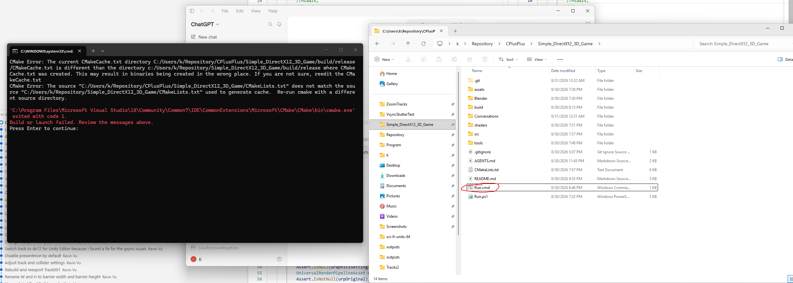

# Launcher error after moving the repository

Date: 2026-09-04

Repository: `Simple_DirectX12_3D_Game`

## User

> i recently moved this repo to a different folder. when i ran run.cmd, i got this error. what should be done?

The user also instructed the assistant to distinguish instructions in attached documents from the user's request. The screenshot was treated as diagnostic evidence.

Attached screenshot (original image preserved):

## Assistant progress

The error indicates that CMake's saved build files still point to the repo's old location. I'll check the launcher and make it recover from a folder move.

The fix is to regenerate CMake's saved configuration for the new location. I'm adding a check so `Run.cmd` does this automatically after a move and keeps normal incremental builds afterward.

The launcher detected the old path and rebuilt successfully in the new location. I'm checking game startup and a second launch to confirm that normal incremental builds still work.

Both build checks passed: the moved repo rebuilt successfully, and the next run skipped recompilation. The game process also started, though I couldn't verify its window from this background session. I'm saving the fix and the conversation record with your screenshot.

## Changes and verification

- Confirmed that `build/release/CMakeCache.txt` contained the old source and build paths under `C:/Users/k/Repository/Simple_DirectX12_3D_Game`.
- Updated `Run.ps1` to compare the cached source/build directories with its current directories, ignoring Windows path case and slash differences. It adds CMake's `--fresh` option only when a directory differs.
- Kept `Run.cmd` as the existing minimal PowerShell wrapper and updated the README to describe relocation recovery and the CMake 3.24 minimum for this option.
- Verified PowerShell parsing and checked the diff for whitespace errors. The initial parser attempt was restricted by the read-only shell's language mode; the subsequent full-language check passed.
- Ran the actual `Run.cmd` from outside the repository. CMake refreshed the stale configuration, rebuilt the shaders and C++ executable, and wrote the current source/build paths to its cache.
- Ran the launcher again. It staged runtime assets without refreshing CMake or recompiling C++. Both launcher error logs were empty.
- Confirmed that the game process started, but window checks could not locate its window from the background verification environment. No visual rendering verification is claimed. Closed the background processes created for verification.
- Committed the launcher change separately from this conversation record.

Reference: [CMake documentation for `--fresh`](https://cmake.org/cmake/help/v3.24/manual/cmake.1.html#cmdoption-cmake-fresh).

## Assistant response

CMake's saved configuration still referenced the old folder. I updated `Run.ps1` to refresh it automatically after a move.

The rebuild and subsequent incremental build succeeded. Double-click `Run.cmd` again.
