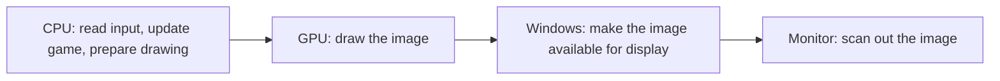

# Conversation: Godot Direct3D 12 input latency comparison

## User

what would it take to make a godot engine game that has its dx12 rendering pipeline configured in a way that matches the MinimizeInputLatency profile for "C:\Users\k\Repository\Veehiicuul\Cpp"? in other words, how much input latency optimization am i sacrificing by using godot engine instead of a custom c++/dx12 renderer?

the godot source code is here: C:\Users\k\Repository\External

## Assistant

I’ll compare the C++ latency profile with Godot’s Direct3D 12 frame loop, then identify what Godot can match through settings and what would require engine changes.

## Assistant

The source shows a real gap: Godot can match VSync-off, tearing, and two swap-chain buffers, but it enforces at least two GPU frame slots and lacks your C++ renderer’s explicit DXGI presentation-admission wait. I’m checking the wait timing relative to input processing, because queue counts alone don’t tell us the latency cost.

## Assistant

The timing check confirms that Godot does not impose an unavoidable extra input-buffering frame in its default rendering mode. The main differences are GPU overlap and presentation admission. Matching those looks like a focused engine modification; the latency cost in milliseconds still needs a matched benchmark, since the existing C++ captures did not measure physical input-to-photon latency.

## Assistant

**Stock Godot cannot exactly match your `MinimizeInputLatency` profile through settings alone. A custom Godot build could reproduce its queueing and synchronization behavior without replacing Godot’s renderer.** The remaining difference would be the CPU/GPU cost of running your game through Godot, plus how you handle input and simulation.

I inspected your local **Godot 4.8.dev**, commit `dfa06cafb454`, and the current C++ implementation. This is a source comparison, not a measured latency benchmark.

| Control                    | Your C++ profile                 | Closest stock Godot D3D12                  |
| -------------------------- | -------------------------------- | ----------------------------------------- |
| GPU frames in flight       | 1                                | Minimum 2 frame slots                      |
| DXGI maximum frame latency | Explicitly set to 1              | No explicit setting                       |
| Presentation admission     | Waitable swap chain              | Not implemented                           |
| Swap-chain buffers         | 2                                | Configurable to 2; default 3               |
| VSync and tearing          | VSync off; tearing when supported | Can match                                 |
| GPU wait strategy          | Spin                             | Event wait; no selectable spin             |
| Application FPS cap        | None                             | Can disable                               |

VSync is separate from your preset; the shipped configuration disables it. Sources: [C++ profile](C:/Users/k/Repository/Veehiicuul/Cpp/Source/RenderPreparation.h:26), [Godot’s hard minimum](C:/Users/k/Repository/External/godot/servers/rendering/rendering_device.cpp:8619), [swap-chain implementation](C:/Users/k/Repository/External/godot/drivers/d3d12/rendering_device_driver_d3d12.cpp:2903), and [event wait](C:/Users/k/Repository/External/godot/drivers/d3d12/rendering_device_driver_d3d12.cpp:2549).

The important distinction is **when fresh input enters a frame relative to unfinished work**. Your C++ renderer waits for GPU capacity and DXGI presentation admission, processes window messages again, and then computes the frame’s state. That is a stronger policy than merely using two buffers. [C++ frame preparation](C:/Users/k/Repository/Veehiicuul/Cpp/Source/Renderer.cpp:1274)

Godot’s default “Safe” rendering mode does not inherently add a separate render-thread frame of delay. Its frame-resource wait happens at the preceding draw’s tail, before the next Windows input pump. However, with two frame slots, the immediately preceding GPU frame can still be unfinished when the next frame’s input and simulation are processed. Also, GPU completion does not establish presentation readiness. [Godot frame sequence](C:/Users/k/Repository/External/godot/servers/rendering/rendering_device.cpp:8119)

**How much latency does that sacrifice? There is no fixed millisecond penalty.**

- **When the GPU finishes quickly:** the extra queue capacity may remain unused, so its latency cost can be small.
- **When the GPU is saturated:** stock Godot permits one additional older GPU frame compared with your profile. The resulting delay can be on the order of a GPU frame’s duration, depending on CPU/GPU overlap.
- **When presentation is the bottleneck:** the missing DXGI admission wait can matter separately, because a frame may already contain older input when presentation blocks. Microsoft describes why waiting before producing the frame can reduce this delay. [DXGI latency guidance](https://learn.microsoft.com/en-us/windows/uwp/gaming/reduce-latency-with-dxgi-1-3-swap-chains)

For scale, one frame interval is **16.7 ms at 60 FPS, 6.9 ms at 144 FPS, or 4.2 ms at 240 FPS**. Those are illustrations, not measured Godot penalties, and the queueing effects should not simply be added together.

Your C++ policy also sacrifices CPU/GPU overlap. Godot could achieve higher throughput from that overlap, partially offsetting the latency disadvantage. Conversely, more expensive Godot rendering or game logic could make the difference larger. Neither engine choice alone determines the result.

The closest stock configuration would use D3D12 with Forward+ or Mobile, VSync disabled, and:

- `rendering/rendering_device/vsync/swapchain_image_count = 2`
- `rendering/rendering_device/vsync/frame_queue_size = 2` — entering `1` is silently clamped to `2`.
- `rendering/driver/threads/thread_model = 1` — “Safe,” for the simplest comparison.
- `application/run/max_fps = 0`, `frame_delay_msec = 0`, and `low_processor_mode = false`. Set `low_processor_mode_sleep_usec = 0` as well to eliminate the automatic undrawable-window delay under your no-background-cap policy.

For gameplay, avoid unnecessarily delaying camera or immediate visual feedback until a 60 Hz physics tick or an interpolated transform. Waiting for a physics tick can itself approach 16.7 ms. You can also test `Input.use_accumulated_input = false` for mouse handling, but that changes event coalescing; it does not remove GPU queueing.

To match your profile’s behavior, I would make a focused engine modification:

1. **Add the DXGI presentation gate:** create a waitable swap chain, set maximum frame latency to one, and manage its handle through swap-chain recreation.
2. **Enforce one unfinished GPU frame:** preferably keep Godot’s existing resource allocations initially and add an independent admission limit. Simply changing the minimum frame-slot count is not the complete fix. A separate fence placed after `Present` would also mirror your C++ ordering without repurposing Godot’s existing fences.
3. **Gate before input and simulation:** wait for both GPU and presentation readiness, including the initial frame, then process fresh Windows input. Preserve this ordering if separate-thread rendering is later enabled.
4. **Add spin waiting for exact parity**, while keeping window messages responsive. Spin is a CPU/power tradeoff, not a guaranteed latency improvement.

That is engine/backend work, not just a GDScript setting. My rough estimate for someone familiar with Godot and D3D12 is **a few working days for a prototype and a few weeks for a tested implementation**, including resize, minimize/restore, presentation-mode changes, and measurements. I have not built or tested such a patch.

For your decision, I would first compare a minimal Godot release build against C++ using the **same input-driven visual response and workload**, then test the engine patch if the gap matters. Your existing C++ captures cannot answer this: their input-to-photon fields were unavailable, and their very high presentation FPS is not an input-latency measurement. [Capture limitations](<C:/Users/k/Repository/Veehiicuul/Cpp/SavedLogOutput/2026-09-11 MinimumInputLatency/Report.md:329>)

## User

okay, i don't fully understand a lot of this. let's say that the game is extremely performant with respect to a target fps of 100, in that the game's frametime (cpu + gpu work) easily finishes within 500 microseconds. the game's fps is limited to 100 using nvidia app/nvidia control panel

what would be the minimum achievable input latency with godot engine vs custom c++/dx12?

## Assistant

I’ll use your 0.5 ms workload and 100 FPS limit to separate the delay from rendering from the delay caused by waiting between frames. The key uncertainty is where the NVIDIA limiter pauses the game relative to input processing.

## Assistant

**In that scenario, Godot could be essentially as responsive as your custom C++ renderer. Godot does not automatically add an extra 10 ms just because it allows another frame in flight.**

At **100 FPS**, a new frame is produced every **10 ms**. If producing it takes only **0.5 ms**, roughly **9.5 ms is spent waiting**. What matters most is whether the game reads your input **before or after that waiting**.

For an ideal comparison, assume:

- Both versions take exactly 0.5 ms to process input and produce the frame.
- They read fresh input after waiting, once per rendered frame.
- The response does not wait for a separate physics update, and no completed frames are held in a queue.

Then the numbers are identical:

| Input timing                                  | Godot    | Custom C++/DX12 |
| --------------------------------------------- | -------- | --------------- |
| Just before the game reads input: minimum      | ~0.5 ms  | ~0.5 ms         |
| Randomly timed input: average                  | ~5.5 ms  | ~5.5 ms         |
| Just after the game reads input: longest delay | ~10.5 ms | ~10.5 ms        |

**These are input-available-to-completed-frame times, not physical button-to-screen times.** Since you said the work finishes *within* 0.5 ms, those figures decrease if the actual work takes less time.

The minimum is small because an input arriving just before the game reads it can affect the next frame immediately. The average includes about 5 ms waiting for the next opportunity to read input.

**The NVIDIA limiter prevents us from promising those numbers in practice.** Consider two simplified sequences:

- **Fresh input:** wait 9.5 ms → read input → render for 0.5 ms → present.
- **Older input:** read input → render for 0.5 ms → wait 9.5 ms → present.

Both produce 100 FPS, but the second makes the rendered input about **9.5 ms older**. These illustrate possible timing arrangements; I am not claiming NVIDIA necessarily uses either one. NVIDIA documents the frame-rate cap, but its public description does not establish where that wait occurs relative to your game’s input processing. [NVIDIA’s settings reference](https://www.nvidia.com/content/Control-Panel-Help/vLatest/en-us/mergedProjects/nv3d/Manage_3D_Settings_%28reference%29.htm)

Your C++ profile controls its own waiting carefully, but it cannot guarantee that an external driver limiter will not introduce another delay afterward.

**For your very lightweight game, I would not assume a meaningful latency sacrifice from choosing Godot.** The ideal minimum is the same; the actual difference needs measurement with that limiter enabled. Physical input-to-screen latency also adds mouse/controller delay and display delay, which depend on the monitor’s refresh rate, VSync/VRR settings, scanout, and pixel response.

## User

okay, let's do some input latency experiments.

i would like to use "C:\Users\k\Program\PresentMon-2.5.1-x64.exe". the plan is to use presentmon to capture data from a minimal godot scene and the program in "C:\Users\k\Repository\Veehiicuul\Cpp". for each game, i will open it, click in the window to focus it, and continually do keyboard keypresses, mouse movement, and mouse click. presentmon should capture input latency data for those inputs. then, we can compare the captures and see if there is a meaningful difference in input latencies between godot engine vs custom cpp/dx12.

does this make sense? analyze the presentmon source code at C:\Users\k\Repository\External\PresentMon_2-5-1 to determine how it captures input latency.

## Assistant

I’ll trace how PresentMon 2.5.1 detects input and associates it with displayed frames, then check which parts of your proposed experiment it can measure reliably.

## Assistant

The experiment makes sense as a first comparison, but the source reveals an important limitation: PresentMon associates Windows input events with subsequently presented frames; it does not check whether those frames visibly respond to the input. It also combines input events, so mixing constant mouse movement with keypresses would make the results harder to interpret.

## Assistant

I found a detail that affects the test design: although the documentation says “earliest” input, this version’s code keeps the most recent general input timestamp. Continuous mouse movement can therefore replace the timestamp of an earlier keypress. I’d run clicks, keyboard presses, and mouse movement separately, starting with a short capture to confirm that each produces valid samples.

## Assistant

**Yes—as a first comparison of input-to-presentation timing. But PresentMon alone cannot prove how quickly the game visibly reacts to each input.** Your experiment is useful if we account for that distinction and test each input type separately.

I inspected the local source at tag **v2.5.1**, commit `3e06c7dcb922`, and confirmed that your executable reports version 2.5.1.

PresentMon captures input latency through **Windows tracing events**, without needing changes to either game:

1. **Windows reads an input device.** PresentMon records the timestamp and whether it was a mouse or keyboard, using `InputDeviceRead_Stop`.
2. **A process retrieves input for a window.** PresentMon associates the tracked input timestamp with that process, using `RetrieveInputMessage_Info`. Mouse clicks receive additional tracking through `OnInputXformUpdate_Info`.
3. **That process presents a frame.** PresentMon assigns the pending input information to the newly tracked frame.
4. **Windows reports the frame’s display timing.** PresentMon subtracts the associated input timestamp from that display timestamp.

Those steps are implemented in the [input-event handlers](C:/Users/k/Repository/External/PresentMon_2-5-1/PresentData/PresentMonTraceConsumer.cpp:1698), [input-to-frame assignment](C:/Users/k/Repository/External/PresentMon_2-5-1/PresentData/PresentMonTraceConsumer.cpp:2576), and [latency calculation](C:/Users/k/Repository/External/PresentMon_2-5-1/IntelPresentMon/CommonUtilities/mc/MetricsCalculatorInput.cpp:14).

The two relevant default CSV columns are:

| Column                      | What it represents                                      |
| --------------------------- | ------------------------------------------------------- |
| `MsAllInputToPhotonLatency` | Associated keyboard or mouse input → frame display time |
| `MsClickToPhotonLatency`    | Associated mouse click → frame display time             |

With `--v2_metrics`, the names omit the `Ms` prefix; values remain milliseconds. There is no separate keyboard-only or mouse-movement-only column.

**There are three important limitations for your experiment.**

**First, it infers which frame contains the response.** It does not inspect the game’s input handlers, simulation state, or pixels. A program can retrieve a keypress, ignore it, and still receive a latency measurement. Likewise, if Godot postpones the visible response until a later physics update, PresentMon does not automatically discover that delay. The association is made at the process/presentation level.

Therefore, your existing C++ program and a minimal Godot scene can potentially produce these metrics without reacting visibly. To make the comparison represent actual responsiveness, I would give both a simple immediate response—such as changing a rectangle’s color on a keypress or click—and ensure that state reaches the next rendered frame.

**Second, it does not preserve a separate measurement for every input event.** This is especially relevant to your proposal to keep moving, clicking, and typing simultaneously.

Although the [documentation](https://github.com/GameTechDev/PresentMon/blob/v2.5.1/README-ConsoleApplication.md) describes the “earliest” contributing input, the source explicitly keeps the **most recent general input timestamp** and replaces older timestamps. Keyboard and mouse activity share that tracking. Continuous mouse movement can therefore replace the timestamp of an earlier keypress. [Tracking state and its explanatory comments](C:/Users/k/Repository/External/PresentMon_2-5-1/PresentData/PresentMonTraceConsumer.hpp:526)

Consequently, a low value during continuous mouse movement does not mean every movement event or keypress had that latency.

**Third, “to photon” is a metric name, not an optical measurement.** The normal capture starts at a Windows input-read event and ends at a display timestamp derived from system events. It does not measure the physical button’s travel, earlier device/USB delays, or the monitor’s actual pixel response.

There are also normal missing samples: frames without associated input can contain `NA`. Inputs associated with a frame that was not displayed can be carried forward to a later displayed frame. Neither behavior gives us a one-row-per-keypress log. [Calculation and carry-forward behavior](C:/Users/k/Repository/External/PresentMon_2-5-1/IntelPresentMon/CommonUtilities/mc/MetricsCalculatorInput.cpp:30)

**I would adjust your experiment as follows:**

1. **Start with a short validation capture for each application.** Focus the window before the measurement interval, then verify that clicks, keyboard presses, and movement actually populate the expected columns. Godot and C++ use different input-reading paths, so successful coverage should be checked.
2. **Run three separate tests:** mouse clicks with the mouse stationary; keyboard presses with the mouse stationary; and mouse movement without clicking or typing. Use discrete presses rather than holding a key for automatic repeats.
3. **Keep the conditions identical:** standalone release builds, D3D12, the same window size, monitor, 100 FPS driver cap, VSync/VRR settings, and comparable rendering work. Capture the game process, not the Godot editor.
4. **Repeat in alternating order.** Compare valid-sample counts, median latency, and the slower tail, such as the 95th percentile. Report missing samples separately; never treat `NA` as zero.

Input and display tracking are **enabled by default**. These basic columns do not require the optional application-instrumentation flags. [Capture defaults](C:/Users/k/Repository/External/PresentMon_2-5-1/PresentMon/CommandLine.cpp:391)

This would give us a useful comparison of the two presentation pipelines under your driver cap. A claim about actual physical input-to-visible-response latency would additionally require verified input-to-frame association and, for the display itself, a camera or sensor measurement.

## User

okay, this is the part that concerns me:
First, it infers which frame contains the response. It does not inspect the game’s input handlers, simulation state, or pixels. A program can retrieve a keypress, ignore it, and still receive a latency measurement. Likewise, if Godot postpones the visible response until a later physics update, PresentMon does not automatically discover that delay. The association is made at the process/presentation level.
Therefore, your existing C++ program and a minimal Godot scene can potentially produce these metrics without reacting visibly. To make the comparison represent actual responsiveness, I would give both a simple immediate response—such as changing a rectangle’s color on a keypress or click—and ensure that state reaches the next rendered frame.

first thing i need to emphasize: the game *does not* have a separate physics update or any kind of other separate update/step. the game is very simple. it has one update loop that should get the freshest possible input, compute game state, and then draw the game state.

for custom cpp/dx12, i'm confident that we can use the proper api to get the freshest input.

my concern is about godot engine. once again, my game only needs one update loop. i simply need to ensure that i get the freshest input when reading input from within the update loop in godot engine. how do i ensure this?

## Assistant

I’ll trace Godot’s Windows input processing into `_process()` and check whether you can refresh input there, so the answer fits your single-loop design.

## Assistant

Godot exposes the call you need: `DisplayServer.process_events()`. In your Windows source, it reads pending Windows input and flushes it into Godot’s input state. Calling it at the start of `_process()` lets you refresh input immediately before computing game state; input getters alone just read Godot’s stored state.

## Assistant

**Your single-update-loop design is supported by Godot. Use `_process()`, and call `DisplayServer.process_events()` immediately before reading input and computing game state. No engine modification is needed for that.**

My earlier example about waiting for a physics update does not apply to the design you’ve described.

Godot normally processes Windows input before entering its main iteration. An explicit `DisplayServer.process_events()` at the start of your update refreshes input again, catching events that arrived since that earlier processing. [Normal Windows loop](C:/Users/k/Repository/External/godot/platform/windows/os_windows.cpp:2355)

In your local Godot source, that call:

- Reads pending raw mouse input.
- Processes queued keyboard, mouse-button, and other window messages.
- Flushes the resulting events into Godot’s input state before returning.

That behavior is directly visible in the [Windows implementation](C:/Users/k/Repository/External/godot/platform/windows/display_server_windows.cpp:4515), and the method is exposed to scripts. [Godot API documentation](https://docs.godotengine.org/en/latest/classes/class_displayserver.html#class-displayserver-method-process-events)

For example, with a `ColorRect` child named `Indicator`:

```gdscript
extends Node

@onready var Indicator: ColorRect = $Indicator

func _process(_Delta: float) -> void:
    # Refresh input immediately before this frame's game update.
    DisplayServer.process_events()

    # Read input and compute this frame's state.
    var Pressed := (
        Input.is_physical_key_pressed(KEY_SPACE)
        or Input.is_mouse_button_pressed(MOUSE_BUTTON_LEFT)
    )

    # Give that state to the renderer during this same update.
    Indicator.color = Color.WHITE if Pressed else Color.BLACK
```

Here, the rectangle is white while Space or the left mouse button is held. Godot runs the rendering step after the game’s process callbacks, so this does not intentionally defer the new color to a later game update. [Update-before-render ordering](C:/Users/k/Repository/External/godot/main/main.cpp:5055)

**The important distinction is between refreshing input and reading stored input:**

| Operation                        | What it does                                                |
| -------------------------------- | ----------------------------------------------------------- |
| `Input.is_action_pressed(...)`   | Reads Godot’s current stored input state.                   |
| `Input.flush_buffered_events()`  | Processes events Godot has already collected.               |
| `DisplayServer.process_events()` | Processes pending OS events and, on Windows, flushes input. |

Calling only `Input.flush_buffered_events()` does **not** fetch newly arrived Windows messages. In this Windows implementation, adding it after `DisplayServer.process_events()` is redundant.

For your setup, I would also:

- Keep the controller’s `_process()` on the **main thread**, and use rendering thread model **Safe** (`1`).
- Keep physics interpolation disabled and apply the computed state directly to the visible nodes.
- For discrete presses, use a mapped action’s `Input.is_action_just_pressed()` when you need to retain a brief press that was released between updates.
- For captured relative mouse movement, collect and sum motion events in `_input()`, then consume that sum during `_process()`. That callback collects input; it does not need to run a second game update. Do not call `process_events()` recursively from `_input()`.

**You do not need to disable input accumulation to make this refresh work.** The explicit Windows processing call flushes accumulated events before returning. Disabling accumulation changes event coalescing and processing cost; it is not the essential freshness control here.

The precise guarantee is that you process available Windows input immediately before your game update. It is not direct hardware polling, and input arriving after that sampling point can still miss the current frame—as it can in C++. Later GPU, presentation, or driver-limiter waits remain separate from this input-refresh question.

## User

okay, good. so we can say that this limitation is acceptable and shouldn't invalidate input latency data from presentmon:

First, it infers which frame contains the response. It does not inspect the game’s input handlers, simulation state, or pixels. A program can retrieve a keypress, ignore it, and still receive a latency measurement. Likewise, if Godot postpones the visible response until a later physics update, PresentMon does not automatically discover that delay. The association is made at the process/presentation level.
Therefore, your existing C++ program and a minimal Godot scene can potentially produce these metrics without reacting visibly. To make the comparison represent actual responsiveness, I would give both a simple immediate response—such as changing a rectangle’s color on a keypress or click—and ensure that state reaches the next rendered frame.

given this, what is the current plan for the presentmon experiments?

## Assistant

I’ll consolidate the experiment plan around your single update loop and the input-refresh point we verified in Godot.

## Assistant

**Yes—for this controlled experiment, that limitation is acceptable, provided we establish that the sampled input changes the state drawn in the next presentation.** Your single-update-loop design makes that straightforward. We’ll interpret PresentMon’s results as Windows-input-to-presentation estimates.

The current plan is:

1. **Prepare the two applications.**
   - **C++:** use the existing application with `MinimizeInputLatency` and VSync off.
   - **Godot:** create a minimal standalone D3D12 game using one main-thread `_process()` callback: refresh input with `DisplayServer.process_events()`, read input, compute state, and update the visuals. Use Safe rendering threading, interpolation off, two swap-chain images, and Godot’s minimum frame queue size of two.
   - Give both the same simple input indicators: a visible change on Space, a visible change on a mouse click, and a marker responding to mouse movement. Keep input collection before the game update and apply its results directly to that frame’s visuals.

2. **Match and record the test conditions.**
   - Apply the **100 FPS NVIDIA driver cap to both executables**; use no in-game FPS limiter.
   - Use the same monitor, window size, window mode, mouse mode, and VSync/VRR settings.
   - Run release builds outside the Godot editor. Check that both workloads are comfortably below the 10 ms frame budget.
   - Record the executable versions, settings, monitor refresh rate, and relevant driver settings alongside the captures.

3. **Do a short validation capture first.**
   - Use your `PresentMon-2.5.1-x64.exe`, targeting the actual game process.
   - You launch the game and focus its window. Recording starts after a short settling period, excluding the focus click.
   - Try each input type separately and confirm that the appropriate latency columns contain valid measurements.
   - Keep the original CSV data, including dropped frames and missing values. If a required column stays `NA`, investigate before collecting the main dataset.

4. **Capture three separate input tests.**

   | Test           | Your activity                                         | Primary metric              |
   | -------------- | ----------------------------------------------------- | --------------------------- |
   | Keyboard       | Repeatedly press and release Space; mouse stays still | `MsAllInputToPhotonLatency` |
   | Mouse clicks   | Repeatedly click; mouse stays still                   | `MsClickToPhotonLatency`    |
   | Mouse movement | Continuously move the mouse; no clicks or keypresses  | `MsAllInputToPhotonLatency` |

   Use normal individual keypresses rather than holding a key for automatic repeats. We’ll compare each input type against the same input type in the other application.

   Start with **30 seconds per capture and three repetitions per test per application**: 18 captures, or nine minutes of recorded activity. Alternate which application runs first to reduce effects from changing system conditions.

5. **Compare the captures.**
   - Report valid sample counts, missing-value rates, and dropped-frame rates.
   - Compare median latency, the 95th percentile, and a low percentile to describe the faster responses.
   - Check actual FPS and presentation mode to confirm comparable runs.
   - Look for a consistent difference across repeated runs, rather than relying on one unusually fast or slow sample.

The main question this answers is: **with fresh input applied during one update per frame and both applications capped at 100 FPS, does stock Godot’s D3D12 pipeline show a repeatable latency disadvantage versus your C++ profile?**

## User

what does `rendering/driver/threads/thread_model = 1` do? why do the godot docs say that it is experimental? https://docs.godotengine.org/en/stable/classes/class_projectsettings.html#class-projectsettings-property-rendering-driver-threads-thread-model

what is the default value?

## Assistant

I’ll check the stable documentation and your local Godot source to see what value `1` selects and how the experimental warning applies.

## Assistant

**`1` means “Safe,” and it is the default value.** Our experiment plan therefore keeps Godot’s normal rendering-thread configuration. The [stable documentation](https://docs.godotengine.org/en/stable/classes/class_projectsettings.html#class-projectsettings-property-rendering-driver-threads-thread-model) also lists the default as `1`.

With **Safe**, the main CPU thread runs your game update and then drives rendering. Godot does **not** create a separate rendering thread for this mode. The GPU still executes work asynchronously, and Godot can still use worker threads for other tasks; this setting does not make the entire engine single-threaded. [Rendering implementation](C:/Users/k/Repository/External/godot/servers/rendering/rendering_server_default.cpp:447)

The options in your checkout are:

| Value | Mode                | Meaning                                  |
| ----- | ------------------- | ---------------------------------------- |
| `0`   | Unsafe (deprecated) | Legacy option; unnecessary for our test. |
| `1`   | Safe                | Default; no separate rendering thread.   |
| `2`   | Separate            | Runs rendering on a separate CPU thread. |

**The experimental warning concerns the separate rendering-thread feature.** The documentation attaches its warning to the entire property, which makes the wording confusing.

Your source code is more explicit: it emits the experimental/crash warning **only when separate-thread rendering is enabled**, and specifically recommends setting the property to **Safe**. [Startup warning](C:/Users/k/Repository/External/godot/main/main.cpp:3517)

For our experiment, `1` gives us the straightforward ordering we want: **input → game update → rendering on the main thread**. It does not itself change GPU frames in flight, VSync, or the FPS limit.


## User

okay, i want to use this as the godot test app: C:\Users\k\Repository\VsyncStutterTest
i would like to upgrade it to godot 4.7.2.

what changes are needed for the upgrade, and what changes are needed to make this a suitable test app for the presentmon experiments?

## Assistant

I’ll inspect VsyncStutterTest’s current Godot version, update loop, and rendering settings, then separate the changes needed for 4.7.2 from those needed for the latency experiment.

## Assistant

The app already uses D3D12, disables VSync, and updates the sphere in `_process()`. Its latest log confirms Godot 4.6.3. The main experiment gaps are that the animation doesn’t respond to input, and the launcher runs an existing export with PresentMon capture commented out.

## Assistant

The upgrade appears straightforward: the scene uses standard nodes and one small script, with no evident 4.7 migration problems. I also found two comparison settings to align: Godot starts in its “exclusive fullscreen” mode and is raised to High process priority; the C++ app starts windowed and doesn’t raise its priority.

## Assistant

**This is a suitable starting point, and the changes are fairly small.** No Godot engine modifications are needed for this experiment.

Your latest [runtime log](C:/Users/k/Repository/VsyncStutterTest/MyLogOutput/2026-09-15_23-28-02/Godot.log) confirms **Godot 4.6.3, D3D12, Forward+**.

**For the upgrade**, I would:

1. Install the standard Windows x64 Godot **4.7.2** editor and matching export templates. This project uses GDScript, so the .NET edition is unnecessary.
2. Import and save the project with 4.7.2, then regenerate the Windows **release export**, including its supporting files.
3. Update [Run.ps1](C:/Users/k/Repository/VsyncStutterTest/Run.ps1:17) to export with that specific engine version before launching. Currently it simply runs the existing executable, so changing the project’s version label would leave the old engine running.

I found no evident required script or scene API changes when comparing this small project with the [4.7 migration guide](https://docs.godotengine.org/en/stable/tutorials/migrating/upgrading_to_godot_4.7.html). That still needs confirmation by importing and running it.

The upgrade is relevant to our testing: **4.7.2 includes a Windows fix for performance problems while moving a mouse with a high polling rate.** [Release notes](https://godotengine.org/article/maintenance-release-godot-4-7-2/)

**For the PresentMon experiment**, I would make these changes:

1. **Apply fresh input within the existing single update loop.**

   [Sphere.gd](C:/Users/k/Repository/VsyncStutterTest/Godot/Sphere.gd:24) currently moves the sphere automatically and never uses input to change game state. Keep one `_process()` update, with this order:

   **`DisplayServer.process_events()` → read input → update game state and visual response → Godot renders.**

   I verified that the Windows implementation in **4.7.2** processes Windows input and flushes Godot’s input buffer. The existing `Input.set_use_accumulated_input(false)` can remain. No physics update is needed.

2. **Add simple visible responses.**

   Use a color change for a keyboard press, another for a mouse click, and a game-rendered marker that follows mouse movement. Update these in that same loop. The existing sphere scene can remain. These responses make the intended input-to-frame relationship concrete; PresentMon still infers that relationship.

3. **Make the relevant rendering settings explicit.**

   [project.godot](C:/Users/k/Repository/VsyncStutterTest/Godot/project.godot:18) already selects D3D12, disables VSync, uses two swap-chain images, and disables fallback to other graphics APIs. Keep those. Explicitly record Safe rendering-thread mode (`1`), frame-queue size `2`, physics interpolation off, and Godot’s FPS limit disabled. Several are already defaults; making them explicit improves reproducibility. The **100 FPS limit remains external**.

4. **Align the conditions with the C++ app.**

   Godot currently starts in its “exclusive fullscreen” mode, while C++ starts windowed and offers borderless fullscreen. Choose matching window modes and resolutions, then check PresentMon’s actual presentation mode. Also match process priority: Godot’s launcher currently raises it to High; C++ does not.

   Use identical driver settings for both executables. The existing [README recommendations](C:/Users/k/Repository/VsyncStutterTest/README.md:45) include 240 FPS and driver VSync on, so they need a separate set of instructions for this experiment.

5. **Enable a controlled capture workflow.**

   PresentMon launching is currently [commented out](C:/Users/k/Repository/VsyncStutterTest/Run.ps1:7). Add capture of the launched game’s process ID using your PresentMon 2.5.1 executable, allow focus and warm-up before recording, and save the CSV and effective test settings in the existing timestamped log folder.

   Retain the planned separate keyboard, click, and movement runs: 30 seconds each, three repetitions per application.

Before comparing latency, verify that both applications’ actual CPU/GPU work remains comfortably below the 10 ms frame interval. A simple-looking scene does **not** establish the earlier hypothetical 500 µs workload; time spent waiting for the external cap must be distinguished from actual work.

I have inspected the project and target engine source; I have not changed VsyncStutterTest or run an upgraded export yet.


## User

explain in detail and for someone unfamiliar with these  what each of these mean:
| Control                    | Your C++ profile                 | Closest stock Godot D3D12                  |
| -------------------------- | -------------------------------- | ----------------------------------------- |
| GPU frames in flight       | 1                                | Minimum 2 frame slots                      |
| DXGI maximum frame latency | Explicitly set to 1              | No explicit setting                       |
| Presentation admission     | Waitable swap chain              | Not implemented                           |
| Swap-chain buffers         | 2                                | Configurable to 2; default 3               |
| VSync and tearing          | VSync off; tearing when supported | Can match                                 |
| GPU wait strategy          | Spin                             | Event wait; no selectable spin             |
| Application FPS cap        | None                             | Can disable                               |

## Assistant

I’ll check the relevant code and documentation, then explain each control in terms of where a frame can wait between reading input and appearing on screen.

## Assistant

The key distinction is that a frame slot or buffer is available capacity, not a mandatory delay. Godot having two frame slots does not automatically mean an extra 10 ms at 100 FPS. The C++ profile gives more control over how far work can get ahead and when to wait before reading input; the experiment will tell us how much that matters here.

## Assistant

I also confirmed that these are two separate questions: what condition must become ready, and how the CPU waits for it. The waitable swap chain supplies a readiness notification; spin versus event waiting determines how the CPU checks or waits for that notification. Neither is an FPS limiter.

## Assistant

**These controls govern how much work can get ahead, where the game waits, and how a finished image reaches the display.** They are related, but they control different things.

One clarification to my earlier table: **Godot’s minimum of two frame slots is a capacity, not a compulsory two-frame delay.** We cannot translate that row into “Godot adds 10 ms at 100 FPS.”

A frame is one image of the game. The CPU runs your update and prepares drawing instructions; the GPU executes those instructions. Windows then arranges for the image to reach the display.

The visible effect of an input follows this path:



Different frames can occupy different stages simultaneously. Also, submitting an image for presentation does not mean it has already appeared on screen.

1. **GPU frames in flight: how far the CPU can get ahead of completed GPU work**

   The CPU can give the GPU drawing instructions and continue running while the GPU executes them. That makes overlap possible: the GPU draws frame A while the CPU prepares frame B.

   Each unfinished frame needs some resources kept intact—such as its drawing instructions and object positions—until the GPU finishes using them. A **frame slot** is a reusable collection of those resources.

   Your C++ profile uses **one slot**. Before preparing the next frame for rendering, it checks that the GPU has finished the work that used that slot. This prevents the application from building up multiple unfinished GPU frames. [C++ profile](C:/Users/k/Repository/Veehiicuul/Cpp/Source/RenderPreparation.h:26)

   Godot’s window-rendering path allocates **at least two slots**. It can use slot B while work using slot A is unfinished, then must wait before reusing A if A is still busy. This allows more CPU/GPU overlap. [Godot 4.7.2 implementation](https://github.com/godotengine/godot/blob/4.7.2-stable/servers/rendering/rendering_device.cpp)

   The tradeoff is that overlap can improve throughput, but a frame based on older input may be waiting behind earlier GPU work. With your extremely light workload and 100 FPS cap, however, the GPU might finish each frame long before the next starts. In that situation, the extra slot need not contain any pending work.

   **GPU completion also has a specific meaning:** the GPU has finished its commands. The resulting image may still be waiting to appear on the monitor.

2. **DXGI maximum frame latency: a limit on the swap chain’s outstanding frames**

   **DXGI** is the Windows graphics infrastructure used here to manage presentation. A **swap chain** is the collection of images and associated machinery through which the application presents frames.

   Calling `SetMaximumFrameLatency(1)` explicitly sets the waitable swap chain’s queue limit to one frame. The word “latency” in this API can be misleading: **the argument is a frame count, not milliseconds, and it does not guarantee any particular input-to-screen time.** [Microsoft API documentation](https://learn.microsoft.com/en-us/windows/win32/api/dxgi1_3/nf-dxgi1_3-idxgiswapchain2-setmaximumframelatency)

   This addresses a different boundary from the GPU frame-slot limit. GPU work can be finished while presentation is still outstanding. Limiting unfinished GPU work alone therefore does not completely control presentation.

   Your C++ renderer explicitly sets this limit. Stock Godot’s D3D12 implementation does not create the corresponding waitable swap chain or call this setter. “No explicit setting” means Godot does not exercise this particular control; Windows, the driver, buffer availability, and other synchronization still constrain it. It does not establish a specific larger queue length.

3. **Presentation admission: getting permission to start another frame**

   “Presentation admission” is the name I used for this behavior. A **waitable swap chain** gives the application a Windows notification it can wait for before starting another frame.

   Think of that notification as: **“The presentation system has room for you to proceed with another frame under the configured queue limit.”**

   The previous row sets the limit. This row provides the notification that lets the application arrange its work around that limit.

   Why can waiting help responsiveness? Because **input continues to arrive while the application waits**. Consider these two orderings when presentation is congested:

   - Read input → update and draw → wait for room to present.
   - Wait for room → read input → update and draw.

   In the second ordering, the update can use input that arrived during the wait. The image contains fresher information when it reaches presentation. This is the purpose of Microsoft’s [waitable swap-chain technique](https://learn.microsoft.com/en-us/windows/uwp/gaming/reduce-latency-with-dxgi-1-3-swap-chains).

   Your C++ renderer waits for both its GPU resources and presentation admission, then processes Windows input messages again before proceeding. [Frame preparation](C:/Users/k/Repository/Veehiicuul/Cpp/Source/Renderer.cpp:1274)

   Godot lacks this explicit DXGI admission step. It still waits where required by its renderer and the driver, but it has less control over moving this particular wait ahead of your game update.

   This notification is neither a “100 FPS timer” nor a measurement of pixels becoming visible. It also cannot guarantee that a subsequent driver operation will never block.

4. **Swap-chain buffers: how many image surfaces are available**

   A buffer here is GPU memory containing an image. For a simplified picture of **two buffers**, imagine:

   - One image is being used for display.
   - Another image is available for the GPU to draw into.

   Their roles rotate as frames are presented. A third buffer provides another image surface, which can allow work to continue when the others are occupied.

   Both renderers use a modern DXGI presentation model that requires at least two buffers. Your C++ profile uses two; Godot defaults to three and can be configured to use two. Your VsyncStutterTest already requests two. [Microsoft flip-model guidance](https://learn.microsoft.com/en-us/windows/win32/direct3ddxgi/for-best-performance--use-dxgi-flip-model), [project settings](C:/Users/k/Repository/VsyncStutterTest/Godot/project.godot:29)

   **Buffer count and GPU frame-slot count describe different resources.** Your C++ configuration illustrates this: it has two image buffers but permits only one unfinished GPU frame. It needs an image to display while preparing the next image, even though it restricts how far rendering can advance.

   Extra buffers can permit additional queuing, but the other limits may prevent that capacity from being used. Three buffers therefore do not automatically imply three frames of latency.

5. **VSync and tearing: when the displayed image may change**

   A monitor typically scans an image progressively across the screen. On a fixed-refresh display, new refreshes start at regular intervals: every **10 ms at 100 Hz**, or about **4.17 ms at 240 Hz**. These are monitor refresh rates; your game’s 100 FPS cap is a separate setting.

   **VSync on** coordinates image changes with refresh boundaries. That avoids switching images partway through a scan, but a ready frame may have to wait for the next suitable boundary.

   **VSync off with tearing allowed** permits image changes without requiring that alignment, when the presentation path supports it. This can reveal newer game information sooner. The visual tradeoff is a possible tear: one part of the screen comes from an older frame and another part from a newer frame.

   Your C++ application requests VSync off and allows tearing when supported. Godot’s D3D12 backend can make equivalent requests. [Microsoft presentation documentation](https://learn.microsoft.com/en-us/windows/win32/api/dxgi/nf-dxgi-idxgiswapchain-present)

   With variable refresh rate—such as G-SYNC—the display can adjust refresh timing to arriving frames within its supported range. Allowing tearing through the API does not imply that you will necessarily see tearing; those flags also support the variable-refresh presentation path. Driver settings and the actual display mode matter. [Microsoft VRR documentation](https://learn.microsoft.com/en-us/windows/win32/direct3ddxgi/variable-refresh-rate-displays)

   Neither renderer can make every pixel change instantly: display scanout and pixel response still take time.

6. **GPU wait strategy: how the CPU waits for a condition to become ready**

   When the CPU needs a resource that the GPU is still using, it must wait. A **GPU fence** is a progress marker that lets the CPU check whether the relevant GPU work has completed.

   With **spin waiting**, the CPU repeatedly checks the condition: “Finished yet? Finished yet?” Your C++ frame-preparation loop uses this strategy for both GPU readiness and presentation admission.

   Spinning can notice readiness promptly because the thread is actively checking. Its cost is CPU activity: it can keep a logical CPU core busy during the wait, consuming power and competing with other work. Windows can still interrupt or reschedule that thread.

   With an **event wait**, the thread asks Windows to wake it when the condition becomes ready. Godot’s D3D12 fence waits use this approach. It generally consumes less CPU while waiting, but signaling and rescheduling can add some delay before the thread resumes. [Godot D3D12 implementation](https://github.com/godotengine/godot/blob/4.7.2-stable/drivers/d3d12/rendering_device_driver_d3d12.cpp), [Microsoft fence-event documentation](https://learn.microsoft.com/en-us/windows/win32/api/d3d12/nf-d3d12-id3d12fence-seteventoncompletion)

   An event wait is **condition-driven**. It does not deliberately sleep for one frame or a fixed number of milliseconds. If the condition is already ready, it can return immediately. [Windows wait behavior](https://learn.microsoft.com/en-us/windows/win32/api/synchapi/nf-synchapi-waitforsingleobject)

   Consequently, this difference may matter little when the GPU has already finished before the CPU reaches the wait. Its actual latency cost needs measurement.

7. **Application FPS cap: deliberate pacing performed by the game**

   An application FPS cap deliberately limits how often the game produces frames. For 100 FPS, the intended interval is 10 ms.

   Your C++ application has no such limiter. Godot provides one through `application/run/max_fps`, with `0` meaning disabled. We would leave it disabled and use your external NVIDIA cap for both applications.

   Disabling the application cap does not eliminate the external cap, VSync, or waits for busy resources. Those can all restrict the rate at which frames proceed.

   The position of a limiter’s wait matters for input freshness. A wait before the input read lets the update use inputs arriving during that wait; a wait after the update lets the already-computed state become older. We should not assume exactly where the NVIDIA cap delays either application without observing its behavior.

For your proposed **100 FPS, roughly 0.5 ms of CPU-plus-GPU work** experiment, there is ample time between frames for GPU work to finish. That could make the frame-slot and GPU-wait differences small. Presentation timing and the external limiter can still matter.

**The table describes differences in control, not seven measured latency penalties.** The captures are needed to establish which differences actually affect your two applications under the chosen conditions.


## User

going back to the presentmon experiment:
Prepare the two applications.
- C++: use the existing application with MinimizeInputLatency and VSync off.
- Godot: create a minimal standalone D3D12 game using one main-thread _process() callback: refresh input with DisplayServer.process_events(), read input, compute state, and update the visuals. Use Safe rendering threading, interpolation off, two swap-chain images, and Godot’s minimum frame queue size of two.
- Give both the same simple input indicators: a visible change on Space, a visible change on a mouse click, and a marker responding to mouse movement. Keep input collection before the game update and apply its results directly to that frame’s visuals.

is C:\Users\k\Repository\Veehiicuul\Cpp ready for this without any further changes?

## Assistant

I’ll check the C++ app’s current input handling, visuals, and rendering settings against that experiment plan.

## Assistant

**No—not yet. Its rendering configuration is ready, but the three input indicators and their connection to rendering are missing.**

The parts already in place are:

- **`MinimizeInputLatency` selected and VSync off.** These are the current [settings](C:/Users/k/Repository/Veehiicuul/Cpp/Assets/Settings.json:2). The selected preset supplies one GPU frame in flight, DXGI latency of one, presentation admission, two swap-chain buffers, and spin waiting. The other custom values in that JSON do not override the selected preset.
- **Input-message processing after rendering waits.** [`PrepareFrame()`](C:/Users/k/Repository/Veehiicuul/Cpp/Source/Renderer.cpp:1274) waits for GPU resources and presentation admission, then processes Windows messages again before rendering.
- **One main-thread loop, with no application FPS limiter.**

What is missing:

| Required response        | Current implementation                         |
| ------------------------ | ---------------------------------------------- |
| Visible change on Space  | No Space-specific behavior.                    |
| Visible change on click  | No mouse-button input handling for game state. |
| Marker following motion  | No mouse-position state or game-rendered marker. |

The existing [keyboard handler](C:/Users/k/Repository/Veehiicuul/Cpp/Source/Application.cpp:202) only implements Escape, F11, and V. The rendered animation is [calculated from elapsed time](C:/Users/k/Repository/Veehiicuul/Cpp/Source/Renderer.cpp:1083), independently of those test inputs. The ordinary Windows mouse cursor is not the game-rendered marker we need.

The required addition is to collect keyboard/button events and mouse position, then use that collected input after `PrepareFrame()` succeeds to update the indicators and render them in that frame:

**Wait for readiness → refresh input → update indicator state → render → present.**

There is also one input-freshness detail to address: [`ServiceMessages()`](C:/Users/k/Repository/Veehiicuul/Cpp/Source/Application.cpp:58) processes at most 64 messages per call. Calling it after the waits does not guarantee that every queued input message has been consumed. The added input collection should account for that rather than assume the queue is empty.

PresentMon may already produce input-latency measurements for this application, but it does **not yet meet our agreed requirement that those inputs directly affect that frame’s visuals**. The renderer settings can stay as they are.


## User

for now, i don't care about this stuff:
| Required response        | Current implementation                         |
| ------------------------ | ---------------------------------------------- |
| Visible change on Space  | No Space-specific behavior.                    |
| Visible change on click  | No mouse-button input handling for game state. |
| Marker following motion  | No mouse-position state or game-rendered marker. |

in general, i don't currently care about displaying any visual indicator of received input

i do care about this:
There is also one input-freshness detail to address: [`ServiceMessages()` (line 58)](C:/Users/k/Repository/Veehiicuul/Cpp/Source/Application.cpp:58) processes at most 64 messages per call. Calling it after the waits does not guarantee that every queued input message has been consumed. The added input collection should account for that rather than assume the queue is empty.

why does it process at most 64 messages instead of all available messages (i.e. draining the queue)?

## Assistant

I’ll check the reason for that limit and how Windows delivers mouse input, since draining the queue can behave differently with a continuous stream of events.

## Assistant

The history confirms this was a guard against message processing delaying rendering, introduced with the frame-admission changes. I found no measured justification for choosing 64. It is also a limit per call, not per frame—the app calls this function several times around its rendering waits.

## Assistant

**The 64-message limit is a guard against message processing preventing the game from reaching rendering. It is a design choice, not a Windows requirement or a proven optimal value.**

Understood about the visual indicators—we can leave those out for now.

The code states its reason directly: “A bounded batch prevents high-rate input from starving rendering.” [Application.cpp](C:/Users/k/Repository/Veehiicuul/Cpp/Source/Application.cpp:58)

A drain-to-empty loop would effectively do this:

```cpp
while (PeekMessageW(&message, nullptr, 0, 0, PM_REMOVE)) {
    TranslateMessage(&message);
    DispatchMessageW(&message);
}
```

The subtlety is that **the queue can receive new messages while that loop is running**. It is not processing a fixed snapshot of the messages that existed when the function started. Each call checks for another available message. [Windows documentation](https://learn.microsoft.com/en-us/windows/win32/api/winuser/nf-winuser-peekmessagew)

If messages arrive faster than the application can process them, the loop can keep running and postpone rendering indefinitely. Even a temporary burst can delay a frame. Limiting each batch gives rendering an opportunity to proceed despite continued message traffic.

**The tradeoff is exactly the one you identified:** after processing 64 messages, the function can return with newer input still waiting. A frame can then be rendered before that input has been retrieved.

Two details matter for your current application:

- **It is 64 messages per call, not per frame.** The application calls it at the beginning of the loop, repeatedly while waiting for readiness, and once more immediately before rendering. It can therefore process substantially more than 64 messages between frames.
- **Ordinary mouse movement is coalesced by Windows.** The current application does not register for Raw Input. An 8,000 Hz mouse therefore does not automatically mean 80 separate mouse-movement messages must be drained every 10 ms. Windows generates ordinary mouse-movement messages on demand and combines movement updates. [Microsoft explanation](https://devblogs.microsoft.com/oldnewthing/20051104-33/?p=33453)

I traced the limit to the September 6 frame-admission changes. I found no benchmark establishing that **64** is necessary or preferable for this application. The [earlier discussion](C:/Users/k/Repository/Veehiicuul/Conversations/2026-08-30-message-pump-high-rate-input.md:124) actually recommended adding a budget **if profiling demonstrated that continuous input prevented the queue from emptying**.

**For your present experiment, draining the queue immediately before rendering is a reasonable baseline.** Bounded batches could remain useful while waiting for GPU/presentation readiness; the final input refresh is where stopping at an arbitrary count conflicts with your freshness objective. We would verify that continuous mouse movement does not cause excessive time in that final drain.

My previous comment identified a possible source of stale input, **not an observed backlog or measured latency problem**. I have not changed the code.
