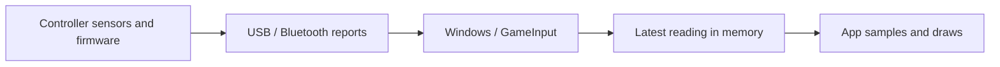

# Input latency application conversation

## User

# AGENTS.md instructions for C:\Users\k\Repository\Veehiicuul

<INSTRUCTIONS>
# Base template

## Style

For single and double quotes, only use the ASCII forms: ', "
Never use these: “, ”, ‘, ’, etc.

## Development platform compatibility

Support Windows 11 x64 as the only development platform.

## Folder and file naming

This only applies to things that we have the freedom to name as wanted.
Use CamelCase.
Use complete proper words. Don't use typical shortenings. Good: Source, Documentation. Bad: src, docs.

## External tools

You may use the tools in `%UserProfile%\Program`.
You may refer to local copies of source repos in `%UserProfile%\Repository\External`.

# PowerShell

Use modern PowerShell whose command should be `pwsh`, not legacy PowerShell.

## Git

When implementing stuff, avoid difficult-to-review "mega-commits".
When it makes sense, split large work into multiple commits to make it easier to review.
Separate commits that record conversations from other commits.

## Markdown tables

Tables in Markdown must be padded and aligned in a way to make them easy to read in a plaintext editor, not only in a Markdown viewer.

## Mathematical notation in Markdown

Any mathematical notation in Markdown files (LaTeX, KaTeX, MathJax, etc) must display properly in VSCode's Markdown previewer, GitHub.com's Markdown displayer, and the markdown viewer in the Windows 11 ChatGPT app.

## PowerShell

All PowerShell scripts must use:

- Set-StrictMode -Version Latest
- $ErrorActionPreference = 'Stop'

## Godot

When creating a Godot application:

- Use Godot 4.7.2 .NET
- Use C#
- Don't use GDScript
- Halt if you don't find a portable/self-contained install of Godot 4.7.2 .NET at `%UserProfile%\Program\Godot_v4.7.2-stable_mono_win64`
- Halt if that install of Godot doesn't have export templates installed
- Build.cmd must do all building/exporting using release configuration with optimizations fully enabled and use Godot's export via the command-line to create an EXE
- Use DirectX 12
- Keep vsync off
- Keep max fps limiter off
- Set rendering_device/vsync/swapchain_image_count=2
- Set rendering_device/fallback_to_vulkan=false
- Set rendering_device/fallback_to_opengl3=false
- Use Forward+ renderer

The Godot csproj must include this:

```xml
<PropertyGroup>
    <TargetFramework>net10.0</TargetFramework>

    <!-- Enables nullable reference annotations and warnings to catch potential null errors. -->
    <Nullable>enable</Nullable>

    <!-- Enforces the repository's configured code-style rules during builds. -->
    <EnforceCodeStyleInBuild>true</EnforceCodeStyleInBuild>

    <!--
        Required for IDE0005 to work.
        Enables the build-time IDE0005 check for unused using directives by generating XML documentation.
    -->
    <GenerateDocumentationFile>true</GenerateDocumentationFile>

    <!--
        Required in Godot .NET/C# projects.
        Prepares the C# library and its dependencies for dynamic loading by Godot.
    -->
    <EnableDynamicLoading>true</EnableDynamicLoading>

    <!--
        Required to properly export a Godot .NET/C# project using the command-line (instead of the Godot Editor export GUI).
        Prevents an idle compiler server from keeping Godot's Windows console wrapper waiting after export.
        See https://github.com/godotengine/godot/issues/110101 for more information.
    -->
    <UseSharedCompilation>false</UseSharedCompilation>
<PropertyGroup>
```

## Applications

### Running

If you create a runnable application, create files called `Build.cmd` and `Run.cmd` that respectively build and run the application when double-clicked from File Explorer.
These must be located at the root of the application's folder in the Git repo.
These must be simple wrappers for PowerShell scripts named `Build.ps1` and `Run.ps1` which contain the actual logic to minimize the amount of batch code written.
Run.cmd must exit if it doesn't discover a build of the application at the place that Build.cmd outputs to.
If the application doesn't need to be "built" for it to be run (such as a PowerShell script), then omit Build.cmd and Build.ps1.

### Logging

When creating an application, create a folder called `LogOutput` at the root of the application's folder in the git repo.
For each run of the application, a folder must be created in LogOutput and named with the current timestamp. This PowerShell code shows what the name of the folder should be:

```powershell
$logFolderPath = "$env:UserProfile\Repository\Godot\VsyncStutterTest\LogOutput\$(Get-Date -Format "yyyy-MM-dd_HH-mm-ss")"
New-Item -ItemType "Directory" -Path $logFolderPath
```

Any logs for that application session must be put in that log folder.
`LogOutput/` must be gitignored.

# Base template additions

## Conversations

Record verbatim and commit all conversations in a folder named `Conversations` located at the root of this Git repo.
Use one file per conversation.
Prefix these files with the PowerShell evaluation of `[DateTime]::UtcNow.ToString("yyyy-MM-dd_HH-mm") + "_UTC"`.
Prefix these commits with `[cnv]`.
If I attach images to prompts, save and record these in the conversation logs.
If the conversation begins with `dnr`, then do not record the conversation.

## Application compatibility

Do not attempt to maintain any sort of application compatibility between different commits of the repo. This creates unwanted complexity.

## Target platform compatibility

Support Windows 11 x64 as the only target platform.

</INSTRUCTIONS><environment_context>
  <cwd>C:\Users\k\Repository\Veehiicuul</cwd>
  <shell>powershell</shell>
  <current_date>2026-10-06</current_date>
  <timezone>America/Los_Angeles</timezone>
  <filesystem><workspace_roots><root>C:\Users\k\Repository\Veehiicuul</root><root>C:\Users\k\.codex\visualizations\2026\10\07\01a113c0-04c4-7d60-a10d-f7c838e0a332</root></workspace_roots><permission_profile type="managed"><file_system type="restricted"><entry access="read"><special>:root</special></entry><entry access="write"><path>C:\Users\k\Repository\Veehiicuul</path></entry><entry access="write"><path>C:\Users\k\.codex\visualizations\2026\10\07\01a113c0-04c4-7d60-a10d-f7c838e0a332</path></entry><entry access="write"><special>:slash_tmp</special></entry><entry access="write"><special>:tmpdir</special></entry><entry access="read"><path>C:\Users\k\Repository\Veehiicuul\.git</path></entry><entry access="read"><path>C:\Users\k\.codex\visualizations\2026\10\07\01a113c0-04c4-7d60-a10d-f7c838e0a332\.git</path></entry><entry access="read"><path>C:\Users\k\Repository\Veehiicuul\.agents</path></entry><entry access="read"><path>C:\Users\k\.codex\visualizations\2026\10\07\01a113c0-04c4-7d60-a10d-f7c838e0a332\.agents</path></entry><entry access="read"><path>C:\Users\k\Repository\Veehiicuul\.codex</path></entry><entry access="read"><path>C:\Users\k\.codex\visualizations\2026\10\07\01a113c0-04c4-7d60-a10d-f7c838e0a332\.codex</path></entry><entry access="read"><path>C:\Users\k\Repository\Veehiicuul\.aws</path></entry><entry access="read"><path>C:\Users\k\.codex\visualizations\2026\10\07\01a113c0-04c4-7d60-a10d-f7c838e0a332\.aws</path></entry></file_system></permission_profile></filesystem>
</environment_context>

## User

<external_codex_apps_open_page>{"page_id":null}</external_codex_apps_open_page>

## User

In "C:\Users\k\Repository\Veehiicuul\InputLatency_CppDx12" create a c++ and directx 12 application that measures input latency of connected mice, keyboard, and gamepads. use microsoft's gameinput api. implement it in a way to fully minimize input latency. Refer to "C:\Users\k\Repository\Veehiicuul\3dTestScene_CppDx12" for minimal input latency configuration.

## Assistant Commentary

I'll inspect the reference app's low-latency configuration, then build the GameInput measurement app with DirectX 12 and the repository's build, run, and logging conventions.

## Assistant Commentary

The reference uses one GPU frame in flight, two swap-chain buffers, a presentation queue limit of one, spin waits, and tearing with VSync off. I'll carry those settings over and sample input after the rendering waits.

The app will measure delay from GameInput's reading timestamp to detection and presentation submission. Physical switch-to-screen latency requires external measurement hardware, so the dashboard and logs will make that distinction clear.

## User

make the app wholly self-contained within C:\Users\k\Repository\Veehiicuul\InputLatency_CppDx12

## Assistant Commentary

I'll keep the source, dependencies, build output, launchers, and session logs inside `InputLatency_CppDx12`. The reference app will only guide the configuration; the new app will run independently.

## Assistant Commentary

The GameInput package supports loading its runtime beside the executable. I've staged the Microsoft binaries locally, so the app can use that copy without installing GameInput system-wide. Next I'll add the device measurements and DirectX 12 dashboard, with logging on a separate thread to keep disk writes out of the input and rendering paths.

## Assistant Commentary

The measurement path now captures reading callback timing, while the renderer polls each device for its freshest state after the GPU and presentation waits. CSV writing and percentile calculations run separately. I'll finish the window controls, then build and test the complete app.

## Assistant Commentary

The Release build and tests passed. The app rendered through DirectX 12, loaded the bundled GameInput runtime, and enumerated 11 input devices, including the connected Xbox controller.

I'm now checking the Debug build and tightening the measurement rules so cached readings, focus changes, and devices outside the visible dashboard don't produce misleading latency samples.

## Assistant Commentary

The Debug checks passed. I also added an optional GPU frame capture for verification, so I can inspect the dashboard without taking over the desktop. The final Release check is running, followed by a check that the copied executable folder can launch independently.

## Assistant Commentary

Release and Debug tests passed, and I inspected the captured dashboard. The hardware launch and an isolated copy of the executable folder also ran successfully, with no dependency on the reference app.

I'm finishing the documentation and separate commits. The automated runs were hidden, so they verified startup, device enumeration, rendering, and logging; live input measurements require using the focused window.

## Assistant Final

Created the self-contained app with bundled GameInput, DirectX 12, per-device statistics, and CSV logs.

Double-click [Build.cmd](C:/Users/k/Repository/Veehiicuul/InputLatency_CppDx12/Build.cmd), then [Run.cmd](C:/Users/k/Repository/Veehiicuul/InputLatency_CppDx12/Run.cmd).

Release/Debug tests, hardware/WARP runs, and standalone-package checks passed. Measurements cover software input timing; physical input-to-photon latency requires external hardware.

## User

the application must show visualization and data for a single controller's analog stick and trigger states.

## User

the application must show visualization and data for a single controller's analog stick and trigger states. if there are multiple gamepads detected, pick one. display the name/identifier of the controller being shown so the user knows which controller is being shown.

## Assistant Commentary

I'll add a dedicated view for one gamepad, showing both analog sticks, both triggers, their numeric values, and the selected controller's name and identifier.

## Assistant Commentary

The current dashboard only has small indicators for the left stick and triggers. I'll add a persistent panel for both sticks and both triggers, with live numeric values and the controller's full GameInput identifier. It will keep the same gamepad selected until it disconnects, then choose another connected gamepad.

## Assistant Commentary

The Release tests passed. The captured dashboard shows the selected Xbox Controller's name and full identifier, two stick diagrams with X/Y values, and two trigger bars with numeric values. The selection tests also passed, including fallback when the selected gamepad disconnects. I'm checking the Debug build next.

## Assistant Commentary

Release and Debug checks passed, including controller selection and disconnect fallback. I also verified the captured dashboard against the connected controller's readings. I'm finishing the documentation and commits.

## Assistant Final

Implemented a persistent controller panel showing one gamepad's name and full identifier, both analog sticks with X/Y values, and both triggers with numeric values.

It keeps the same gamepad selected until it disconnects, then picks another. Release and Debug tests passed.

Launch with [Run.cmd](C:/Users/k/Repository/Veehiicuul/InputLatency_CppDx12/Run.cmd).

## User

change the color scheme to grayscale, as in only colors between pure black and pure white

## Assistant Commentary

I'll change the dashboard to grayscale, keeping the controller states and latency data readable through brightness differences.

## Assistant Commentary

The rebuilt app passed all Release tests. I inspected the dashboard and checked all 1,100,800 captured pixels: every pixel has equal red, green, and blue values.

## Assistant Final

Changed the app to grayscale. Rebuilt Release, passed all tests, and verified the captured dashboard contains no colored pixels.

Launch with [Run.cmd](C:/Users/k/Repository/Veehiicuul/InputLatency_CppDx12/Run.cmd).

## User

explain how "C:\Users\k\Repository\Veehiicuul\InputLatency_CppDx12" measures input latency and how it compares to presentmon 2.6.0 ("C:\Users\k\Repository\External\PresentMon_2-6-0")

## Assistant Commentary

I'll inspect both applications' measurement paths and compare where their latency clocks start and stop.

## Assistant Commentary

The main difference is the endpoint: this app stops at the CPU's `Present` call, while PresentMon can follow a frame through to its reported display time. PresentMon's standard input metrics also cover keyboard and mouse events; this app tracks GameInput readings separately for each mouse, keyboard, and gamepad.

## Assistant Final

**InputLatency_CppDx12 measures the age of GameInput readings when your app receives, samples, and submits them for presentation. PresentMon follows frames further, through to their reported display time.** Their latency numbers therefore describe different parts of the pipeline.

Every GameInput reading has a timestamp from `IGameInputReading::GetTimestamp()`. Your app records its measurement endpoints using `IGameInput::GetCurrentTimestamp()`, keeping both ends on the same clock. Timestamps and CSV differences use microseconds; the dashboard converts them to milliseconds. Microsoft's [timestamp documentation](https://learn.microsoft.com/en-us/gaming/gdk/docs/reference/input/gameinput/interfaces/igameinputreading/methods/igameinputreading_gettimestamp) describes this comparison.

Your app calculates these metrics:

| Metric                | Calculation                                  | What it tells you                                  |
| --------------------- | -------------------------------------------- | -------------------------------------------------- |
| Callback              | Callback entry minus reading timestamp       | GameInput delivery and callback scheduling delay   |
| Sample                | Fresh poll return minus reading timestamp    | Age of the reading used by the render thread       |
| Present               | CPU Present entry minus reading timestamp    | Reading age when the app calls DXGI Present        |
| State-change interval | Current reading timestamp minus previous one | Spacing between reported input changes             |
| Present call duration | CPU Present return minus entry               | Time spent inside the Present API call             |

The calculations are in [InputMonitor.cpp](C:/Users/k/Repository/Veehiicuul/InputLatency_CppDx12/Source/InputMonitor.cpp:285). **Callback, Sample, and Present share the same starting timestamp; do not add them together.** State-change intervals also depend on your activity, so they are not measurements of USB polling frequency.

The callback records each delivered change. Independently, the renderer polls the newest reading for each device, allowing intermediate readings to be superseded. Rendering does not wait for the callback. Consequently, callback and rendering statistics can have different sample counts.

Cached initial readings establish baselines, repeated readings are deduplicated, and measurements exclude unfocused activity. Present statistics require an accepted presentation and a visualized device: either a visible latency row or the selected controller panel. Means cover the session; p95/p99 cover the latest 8192 observations.

To reduce delay, the app waits for GPU/presentation readiness **before sampling input**, then draws and submits the dashboard. It uses one GPU frame in flight, two swap-chain buffers, presentation latency one, spin waits, VSync off, tearing when available, and no FPS limit. Logging and percentile calculations run on another thread. See [Renderer.cpp](C:/Users/k/Repository/Veehiicuul/InputLatency_CppDx12/Source/Renderer.cpp:285).

PresentMon 2.6.0 observes Windows ETW events and associates input, rendering, presentation, and display events with a target process's frames. Its relevant metrics are:

| PresentMon metric       | Start                           | End                          |
| ----------------------- | ------------------------------- | ---------------------------- |
| ClickToPhotonLatency    | Associated mouse-click event    | Reported frame display time  |
| AllInputToPhotonLatency | Associated keyboard/mouse input | Reported frame display time  |
| DisplayLatency          | Frame CPU start                 | Reported frame display time  |
| MsUntilDisplayed        | Present start                   | Reported frame display time  |
| MsInPresentAPI          | Present entry                   | Present return               |
| InstrumentedLatency     | Instrumented frame start        | Reported frame display time  |

These definitions are documented in the [PresentMon 2.6.0 metric reference](https://github.com/GameTechDev/PresentMon/blob/v2.6.0/README-ConsoleApplication.md#csv-columns). `MsInPresentAPI` is the closest equivalent to your app's Present call duration. `MsUntilDisplayed` covers the later presentation-to-display portion that your app currently does not measure.

PresentMon's standard input tracking uses Windows keyboard/mouse input events and message retrieval, rather than per-device GameInput readings. Native GameInput gamepad sticks and triggers are outside that standard path. Its input-to-frame association is reconstructed from events, whereas your app directly knows which gamepad reading it draws. See the local [ETW input tracking code](C:/Users/k/Repository/External/PresentMon_2-6-0/PresentData/PresentMonTraceConsumer.cpp:1782).

Instrumented metrics require suitable application/driver markers; your app currently emits none. PresentMon's `MsPCLatency` additionally uses input/simulation markers and a smoothed input-to-frame-start estimate, so it is another distinct measurement. See [its calculation](C:/Users/k/Repository/External/PresentMon_2-6-0/IntelPresentMon/CommonUtilities/mc/MetricsCalculatorInstrumented.cpp:130).

**Neither your app's Present value nor ordinary PresentMon "photon" metrics directly measure physical switch-to-visible-pixel latency.** Your app stops before display tracking; ordinary PresentMon uses reported display events, without observing actual panel light output. PresentMon also supports optional hardware-measured data when separate measurement equipment is supplied.

Use your app to inspect GameInput delivery and reading freshness per device. Use PresentMon to examine a target application's frame and display pipeline. Comparing their averages directly can mislead because their starting timestamps, endpoints, input selection, and treatment of undisplayed frames differ. Your app's lightweight dashboard also represents its own workload, rather than the latency of a heavier game.

## User

explain how InputLatency_CppDx12 gets the state of the gamepad analog sticks and triggers. for example, when the game wants the state of the left stick, does it send a signal to the gamepad hardware and then receive the latest state from the gamepad hardware? or does it receive some kind of cached that is "out-of-date" by some duration?

## Assistant Commentary

I'll check the app's polling call and GameInput's documentation to explain where the stick and trigger values come from and how fresh they are.

## Assistant Commentary

GameInput returns the most recent reading already in memory. The app fetches it late in each rendered frame, but that fetch does not make the controller produce a new report. An unchanged reading can also remain valid while you hold a stick steady.

## Assistant Final

**It reads the latest cached GameInput snapshot. Requesting the left stick does not send a new query to the gamepad hardware or wait for a hardware reply.** The snapshot can therefore lag behind the physical stick position by a variable amount.

The flow is approximately:



Hardware reports arrive independently of the game's state-fetch calls. For USB interrupt endpoints, hardware communication involves a scheduled polling interval; that bus-level polling is separate from the game calling GameInput. See Microsoft's [USB polling interval documentation](https://learn.microsoft.com/en-us/windows-hardware/drivers/ddi/usbspec/ns-usbspec-_usb_endpoint_descriptor).

In your app, [SampleLatest](C:/Users/k/Repository/Veehiicuul/InputLatency_CppDx12/Source/InputMonitor.cpp:153) does two things:

1. `GetCurrentReading(GameInputKindGamepad, device, ...)` gets the newest available reading for that particular gamepad.
2. `reading->GetGamepadState(...)` copies the stick, trigger, and button values from that reading into a `GameInputGamepadState` structure.

Both sticks and both triggers come from the same snapshot. There is no separate hardware request for each axis. Microsoft describes reading acquisition as a lightweight memory operation without kernel transitions, and the state representations as precomputed data. See [GameInput readings](https://learn.microsoft.com/en-us/gaming/gdk/docs/features/common/input/overviews/input-readings).

**"Latest available" does not mean "measured at the exact instant the game asks."** Its freshness depends on when the controller samples its sensors, when a report travels over USB/Bluetooth, and when Windows/GameInput processes it. For example, a hypothetical controller reporting every 4 ms could have a movement occur just after a report, leaving almost 4 ms before the next report opportunity, plus processing delays. That is an illustration, not a measurement of your controller.

Calling `GetCurrentReading` more frequently can pick up newly available readings sooner; it does not make the controller generate reports more frequently. An acquired reading is a snapshot: keeping that reading object and calling `GetGamepadState` again retrieves that snapshot's values. Fetching the newest snapshot requires another `GetCurrentReading` call. See the [API documentation](https://learn.microsoft.com/en-us/gaming/gdk/docs/reference/input/gameinput/interfaces/igameinput/methods/igameinput_getcurrentreading).

Your app fetches the latest reading once per rendered frame, **after the GPU and presentation waits**, immediately before constructing the live controller visuals. This reduces the time that a fetched snapshot sits around before submission. See [Renderer.cpp](C:/Users/k/Repository/Veehiicuul/InputLatency_CppDx12/Source/Renderer.cpp:489).

The app's Sample measurement is:

`GameInput timestamp immediately after fetching - reading's GameInput timestamp`

That measures reading age relative to GameInput's clock. It cannot establish the full time since the physical stick moved, because the app has no independently measured timestamp for that movement.

Finally, **an older snapshot is not automatically incorrect**. If you hold the stick steady and no newer reading is available, the existing values may still describe it correctly. The app retains those values but does not repeatedly count the same reading as a new latency observation.
