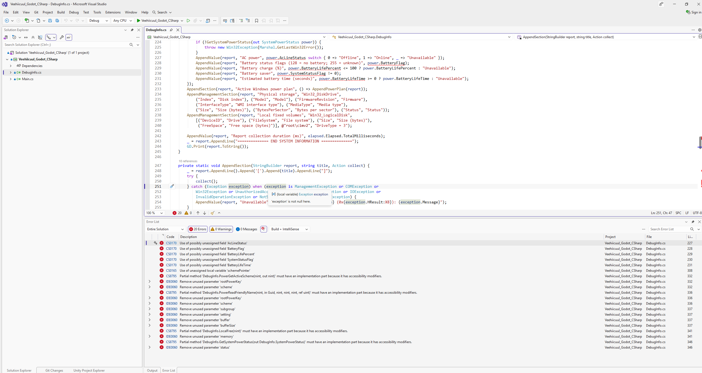
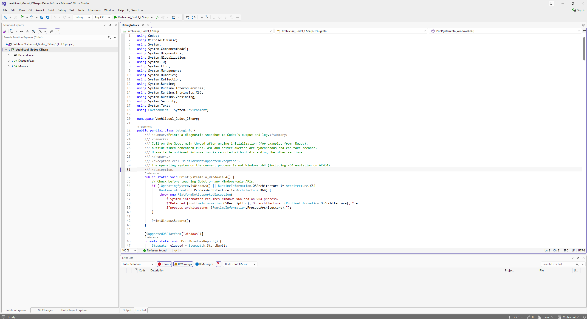
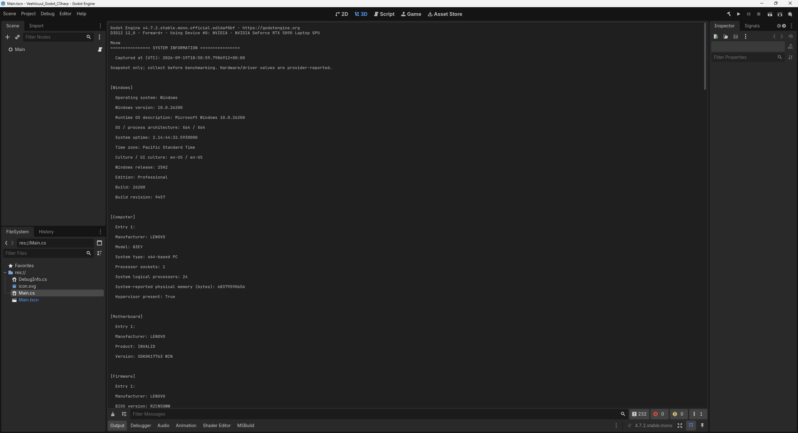

# Windows System Information

## User

```
Lines and columns are 1-based. Columns are StartInclusive:EndExclusive. Columns count UTF-16 code units.
c:\Users\k\Repository\Veehiicuul\Veehiicuul_Godot_CSharp\DebugInfo.cs:6:1-8:6
```

implement this method. it should print out a comprehensive report on the current system's info to aid in potential debugging and performance benchmarking. it should throw if it's not running on windows x64.

## Assistant Commentary

I’ll inspect the method and the project’s logging setup, then add a Windows x64 system report with useful debugging and benchmarking details.

## Assistant Commentary

I’ll include Windows and firmware versions, CPU and memory details, graphics drivers, storage, power settings, displays, and the current Godot/.NET configuration. Unavailable hardware details will be marked in the report; unsupported operating systems or architectures will throw immediately.

## Assistant Commentary

The report is implemented. I’m checking it against this project’s Godot version and running it in both headless mode and with a graphics renderer to verify the output and unavailable-data handling.

## Assistant Commentary

The report now runs successfully on your machine, and the failure test confirms that one unavailable hardware query doesn’t stop the rest. Testing also caught a power-plan query that Windows wouldn’t provide through WMI, so I switched that section to the native Windows API. I’m finishing the graphics and architecture checks.

## Assistant Commentary

The checks passed: Debug and release builds, headless and Direct3D runs, recovery from failed hardware queries, and rejection of a 32-bit process. I’m committing the implementation and recording this conversation separately, as required by the repository instructions.

## Assistant

Implemented in [DebugInfo.cs](C:/Users/k/Repository/Veehiicuul/Veehiicuul_Godot_CSharp/DebugInfo.cs). It prints hardware, Windows, drivers, displays, power, Godot, and .NET diagnostics via `GD.Print`, and throws `PlatformNotSupportedException` unless both Windows and the process are x64.

Call it from `_Ready()` before benchmarking; collection is synchronous.

Verified: Debug/ExportRelease builds, headless and Direct3D runs, unavailable-query recovery, and x86 rejection.

## User

```
Lines and columns are 1-based. Columns are StartInclusive:EndExclusive. Columns count UTF-16 code units.
c:\Users\k\Repository\Veehiicuul\Veehiicuul_Godot_CSharp\DebugInfo.cs:22:1-22:33
```

why is this a partial class?

## Assistant Commentary

I’ll check which generated code requires `DebugInfo` to be partial.

## Assistant

I made it `partial` because its Windows API calls use **`[LibraryImport]` source generation**.

For example, [PowerGetActiveScheme](C:/Users/k/Repository/Veehiicuul/Veehiicuul_Godot_CSharp/DebugInfo.cs:330) is declared as a `partial` method without a body. During compilation, .NET generates that body in another `partial` declaration of `DebugInfo`. The compiler combines both declarations into one class. [Microsoft documentation](https://learn.microsoft.com/en-us/dotnet/standard/native-interop/pinvoke-source-generation)

**Removing `partial` would break the build**, because the generator needs to extend the class to implement those methods.

## User

what are all of these errors? why didn't these break the build when you did your validation? are you able to see all of these errors with the build workflow you use?

Attached image: `C:/Users/k/AppData/Local/Temp/codex-clipboard-433868bc-287d-413d-9b7f-ac57d9c99d8b.png`



## Assistant Commentary

I’ll check the errors in your screenshot against a fresh build and compare the .NET SDK with Visual Studio’s build tools to find out why they disagree.

## Assistant Commentary

A fresh rebuild still passes, and I confirmed that it generates all four Windows API method implementations. The screenshot’s errors appear to stem from those implementations being missing from Visual Studio’s live analysis. I’m checking that distinction; I haven’t yet established why the editor isn’t seeing them.

## Assistant

**These appear to be cascading errors caused by Visual Studio’s live analysis missing the generated Windows API implementations.** My build workflow does **not** automatically read Visual Studio’s live Error List.

The 20 entries in your screenshot break down as follows:

| Diagnostic          | Count | Meaning in this case                                                                    |
| ------------------- | ----- | --------------------------------------------------------------------------------------- |
| `CS8795`            | 4     | The four `partial` Windows API methods appear to have no implementations.               |
| `CS0170` / `CS0165` | 6     | Consequently, the analysis considers the power-status fields and pointer uninitialized. |
| `IDE0060`           | 10    | Parameters appear unused; repository rules promote this diagnostic to an error.         |

**Why validation passed:** I just forced fresh builds using both the .NET SDK compiler and your installed Visual Studio compiler. Both passed. I also inspected the [generated code](C:/Users/k/Repository/Veehiicuul/Veehiicuul_Godot_CSharp/.godot/SystemInfoDiagnosticInvestigation/VisualStudioGenerated/Microsoft.Interop.LibraryImportGenerator/Microsoft.Interop.LibraryImportGenerator/LibraryImports.g.cs), which contains all four implementations. If those compiler errors occurred during these builds, they would fail.

Your screenshot has **Build + IntelliSense** selected, which combines build diagnostics with the editor’s separate live analysis. [Microsoft documentation](https://learn.microsoft.com/en-us/visualstudio/ide/reference/error-list-window?view=vs-2022)

**What my workflow can see:** compiler errors and the analyzers enabled during the build. It cannot guarantee that the running editor has no additional or stale diagnostics. My earlier validation did not check that editor state.

To narrow this down, switch the Error List filter to **Build** and rebuild, then switch to **IntelliSense**. Reloading the solution is a reasonable next step if the errors occur only under IntelliSense. The exact reason its generated-code state is missing or stale remains unconfirmed.

## User

i closed and reopened visual studio, and i no longer see errors.
make a note of this for future reference.

Attached image: `C:/Users/k/AppData/Local/Temp/codex-clipboard-6797961c-983f-4c50-b691-8c91933b26fb.png`



## Assistant Commentary

I’ll add a troubleshooting note for future reference and save your confirmation and screenshot in the conversation log.

## Assistant

Recorded in [AGENTS.md](C:/Users/k/Repository/Veehiicuul/AGENTS.md): restarting Visual Studio cleared the source-generation errors despite builds already passing.

Your confirmation and screenshot are also saved in the conversation log. Both updates are committed.

## User

why is does the system info output look "double-spaced" in the godot output window

Attached image: `C:/Users/k/AppData/Local/Temp/codex-clipboard-76c5ea69-02ad-4c79-b041-464246bafb17.png`



## Assistant Commentary

I’ll check how the report’s line endings pass through Godot’s Output panel to find what’s adding the extra spacing.

## Assistant Commentary

I reproduced the extra spacing. `AppendLine()` adds Windows-style `\r\n` endings, but Godot’s Output panel splits on `\n` and leaves the `\r` behind. Its text renderer treats that leftover character as another line break.

## Assistant

It’s a **line-ending mismatch caused by my use of `StringBuilder.AppendLine()`**.

- On Windows, `AppendLine()` adds `\r\n` (carriage return + line feed). [Microsoft documentation](https://learn.microsoft.com/en-us/dotnet/api/system.text.stringbuilder.appendline)
- Godot’s Output panel splits the text on `\n`, leaving the `\r` attached to each line.
- The text renderer interprets that leftover `\r` as another line break, producing the extra spacing.

I reproduced this behavior in Godot 4.7.2.

The fix is to normalize the report to `\n` before printing:

```csharp
GD.Print(report.ToString().ReplaceLineEndings("\n").TrimEnd('\n'));
```

This also removes the trailing newline that `GD.Print` already supplies, while preserving intentional blank lines between sections.

## User

can StringBuilder.AppendLine() be changed to use \n instead or \r\n

## Assistant Commentary

I’ll check whether `AppendLine()` exposes a newline setting and record the answer in the conversation log.

## Assistant

**There’s no built-in setting for that.** `AppendLine()` uses `Environment.NewLine`, which is read-only and equals `"\r\n"` on Windows. [Microsoft documentation](https://learn.microsoft.com/en-us/dotnet/api/system.environment.newline?view=net-10.0)

Use `Append('\n')` explicitly instead:

```csharp
_ = report.Append("Some text").Append('\n');
_ = report.Append('\n'); // Blank line.
```

For this report, that would generate LF endings directly and avoid needing the final newline conversion.
