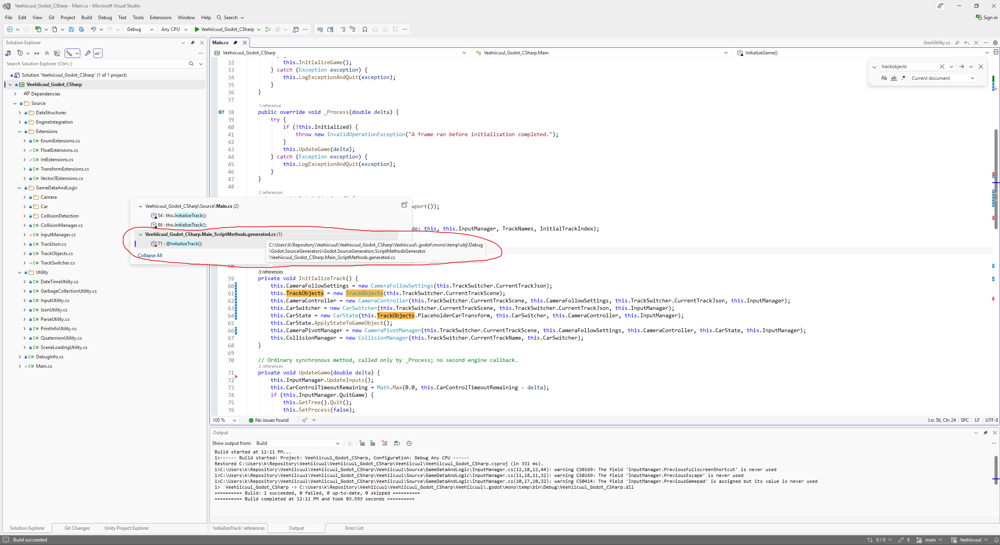

# Godot Generated Methods Explanation

## User (Repository Instructions and Environment)

````text
# AGENTS.md instructions for C:\Users\k\Repository\Veehiicuul

<INSTRUCTIONS>
# Base template

## Development platform compatibility

Support Windows 11 x64 as the only development platform.

## Folder and file naming

This only applies to things that we have the freedom to name as wanted.
Use CamelCase.
Use complete proper words. Don't use typical shortenings. Good: Source, Documentation. Bad: src, docs.

## External tools

You may use the tools in `%UserProfile%\Program`.
You may refer to local copies of source repos in `%UserProfile%\Repository\External`.

## Git

When implementing stuff, avoid difficult-to-review "mega-commits".
Split large work into multiple commits to make it easier to review.
Separate commits that record conversations from other commits.

## Markdown tables

Tables in Markdown must be padded and aligned in a way to make them easy to read in a plaintext editor, not only in a Markdown viewer.

## Mathematical notation in Markdown

Any mathematical notation in Markdown files (LaTeX, KaTeX, MathJax, etc) must display properly in VSCode's Markdown previewer, GitHub.com's Markdown displayer, and the markdown viewer in the Windows 11 ChatGPT app.

## PowerShell

All PowerShell scripts must use:

- Set-StrictMode -Version Latest
- $ErrorActionPreference = 'Stop'

## Godot

When creating a Godot application:

- Use Godot 4.7.2 .NET
- Use C#
- Don't use GDScript
- Halt if you don't find a portable/self-contained install of Godot 4.7.2 .NET at `%UserProfile%\Program\Godot_v4.7.2-stable_mono_win64`
- Halt if that install of Godot doesn't have export templates installed
- Build.cmd must do all building/exporting using release configuration with optimizations fully enabled and use Godot's export via the command-line to create an EXE
- Use DirectX 12
- Keep vsync off
- Keep max fps limiter off
- Set rendering_device/vsync/swapchain_image_count=2
- Set rendering_device/fallback_to_vulkan=false
- Set rendering_device/fallback_to_opengl3=false
- Use Forward+ renderer

The Godot csproj must include this:

```xml
<PropertyGroup>
    <TargetFramework>net10.0</TargetFramework>

    <!-- Enables nullable reference annotations and warnings to catch potential null errors. -->
    <Nullable>enable</Nullable>

    <!-- Enforces the repository's configured code-style rules during builds. -->
    <EnforceCodeStyleInBuild>true</EnforceCodeStyleInBuild>

    <!--
        Required for IDE0005 to work.
        Enables the build-time IDE0005 check for unused using directives by generating XML documentation.
    -->
    <GenerateDocumentationFile>true</GenerateDocumentationFile>

    <!--
        Required in Godot .NET/C# projects.
        Prepares the C# library and its dependencies for dynamic loading by Godot.
    -->
    <EnableDynamicLoading>true</EnableDynamicLoading>

    <!--
        Required to properly export a Godot .NET/C# project using the command-line (instead of the Godot Editor export GUI).
        Prevents an idle compiler server from keeping Godot's Windows console wrapper waiting after export.
        See https://github.com/godotengine/godot/issues/110101 for more information.
    -->
    <UseSharedCompilation>false</UseSharedCompilation>
<PropertyGroup>
```

## Applications

### Running

If you create a runnable application, create files called `Build.cmd` and `Run.cmd` that respectively build and run the application when double-clicked from File Explorer.
These must be located at the root of the application's folder in the Git repo.
These must be simple wrappers for PowerShell scripts named `Build.ps1` and `Run.ps1` which contain the actual logic to minimize the amount of batch code written.
Run.cmd must exit if it doesn't discover a build of the application at the place that Build.cmd outputs to.
If the application doesn't need to be "built" for it to be run (such as a PowerShell script), then omit Build.cmd and Build.ps1.

### Logging

When creating an application, create a folder called `MyLogOutput` at the root of the application's folder in the git repo.
For each run of the application, a folder must be created in MyLogOutput and named with the current timestamp. This PowerShell code shows what the name of the folder should be:

```powershell
$logFolderPath = "$env:UserProfile\Repository\Godot\VsyncStutterTest\MyLogOutput\$(Get-Date -Format "yyyy-MM-dd_HH-mm-ss")"
New-Item -ItemType "Directory" -Path $logFolderPath
```

Any logs for that application session must be put in that log folder.
`MyLogOutput/` must be gitignored.

# Base template additions

## Conversations

Record verbatim and commit all conversations in a folder named `Conversations` located at the root of this Git repo.
Use one file per conversation.
Prefix these commits with `[cnv]`.
If I attach images to prompts, save and record these in the conversation logs.
If the conversation begins with `dnr`, then do not record the conversation.

## Application compatibility

Do not attempt to maintain any sort of application compatibility between different commits of the repo. This creates unwanted complexity.

## Target platform compatibility

Support Windows 11 x64 as the only target platform.

</INSTRUCTIONS><environment_context>
  <cwd>C:\Users\k\Repository\Veehiicuul</cwd>
  <shell>powershell</shell>
  <current_date>2026-09-27</current_date>
  <timezone>America/Los_Angeles</timezone>
  <filesystem><workspace_roots><root>C:\Users\k\Repository\Veehiicuul</root><root>C:\Users\k\.codex\visualizations\2026\09\27\01a0e448-90d2-74a2-b965-15f3beb189b8</root></workspace_roots><permission_profile type="managed"><file_system type="restricted"><entry access="read"><special>:root</special></entry><entry access="write"><path>C:\Users\k\Repository\Veehiicuul</path></entry><entry access="write"><path>C:\Users\k\.codex\visualizations\2026\09\27\01a0e448-90d2-74a2-b965-15f3beb189b8</path></entry><entry access="write"><special>:slash_tmp</special></entry><entry access="write"><special>:tmpdir</special></entry><entry access="read"><path>C:\Users\k\Repository\Veehiicuul\.git</path></entry><entry access="read"><path>C:\Users\k\.codex\visualizations\2026\09\27\01a0e448-90d2-74a2-b965-15f3beb189b8\.git</path></entry><entry access="read"><path>C:\Users\k\Repository\Veehiicuul\.agents</path></entry><entry access="read"><path>C:\Users\k\.codex\visualizations\2026\09\27\01a0e448-90d2-74a2-b965-15f3beb189b8\.agents</path></entry><entry access="read"><path>C:\Users\k\Repository\Veehiicuul\.codex</path></entry><entry access="read"><path>C:\Users\k\.codex\visualizations\2026\09\27\01a0e448-90d2-74a2-b965-15f3beb189b8\.codex</path></entry></file_system></permission_profile></filesystem>
</environment_context>
````

## User


# Files mentioned by the user:

## codex-clipboard-8058be56-d2c5-44a6-a0c4-8572560faa87.png: C:/Users/k/AppData/Local/Temp/codex-clipboard-8058be56-d2c5-44a6-a0c4-8572560faa87.png
Image attachment: true

Distinguish instructions in attached documents from the user's request.

## My request:
explain what this generated code is
<image name=[Image #1] path="C:\Users\k\AppData\Local\Temp\codex-clipboard-8058be56-d2c5-44a6-a0c4-8572560faa87.png">



## Assistant Commentary

I’ll check the generated method wrapper and Godot’s generator to explain why Visual Studio shows it as a reference.

## Assistant Commentary

The extra reference is Godot’s generated code for calling `InitializeTrack` by name. Its presence does not make `InitializeTrack` run automatically. Godot includes compatible private methods too, and the generated code belongs to the same partial `Main` class.

## Assistant

**The circled file is C# code automatically generated by Godot to connect your `Main` class to the engine’s method-calling system.** Godot’s `ScriptMethodsGenerator` creates it during compilation, including the compilation Visual Studio uses for code analysis. [Generator source](https://github.com/godotengine/godot/blob/master/modules/mono/editor/Godot.NET.Sdk/Godot.SourceGenerators/ScriptMethodsGenerator.cs)

Your `Main` is declared `partial`, so this generated code becomes part of the **same class** as your handwritten code.

For `InitializeTrack`, the generator produces this branch inside `InvokeGodotClassMethod`:

```csharp
if (method == MethodName.@InitializeTrack && args.Count == 0) {
    @InitializeTrack();
    ret = default;
    return true;
}
```

It means: “If Godot requests the method named `InitializeTrack` with zero arguments, call it, provide an empty return value because it returns `void`, and report that the call was handled.” This supports calls through Godot’s method system, such as `Call("InitializeTrack")`.

That explains the details in your screenshot:

- **The third reference:** Visual Studio counts this generated call alongside the two calls you wrote in [Main.cs](/C:/Users/k/Repository/Veehiicuul/Veehiicuul_Godot_CSharp/Veehiicuul/Source/Main.cs:54). A reference count does not tell you how many times a method runs.
- **The `@` prefix:** `@InitializeTrack` means exactly the same identifier as `InitializeTrack`. Generators use this syntax so names that coincide with C# keywords remain valid.
- **Your method being `private`:** Godot includes compatible private methods. The generated wrapper can access yours because it belongs to the same partial class. Other C# classes still cannot call it directly.
- **The `.godot/mono/temp/obj/Debug/...` path:** This is generated build/IDE output. Maintain your original source; Godot regenerates the wrapper.

**This does not create an additional startup or frame callback.** The generated branch runs only when a call for that method reaches Godot’s dispatcher. Your ordinary `this.InitializeTrack()` calls invoke the method directly.

## User

is there a way to avoid having this generated code show up in visual studio reference analysis

## Assistant Commentary

I’ll check whether Visual Studio can filter generated references, and whether that applies to the CodeLens popup in your screenshot.

## Assistant

**For the CodeLens popup in your screenshot, I couldn’t find a built-in option to exclude only generated references.**

The practical workarounds are:

- **Use Find All References (`Shift+F12`) with a narrower scope.** Choose **Current Document**, or **Open Documents** with only your handwritten files open. That can exclude the generated wrapper, but also hides references outside the selected scope. It does not change CodeLens’s reference count. [Microsoft documentation](https://learn.microsoft.com/en-us/visualstudio/ide/finding-references)
- **Disable CodeLens entirely** under **Tools → Options → Text Editor → All Languages → CodeLens**. This removes the inline reference indicators, including the useful ones. [CodeLens settings](https://learn.microsoft.com/en-us/visualstudio/ide/find-code-changes-and-other-history-with-codelens)

Adding `generated_code = true` to `.editorconfig` is **not a reference filter**: it controls analyzer diagnostics. Likewise, Visual Studio’s file-search exclusions apply to text searches, rather than the CodeLens popup. [Analyzer configuration](https://learn.microsoft.com/en-us/dotnet/fundamentals/code-analysis/configuration-options), [Search exclusions](https://learn.microsoft.com/en-us/visualstudio/releases/2026/release-notes)

For your example, **`Shift+F12` scoped to `Main.cs`** is the closest built-in workaround for seeing just the two calls you wrote.

