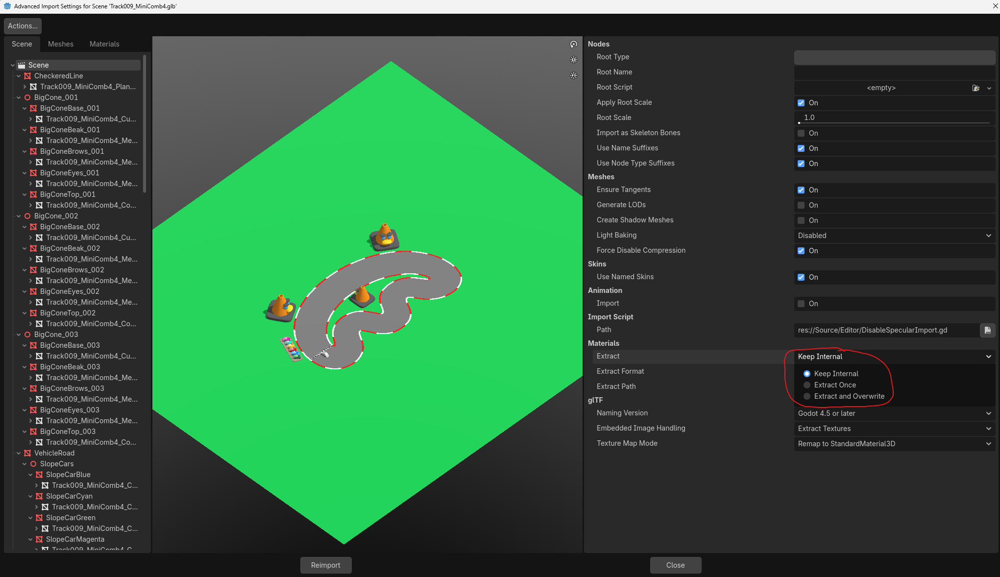

# Godot material extraction investigation

## User — repository instructions and supplied environment

# AGENTS.md instructions for C:\Users\k\Repository\Veehiicuul

<INSTRUCTIONS>
# Base template

## Development platform compatibility

Support Windows 11 x64 as the only development platform.

## Folder and file naming

This only applies to things that we have the freedom to name as wanted.
Use CamelCase.
Use complete proper words. Don't use typical shortenings. Good: Source, Documentation. Bad: src, docs.

## External tools

You may use the tools in `%UserProfile%\Program`.
You may refer to local copies of source repos in `%UserProfile%\Repository\External`.

## Git

When implementing stuff, avoid difficult-to-review "mega-commits".
Split large work into multiple commits to make it easier to review.
Separate commits that record conversations from other commits.

## Markdown tables

Tables in Markdown must be padded and aligned in a way to make them easy to read in a plaintext editor, not only in a Markdown viewer.

## Mathematical notation in Markdown

Any mathematical notation in Markdown files (LaTeX, KaTeX, MathJax, etc) must display properly in VSCode's Markdown previewer, GitHub.com's Markdown displayer, and the markdown viewer in the Windows 11 ChatGPT app.

## PowerShell

All PowerShell scripts must use:

- Set-StrictMode -Version Latest
- $ErrorActionPreference = 'Stop'

## Godot

When creating a Godot application:

- Use Godot 4.7.2 .NET
- Use C#
- Don't use GDScript
- Halt if you don't find a portable/self-contained install of Godot 4.7.2 .NET at `%UserProfile%\Program\Godot_v4.7.2-stable_mono_win64`
- Halt if that install of Godot doesn't have export templates installed
- Build.cmd must do all building/exporting using release configuration with optimizations fully enabled and use Godot's export via the command-line to create an EXE
- Use DirectX 12
- Keep vsync off
- Keep max fps limiter off
- Set rendering_device/vsync/swapchain_image_count=2
- Set rendering_device/fallback_to_vulkan=false
- Set rendering_device/fallback_to_opengl3=false
- Use Forward+ renderer

The Godot csproj must include this:

```xml
<PropertyGroup>
    <TargetFramework>net10.0</TargetFramework>

    <!-- Enables nullable reference annotations and warnings to catch potential null errors. -->
    <Nullable>enable</Nullable>

    <!-- Enforces the repository's configured code-style rules during builds. -->
    <EnforceCodeStyleInBuild>true</EnforceCodeStyleInBuild>

    <!--
        Required for IDE0005 to work.
        Enables the build-time IDE0005 check for unused using directives by generating XML documentation.
    -->
    <GenerateDocumentationFile>true</GenerateDocumentationFile>

    <!--
        Required in Godot .NET/C# projects.
        Prepares the C# library and its dependencies for dynamic loading by Godot.
    -->
    <EnableDynamicLoading>true</EnableDynamicLoading>

    <!--
        Required to properly export a Godot .NET/C# project using the command-line (instead of the Godot Editor export GUI).
        Prevents an idle compiler server from keeping Godot's Windows console wrapper waiting after export.
        See https://github.com/godotengine/godot/issues/110101 for more information.
    -->
    <UseSharedCompilation>false</UseSharedCompilation>
<PropertyGroup>
```

## Applications

### Running

If you create a runnable application, create files called `Build.cmd` and `Run.cmd` that respectively build and run the application when double-clicked from File Explorer.
These must be located at the root of the application's folder in the Git repo.
These must be simple wrappers for PowerShell scripts named `Build.ps1` and `Run.ps1` which contain the actual logic to minimize the amount of batch code written.
Run.cmd must exit if it doesn't discover a build of the application at the place that Build.cmd outputs to.
If the application doesn't need to be "built" for it to be run (such as a PowerShell script), then omit Build.cmd and Build.ps1.

### Logging

When creating an application, create a folder called `MyLogOutput` at the root of the application's folder in the git repo.
For each run of the application, a folder must be created in MyLogOutput and named with the current timestamp. This PowerShell code shows what the name of the folder should be:

```powershell
$logFolderPath = "$env:UserProfile\Repository\Godot\VsyncStutterTest\MyLogOutput\$(Get-Date -Format "yyyy-MM-dd_HH-mm-ss")"
New-Item -ItemType "Directory" -Path $logFolderPath
```

Any logs for that application session must be put in that log folder.
`MyLogOutput/` must be gitignored.

# Base template additions

## Conversations

Record verbatim and commit all conversations in a folder named `Conversations` located at the root of this Git repo.
Use one file per conversation.
Prefix these commits with `[cnv]`.
If I attach images to prompts, save and record these in the conversation logs.
If the conversation begins with `dnr`, then do not record the conversation.

## Application compatibility

Do not attempt to maintain any sort of application compatibility between different commits of the repo. This creates unwanted complexity.

## Target platform compatibility

Support Windows 11 x64 as the only target platform.

</INSTRUCTIONS><environment_context>
  <cwd>C:\Users\k\Repository\Veehiicuul</cwd>
  <shell>powershell</shell>
  <current_date>2026-09-25</current_date>
  <timezone>America/Los_Angeles</timezone>
  <filesystem><workspace_roots><root>C:\Users\k\Repository\Veehiicuul</root><root>C:\Users\k\.codex\visualizations\2026\09\26\01a0db86-25b9-7cb1-9e43-087627a9f445</root></workspace_roots><permission_profile type="managed"><file_system type="restricted"><entry access="read"><special>:root</special></entry><entry access="write"><path>C:\Users\k\Repository\Veehiicuul</path></entry><entry access="write"><path>C:\Users\k\.codex\visualizations\2026\09\26\01a0db86-25b9-7cb1-9e43-087627a9f445</path></entry><entry access="write"><special>:slash_tmp</special></entry><entry access="write"><special>:tmpdir</special></entry><entry access="read"><path>C:\Users\k\Repository\Veehiicuul\.git</path></entry><entry access="read"><path>C:\Users\k\.codex\visualizations\2026\09\26\01a0db86-25b9-7cb1-9e43-087627a9f445\.git</path></entry><entry access="read"><path>C:\Users\k\Repository\Veehiicuul\.agents</path></entry><entry access="read"><path>C:\Users\k\.codex\visualizations\2026\09\26\01a0db86-25b9-7cb1-9e43-087627a9f445\.agents</path></entry><entry access="read"><path>C:\Users\k\Repository\Veehiicuul\.codex</path></entry><entry access="read"><path>C:\Users\k\.codex\visualizations\2026\09\26\01a0db86-25b9-7cb1-9e43-087627a9f445\.codex</path></entry></file_system></permission_profile></filesystem>
</environment_context>

## User


# Files mentioned by the user:

## codex-clipboard-9c302a76-9e57-43e4-8d18-dc7aeede529a.png: C:/Users/k/AppData/Local/Temp/codex-clipboard-9c302a76-9e57-43e4-8d18-dc7aeede529a.png
Image attachment: true

Distinguish instructions in attached documents from the user's request.

## My request:
i am observing some strange and inconsistent behavior when using the "Extract Once" and "Extract and Overwrite" import settings. when i use either of those settings, i observe that some (not all) of the resulting extracted materials don't consistently have `material.metallic_specular = 0.0`.

i don't want to dive too deep into this rabbit hole myself right now, so investigate and see if you can figure out what's going on. make use of the source code at "C:\Users\k\Repository\External\Godot_4-7-2" in your investigation.

<image name=[Image #1] path="C:\Users\k\AppData\Local\Temp\codex-clipboard-9c302a76-9e57-43e4-8d18-dc7aeede529a.png">



</image>

## Assistant Commentary

I’ll trace when Godot extracts and saves materials relative to your import script, then check what could make the result differ between materials and reimports.

## Assistant Commentary

I found an ordering issue: Godot writes the extracted material files before running your script. The script then changes the loaded materials without saving those files again. I’m checking how that interacts with caching, since it could explain why some materials appear correct while others don’t.

## Assistant Commentary

The first tests confirm the mismatch in both extraction modes: all 39 materials are `0.0` in memory after your script runs, but all 39 extracted files reload as `0.5`. I’m now testing reimports and retained material references to pin down the “some, not all” behavior.

## Assistant Commentary

I reproduced the mixed result: retaining a reference to one material across import left that material at `0.0`, while the other 38 loaded from disk as `0.5`. A fresh process loaded all 39 as `0.5`; Keep Internal preserved all 39 at `0.0`. That ties the inconsistency to unsaved changes and resource lifetimes. I’m checking the smallest fix in the disposable copies and recording the findings.

## Assistant Commentary

Explicitly saving the external materials after setting specular passed in both modes: all 39 stayed at `0.0` after a fresh reload. I’ve documented the source trace and tests. The application code is unchanged; one fix-policy choice is whether the script should enforce zero even on materials you’ve manually edited under Extract Once.

## Assistant

**I found the cause: Godot saves the extracted materials before your import script runs.** The script changes their specular value in memory but never saves those external files again.

In your Godot 4.7.2 source, the sequence is:

1. [Extract and save materials](C:/Users/k/Repository/External/Godot_4-7-2/editor/import/3d/resource_importer_scene.cpp:1667).
2. [Run your import script](C:/Users/k/Repository/External/Godot_4-7-2/editor/import/3d/resource_importer_scene.cpp:3435), setting specular to `0.0`.
3. Save the imported scene. External materials remain file references; their modified values aren’t saved with the scene.

**That also explains the “some, not all” behavior.** Materials still held in memory can show `0.0`, while materials loaded from disk show `0.5`. In disposable copies of your project, I reproduced exactly that: one retained material stayed at `0.0`, and the other 38 loaded as `0.5`. A fresh process loaded all 39 as `0.5` with either extraction mode. Keep Internal preserved all 39 at `0.0`.

The two extraction options affect what persists:

- **Extract Once:** keeps existing material files, including any mixture of previously saved values.
- **Extract and Overwrite:** rewrites them before your script runs, so the script’s changes still don’t reach disk.

The smallest fix is to **explicitly save each distinct external material after setting specular**. I tested this in both modes: all 39 then remained `0.0` after a fresh reload. That would also enforce zero on manually edited external materials, including under Extract Once.

I left the application unchanged and recorded the [source trace and test results](C:/Users/k/Repository/Veehiicuul/Documentation/GodotMaterialExtraction.md).

## User

does this bug or any other impactful issues manifest with "extract = keep internal"

## Assistant Commentary

I’ll check the Keep Internal path for this persistence bug and for cases where the script might miss a material or change it too late to be saved.

## Assistant Commentary

Your current Keep Internal setup still looks sound, but I confirmed two exceptions: a material’s “Use External” setting can retain the bug, and a mesh’s “Save to File” setting can lose the specular changes even when its materials are internal. Neither is enabled in your track. I also found that the Advanced Import Settings preview bypasses your post-import script, so it can look different from the saved scene.

## Assistant

**With your current settings, this bug does not occur.** Keep Internal preserves all 39 materials at `metallic_specular = 0.0`, including after loading the scene in a fresh process.

However, I confirmed two settings that can reintroduce it even with **Keep Internal** selected:

- **A material’s “Use External” override.** This operates independently of the extraction dropdown. Testing one external material produced 38 correct materials and one reverting to `0.5`.
- **A mesh’s “Save to File” option.** Godot saves that mesh—including its embedded materials—before your script runs. Testing this on the checkered-line mesh produced 37 correct materials and two reverting to `0.5`. [Mesh-saving code](C:/Users/k/Repository/External/Godot_4-7-2/editor/import/3d/resource_importer_scene.cpp:2857)

**Neither exception is enabled in your current track:** its `_subresources={}` contains no such overrides.

There is also a **preview limitation**: the Advanced Import Settings dialog uses a preliminary import that does **not** execute your post-import script. Its preview can therefore show specular even when the saved scene correctly has zero. [Preview import code](C:/Users/k/Repository/External/Godot_4-7-2/editor/import/3d/resource_importer_scene.cpp:3092)

I found no additional persistence issue affecting your current material-import setup. I added these findings to the [investigation report](C:/Users/k/Repository/Veehiicuul/Documentation/GodotMaterialExtraction.md).
