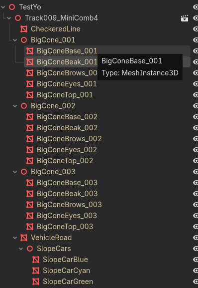

# Inspect track mesh materials

## User

C:/Users/k/Repository/Veehiicuul/Veehiicuul_Godot_CSharp/Testyo/Track009_MiniComb4.glb

given that i have this GLB model in a godot scene and i can view it in the godot scene editor, how do i inspect the materials/shaders for each mesh?

## Assistant

I’ll check the project’s Godot setup and the relevant documentation so the steps match your scene.

## Assistant

**Select the mesh node, then inspect the material inside its Mesh resource.** An empty override slot does not mean the mesh has no material.

1. In the **Scene** tree, right-click your `Track009_MiniComb4` instance and enable **Editable Children** if you cannot access its mesh nodes.
2. Expand the instance and select a **MeshInstance3D** child.
3. In the **Inspector**, click its **Mesh** resource (usually an `ArrayMesh`) to expand it.
4. Expand **Surface 0**, **Surface 1**, etc., then click each surface’s **Material** resource.
5. The material’s properties appear: **Albedo**, **Metallic**, **Roughness**, **Shading**, **Transparency**, and so on. A mesh can have multiple surfaces, each with its own material.

Also check these on the mesh node, because they can replace the imported material:

- **GeometryInstance3D → Material Override**: replaces the material for every surface.
- **Surface Material Override → corresponding slot**: replaces that surface’s material.
- **Mesh → Surface → Material**: used when neither override is assigned.

That is their priority order. [Godot material selection documentation](https://docs.godotengine.org/en/4.3/classes/class_meshinstance3d.html#class-meshinstance3d-method-get-active-material).

**For shader code:**

- **ShaderMaterial:** click its **Shader** resource to open the shader editor.
- **StandardMaterial3D:** Godot generates the shader from the material settings, so there is no editable Shader field. To inspect equivalent shader code, work on a duplicate material, choose **Convert to ShaderMaterial** from its resource context menu, then open its **Shader**. Conversion changes the material type; it is unnecessary for inspecting ordinary material settings. [Godot shader documentation](https://docs.godotengine.org/en/stable/tutorials/shaders/your_first_shader/your_first_3d_shader.html).

Your GLB’s import settings currently keep materials embedded, so you do not need to find separate `.tres` files.

## User

where do i find these text names for the glb model in a file/files on the filesystem



## Assistant

I’ll check where those node names are stored in the GLB and the scene files.

## Assistant

Those are **scene node names**, stored inside the [GLB file](C:/Users/k/Repository/Veehiicuul/Veehiicuul_Godot_CSharp/Testyo/Track009_MiniComb4.glb) itself, in its embedded JSON under `nodes[].name`.

I checked your file. For example:

- **`BigConeBase_001`** in Godot is **`BigConeBase.001`** in the GLB.
- **`BigCone_001`** is **`BigCone.001`** in the GLB.
- **`SlopeCarBlue`** and **`CheckeredLine`** appear unchanged.

Godot replaces the dots with underscores when importing these node names.

The [TestYo.tscn scene](C:/Users/k/Repository/Veehiicuul/Veehiicuul_Godot_CSharp/Testyo/TestYo.tscn:3) only references the GLB instance, so it does **not** list those child names individually. The adjacent `.glb.import` file contains import settings, not the model’s node list.

**To browse the names in a text editor**, you need to extract the GLB’s JSON chunk or convert it to `.gltf`; a GLB is a binary container, not a normal text file. Look for `nodes` and their `name` fields—not `materials` or `meshes`.

## User

i am confused about the "banding" that i'm seeing in godot editor on the flat grass plane. i thought that i configured its material in a way that its basically "unlit" and it should show the exact same pixel color when viewed at any angle. help me understand what's going on.

## Assistant

I’ll inspect the grass material in the GLB and the scene’s lighting and rendering settings to see what could cause the banding.

## Assistant

The saved GLB’s grass material is still lit: it exports zero metallic and zero specular, but no “unlit” flag. I also found that the Godot source you have locally does not handle that exported specular extension. I’m checking how that affects the result; the settings alone won’t establish the exact cause of the visible bands.

## Assistant

**Your expectation is right for a genuinely unshaded, constant-color material—but the grass material currently exported in your GLB is still a lit material.**

I inspected the actual `Grass` material. It contains:

- A constant green base color, with no texture.
- Metallic = **0**.
- Roughness = **1** (the default when omitted from the GLB).
- `KHR_materials_specular.specularFactor = 0`.
- **No `KHR_materials_unlit` extension.**

**“Not shiny” and “unlit” are different settings.** Metallic, roughness, and specular control how a material reflects light. They do not disable lighting. Godot’s importer explicitly selects Unshaded when it finds `KHR_materials_unlit`; your grass does not have that flag. [Importer source](C:/Users/k/Repository/External/Godot_4-7-2/modules/gltf/gltf_document.cpp:2968).

There is another wrinkle: **the local Godot source does not implement `KHR_materials_specular`**, so your exported zero-specular setting is not applied by its built-in importer. The material’s default specular value is **0.5**. That means even your “not shiny” intent may not have survived import. [Default material settings](C:/Users/k/Repository/External/Godot_4-7-2/scene/resources/material.cpp:3913).

**Why can a flat plane change color with viewing angle?**

Godot’s default diffuse model, **Burley**, includes the viewing direction in its lighting calculation. Even without specular reflections, a rough, perfectly flat plane can therefore change brightness as you move the camera. In perspective, the viewing direction also varies across the plane, potentially producing a gradient. [Actual lighting calculation](C:/Users/k/Repository/External/Godot_4-7-2/servers/rendering/renderer_rd/shaders/scene_forward_lights_inc.glsl:232).

A subtle gradient can become visible as stepped color bands when rendering/display precision rounds neighboring values to the same color. **That is a plausible explanation, not a confirmed diagnosis of your bands**—I have not seen an image of the artifact. Overlapping surfaces or the editor’s grid can produce different kinds of stripes.

**The quickest test in your scene:**

1. Select **`Ground_001`**, whose mesh uses `Grass`.
2. Under **GeometryInstance3D → Material Override**, temporarily assign a new **StandardMaterial3D**.
3. Give it a green **Albedo** color.
4. Set **Shading → Shading Mode → Unshaded**. Also enable **Disable Fog** to isolate the test.
5. Move the editor camera and compare. Hide the editor grid if lines remain.

Unshaded explicitly bypasses lighting; setting Specular to zero does not. [Godot material documentation](https://docs.godotengine.org/en/4.4/tutorials/3d/standard_material_3d.html).

If the bands disappear, the original material’s lighting is implicated. If they remain, please send a screenshot showing the bands so we can distinguish color steps from geometry or editor overlays.

One qualification to “exact same pixel color”: **unshaded bypasses lighting, but it does not bypass the whole rendering pipeline**. Fog and post-processing can still affect the image. With a constant albedo, fog disabled, and no spatially varying effects, the interior of the plane should be uniform as you change the viewing angle.

## User

is it possible to configure from the blender side a simple material that literally shows just one exact color from all angles and have that import properly into godot via glb

## Assistant

I’ll check which Blender material setup exports the unlit flag that Godot recognizes.

## Assistant

A two-node material works: RGB connected directly to Material Output’s Surface input. I tested it with your installed Blender 4.5.14, and the exported GLB contains `KHR_materials_unlit`, which Godot maps to Unshaded.

## Assistant

**Yes. In your Blender version, a simple two-node material exports correctly as unlit and Godot recognizes it.** I tested this with your installed Blender 4.5.14.

In Blender:

1. Select the grass object and open its material in the **Shader Editor**.
2. Remove the **Principled BSDF** node.
3. Add an **RGB** node using **Shift+A → Input → RGB**.
4. Set its color.
5. Connect its **Color** output directly to **Material Output → Surface**.

```text
RGB                         Material Output
  Color ──────────────────►   Surface
```

Blender permits that color-to-surface connection, and its glTF exporter recognizes it as an unlit material.

Export as **glTF 2.0 → GLB**, with material export enabled. My test produced:

```json
"extensions": {
  "KHR_materials_unlit": {}
}
```

Godot’s importer maps that flag to **StandardMaterial3D → Shading → Shading Mode → Unshaded** automatically. After reimporting, inspect the grass material to verify that setting. Any material override you added in Godot must be cleared if you want to see the newly imported material. [Godot importer source](C:/Users/k/Repository/External/Godot_4-7-2/modules/gltf/gltf_document.cpp:2968), [Blender exporter documentation](https://github.com/KhronosGroup/glTF-Blender-IO/blob/main/docs/blender_docs/scene_gltf2.rst#exporting-a-shadeless-unlit-material).

**This gives you a constant color unaffected by lighting or viewing angle.** Guaranteeing an exact final screen RGB value also requires controlling Godot’s fog, exposure, tone mapping, glow, and color adjustments; those are outside the GLB material’s control. Likewise, Blender’s color-management settings can make its preview look different from Godot’s.

For your grass, **RGB → Surface is the minimal material setup you want**.

## User

in general, explain what kinds of blender materials/shaders smoothly export to glb and import into godot and what kinds don't

## Assistant

I’ll compare Blender’s exporter with your Godot importer and separate the reliable material features from those that need baking or rebuilding in Godot.

## Assistant

The main limit is that GLB carries a standardized material description, not Blender’s shader node graph. Basic colors, textures, metallic/roughness, normals, emission, and unlit materials have a good path through both tools. Several advanced Principled settings do export from Blender, but your Godot importer does not read their extensions.

## Assistant

**The most reliable Blender → GLB → Godot materials are simple unlit materials and basic Principled materials built from colors and image textures.**

The key is what actually travels between the programs:

```text
Blender nodes → recognized material properties in GLB → Godot StandardMaterial3D
```

**Blender’s shader node graph does not travel with the model.** The exporter recognizes certain node arrangements and writes standardized properties such as base color, roughness, and texture references. Godot builds its own material from those properties. It does not execute Blender’s shader. [glTF material specification](https://registry.khronos.org/glTF/specs/2.0/glTF-2.0.html#materials).

The details below reflect your installed **Blender 4.5.14** exporter and the local **Godot 4.7.2** importer source.

**These features generally transfer well:**

| Blender material feature                                            | What to expect in Godot                                                                            |
| ------------------------------------------------------------------- | -------------------------------------------------------------------------------------------------- |
| Principled **Base Color**: constant color or image texture          | Reliable; becomes albedo.                                                                          |
| Principled **Metallic** and **Roughness**: values or image textures | Reliable; controls metalness and surface roughness.                                                |
| Image texture → **Normal Map** → Principled Normal                  | Reliable with a tangent-space normal map.                                                          |
| Principled **Emission** color, texture, and strength                | Supported; glow and illumination of nearby objects depend on Godot settings.                       |
| **RGB → Material Output Surface**                                   | Exports unlit; becomes Unshaded, as we tested.                                                     |
| Image color → Material Output Surface                               | Can export as an unlit textured material.                                                          |
| Opaque, alpha cutout, and alpha-blended materials                   | Supported when exported as the corresponding glTF alpha mode; blending can have sorting artifacts. |
| Backface culling / double-sided surfaces                            | Supported.                                                                                         |
| Baked ambient occlusion texture                                     | Supported with Blender’s exporter-specific Occlusion hookup.                                       |

For the normal map, use **Tangent Space** and mark the image **Non-Color**. Roughness and metallic images should also be **Non-Color**. Baked AO uses the **Occlusion** input of the exporter’s **glTF Material Output** node group. [Blender export documentation](https://github.com/KhronosGroup/glTF-Blender-IO/blob/blender-v4.5-release/docs/blender_docs/scene_gltf2.rst), [Godot material import implementation](C:/Users/k/Repository/External/Godot_4-7-2/modules/gltf/gltf_document.cpp:2946).

“Transfers well” means the material properties survive. Different lighting, reflections, tone mapping, and rendering algorithms can still make Blender and Godot look different.

**Some advanced properties export into GLB successfully but are not handled by your Godot importer.**

In the source I checked, that includes the material extensions for:

- **Specular IOR Level / Specular Tint**.
- **Coat / clearcoat**.
- **Sheen**.
- **Anisotropy**.
- **Transmission, IOR, and volume absorption** used for glass-like materials.

Blender can write these extensions, but the built-in Godot glTF importer in your checkout does not implement them. Consequently, **using Principled BSDF does not guarantee that every slider survives import**. Your grass’s zero-specular setting was an example of this. You may need to configure a Godot material or shader to reproduce these effects. [Blender extension export code](C:/Users/k/Program/blender-4.5.14-windows-x64/4.5/scripts/addons_core/io_scene_gltf2/blender/exp/material/materials.py:261), [Godot supported-extension registration](C:/Users/k/Repository/External/Godot_4-7-2/modules/gltf/gltf_document.cpp:6967).

**Arbitrary Blender shader effects generally need baking or rebuilding.** Common examples are:

- **Procedural textures:** Noise, Voronoi, Wave, procedural Checker, and combinations with Color Ramps.
- **Complex shader mixtures:** layered Mix Shader/Add Shader networks, custom node groups, and custom OSL shaders. A few recognized arrangements are exceptions, including the unlit setup.
- **View- or scene-dependent effects:** custom Fresnel/Layer Weight effects, Shader to RGB toon shading, and most Light Path tricks.
- **Procedural bump and shader displacement:** the actual bump/displacement calculation is not transferred as shader code.
- **Blender-specific shaders:** arbitrary Glass, Toon, Hair, and volumetric node networks do not become equivalent Godot shaders automatically.

For example, **Noise → Color Ramp → Base Color** should be baked to an image, then connected as **Image Texture → Principled Base Color**. Baking records the evaluated result into texture pixels. Bake surface detail to a normal map when appropriate; apply geometry displacement before export if it must change the silhouette. Effects that must react to the camera, time, or gameplay usually need a Godot shader.

**Texture coordinates are another source of surprises.** A shared UV map for base color, roughness, metallic, and normals is the safest setup. Your Godot importer has restrictions on different UV maps for those channels. Its material texture-transform helper also reads offset and scale but not rotation, so applying transformations to the mesh’s UV coordinates is safer than relying on complex Mapping nodes. [UV handling](C:/Users/k/Repository/External/Godot_4-7-2/modules/gltf/gltf_document.cpp:3102), [texture-transform handling](C:/Users/k/Repository/External/Godot_4-7-2/modules/gltf/gltf_document.cpp:3223).

For your track, use **RGB → Surface** for flat colors that ignore lighting, **basic Principled materials** for surfaces that should respond to light, and **baked textures or Godot shaders** for more elaborate effects.
