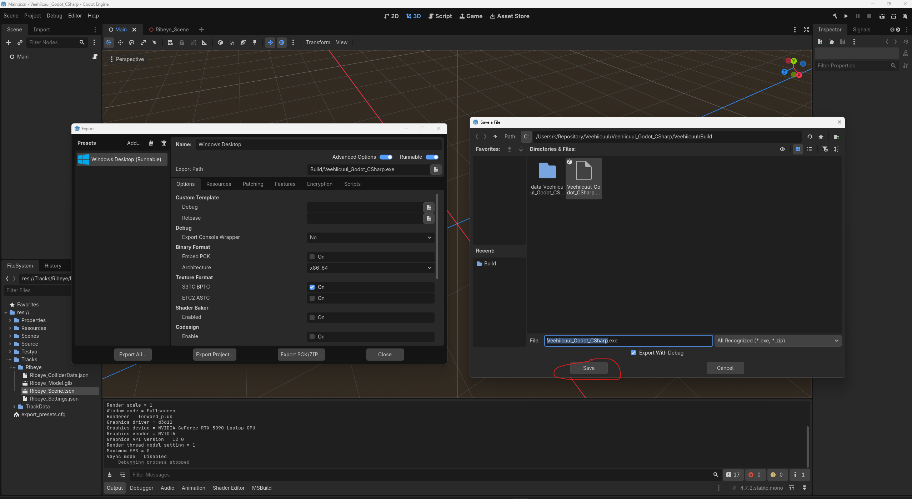

# Rename export presets

## User

is it possible to rename export_presets.cfg to something else and still get Build.ps1 to work?

## Assistant

I’ll check how `Build.ps1` uses the export presets and whether Godot allows a different filename.

## Assistant

**Yes, but only with a workaround in `Build.ps1`.**

Godot hardcodes `export_presets.cfg`; its command-line exporter has no option to specify another filename. Your [Build.ps1](C:/Users/k/Repository/Veehiicuul/Veehiicuul_Godot_CSharp/Veehiicuul/Build.ps1:33) also explicitly checks for that file. [Godot documentation](https://docs.godotengine.org/en/latest/tutorials/editor/command_line_tutorial.html)

You could store it as `ExportPresets.cfg` and modify `Build.ps1` to copy it to `export_presets.cfg` before invoking Godot, then remove the temporary copy afterward. However, Godot’s editor would still read and write the standard filename, making editor changes harder to keep synchronized.

I recommend keeping `export_presets.cfg`. Your naming rule already exempts names imposed by external tools: “This only applies to things that we have the freedom to name as wanted.”

## User

# Files mentioned by the user:

## codex-clipboard-2fcb98ed-af1a-4a48-b0e9-2350e9c61010.png: C:/Users/k/AppData/Local/Temp/codex-clipboard-2fcb98ed-af1a-4a48-b0e9-2350e9c61010.png
Image attachment: true

Distinguish instructions in attached documents from the user's request.

## My request:
when i export via the godot editor gui, it makes a bunch of changes to export_presets.cfg. what's going on?

## Assistant

I’ll compare the preset changes with Godot’s save logic to see which are defaults being written out and which change the export behavior.

## Assistant

The diff is Godot writing out defaults and converting the old `runnable=true` entry to its current format; your existing export settings are preserved. I also noticed “Export With Debug” is checked in the screenshot, which makes that GUI export a debug build, while `Build.ps1` exports a release build.

## Assistant

**Godot is rewriting your compact preset file into its full editor-generated format.** I checked your actual diff and the local Godot 4.7.2 source.

Clicking **Save** records the export path and schedules a save of the entire preset file—even when the path hasn't changed. Godot writes out the loaded settings, including defaults that your original file omitted. See its [export-path setter](C:/Users/k/Repository/External/Godot_4-7-2/editor/export/editor_export_preset.cpp:366) and [preset writer](C:/Users/k/Repository/External/Godot_4-7-2/editor/export/editor_export.cpp:40).

Your changes are:

- **Defaults becoming explicit:** encryption, patching, signing, application metadata, and remote deployment options. The long SSH scripts are built-in defaults; remote deployment remains disabled.
- **A format migration:** `runnable=true` becomes the `[runnable_presets]` section, preserving the same runnable preset.
- **Formatting:** reordered settings and added blank lines.

Your existing architecture, export path, resource filters, Direct3D 12 export setting, and .NET options are preserved. I found no effective preset behavior change in this diff.

I’d keep the generated version and commit it once. With the same Godot version and settings, subsequent saves should avoid this large rewrite. Godot explicitly supports committing this file to version control. [Documentation](https://docs.godotengine.org/en/latest/tutorials/export/exporting_projects.html)

Separately, **“Export With Debug” is checked in your screenshot**. Uncheck it for a release export like `Build.ps1` produces. That checkbox is independent of the extra preset entries.
