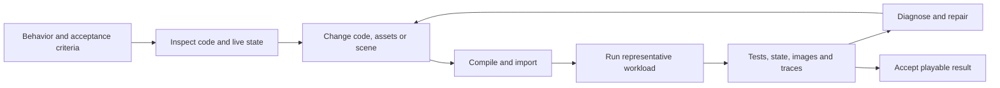

# Godot, Unity and native C++ across levels of AI-assisted development

**For your games, extensive AI use strengthens the case for an observable, testable development platform more than it strengthens the case for a particular language. Godot .NET and Unity are both credible platforms for agents implementing whole features. A small custom C++ framework can be exceptionally easy for agents to manipulate. It owns more platform/runtime responsibilities, whose actual verification and maintenance cost must be measured.**

Prepared September 24, 2026. Scope: your solo racing and world-simulator projects, Windows x64 first, eventual Android, with intended scale and visuals that do not exclude any option. This report complements the [general platform report](C:/Users/k/Repository/External/godot/MyAnalysis/EnginePlatformReport.md); it concentrates on development with AI rather than repeating the engine feature comparison.

The findings combine the preceding repository inspection, additional inspection of automation/test boundaries, and current official documentation. **No controlled AI task comparison, new game build, agent/editor integration, or Android run was performed.** Rankings below are engineering judgments, not measured model success rates. Existing source also does not establish whether a particular change was written by a human or AI; no such provenance is assumed.

**Follow-up assumption:** the agent will have exact-version local source, including Godot 4.7.2. The [source-access addendum](C:/Users/k/Repository/External/godot/MyAnalysis/ExactVersionSourceAccess.md) assesses this advantage and supersedes the version-mismatch concern below for that proposed workflow. It also records a material distinction in Unity's commercial engine-source terms.

## 1. The answer changes with the amount of responsibility delegated

My practical recommendations are:

- **Occasional help or human-led coding:** use the engine whose workflow you already handle well. AI is not a good reason to migrate your existing Unity racer or Godot simulator at this level.
- **Agents implementing bounded tasks:** all three can work well. Your plain C# simulation/collision tests and native CMake/GPU tests matter more than the engine name.
- **Agents owning complete features:** Godot .NET and Unity remain my best default for these games because they combine automation with existing platform services. This is not a measured AI-productivity ranking. Godot offers flexible source-controlled workflows; Unity has substantial official editor automation, including a newer CLI route worth evaluating.
- **Agents driving most implementation over a project's lifetime:** my overall platform preference remains Godot .NET, provided Android is qualified, but the AI-specific evidence does not establish a productivity winner over Unity. Unity may be more effective if its supported editor-agent integration and mobile pipeline reduce your interventions more. A local trial can resolve this; source availability alone cannot.
- **Choosing native because AI will do almost all the coding:** technically plausible, especially for a constrained runtime. It becomes attractive when the remaining framework, verification and maintenance work costs less than engine integration and limitations—not merely when AI can generate the framework quickly.

**There is no established crossover at “80% AI” or “95% AI” where custom C++ automatically wins.** An agent could write nearly every line while you still spend most of your time explaining requirements, correcting behavior, integrating assets and diagnosing devices. Conversely, a small agent-authored change can remove a large recurring manual task.

**Unity supports direct Editor commands and MCP through its experimental CLI; the Assistant package's older in-editor MCP route is deprecated.** These capabilities are untested here. [Unity CLI replacement guidance](https://docs.unity.com/en-us/unity-cli/replace-mcp-server-unity-cli), [Unity CLI status](https://docs.unity.com/en-us/unity-cli).

## 2. Define AI involvement by responsibility, not generated code percentage

| Level                                | AI responsibility                                                                         | Your responsibility                                                                  | Typical request                                                                 |
| ------------------------------------ | ----------------------------------------------------------------------------------------- | ------------------------------------------------------------------------------------ | ------------------------------------------------------------------------------- |
| 0. Baseline                          | None                                                                                      | Design, implementation, integration and verification                                 | Implement a feature yourself.                                                   |
| 1. Occasional assistant              | Explain, suggest, search, review or draft a small snippet                                 | Decide, write/integrate, run and judge                                               | Explain this collision edge case; suggest test cases.                           |
| 2. Coding partner                    | Draft functions/files and tests under frequent direction                                  | Architecture, task breakdown, integration and acceptance                             | Implement this steering function against this interface.                        |
| 3. Bounded task agent                | Inspect, edit, build, test and repair a defined task                                      | Specify the contract and review the completed result                                 | Remove a terrain-copy allocation without changing observations or energy costs. |
| 4. Feature agent or small agent team | Coordinate code, scene/data changes, tests and packaging for a feature                    | Define behavior, resolve design choices, review evidence and playtest                | Add checkpoints, lap timing and an in-game display.                             |
| 5. Extensive AI-driven development   | Plan and implement milestones across many tasks, maintain verification and prepare builds | Product direction, acceptance standards, exceptional decisions and release ownership | Deliver the next playable milestone and demonstrate its acceptance criteria.    |

Higher levels need broader tools and better evidence. They do not necessarily need more simultaneous agents. One agent that can reliably run a complete validation loop can outperform several that only edit code.

Human expertise is a separate axis. A knowledgeable developer delegating most implementation has a different risk profile from someone hoping AI will substitute for all engine, graphics and debugging knowledge. The latter has fewer ways to recognize plausible but incorrect explanations, especially for native synchronization and cross-device failures. More automation can reduce technical labor; it does not make the acceptance standard define itself.

## 3. What makes a platform effective for an agent?

The useful unit is an **accepted feature or resolved defect**, including validation and later rework. Compare platforms on the full loop:

| Property                        | Why it matters more as autonomy increases                                                                               |
| ------------------------------- | ----------------------------------------------------------------------------------------------------------------------- |
| Explicit state and requirements | The agent can determine what is intended, rather than reconstruct it from hidden editor state or conversations.         |
| Semantic operations             | “Create a track scene with these resources” is less fragile than guessed clicks or unvalidated serialization edits.     |
| Fast, trustworthy feedback      | Compilers, test results, runtime state and images make errors repairable within the same task.                          |
| Independent correctness checks  | A passing test that repeats the implementation's mistake does not validate the feature.                                 |
| Controlled side effects         | A repeated command should converge on the intended state instead of duplicating assets or modifying unrelated settings. |
| Small comprehensible boundaries | Agents need less irrelevant context and concurrent work is easier to merge.                                             |
| Reproducible environments       | Version, package, import and platform differences are less likely to masquerade as code defects.                        |
| Inspectable failures            | Useful logs, assertions and captures let the agent explain what failed instead of repeatedly guessing.                  |
| Complete target coverage        | A Windows unit test cannot establish Android graphics, lifecycle or packaging correctness.                              |

These properties can be engineered in all three options. Choosing an engine does not supply all of them automatically, and owning every source file does not guarantee them.

## 4. Comparison at each level

### Level 1: occasional explanations, snippets and review

**Godot:** AI can help with C# or GDScript APIs, scene relationships, resources, signals and small scripts. Text scenes and source availability are convenient when investigating a concrete issue. For your projects, C# preserves the existing domain code and familiar test tools.

**Unity:** AI can help with C#, components, editor scripts, importer settings, shaders and package APIs. Unity's broader ecosystem offers many potential solutions, but recommendations must match the project's editor and render-pipeline versions. More examples available to humans are not proof of a particular model's training coverage or accuracy.

**Native C++:** AI can explain unfamiliar graphics concepts, draft small algorithms and review interfaces. It can make learning Vulkan/DX12 less laborious, but you still carry the graphics/platform design and test responsibilities. Correct-looking setup code is not a demonstrated working renderer.

**Verdict:** little reason to select or switch platforms on AI grounds. Familiarity and existing working systems dominate. Keep Unity for racing work and Godot for simulator work unless broader consolidation goals justify a change.

### Level 2: AI drafts much of the code, you integrate it

**Godot and Unity are close for ordinary C# gameplay.** If the task is an engine-independent pathfinder, collision query or turn rule, the same contracts and tests can serve either. Godot's current modern .NET fit is useful for Automatou. The pinned Unity 6.3 baseline needs compatible syntax/APIs; an assistant that writes ordinary modern .NET code without checking the Unity profile creates avoidable repair work. This is a version-specific issue, not a permanent limitation of Unity. [Existing runtime comparison](C:/Users/k/Repository/External/godot/MyAnalysis/EnginePlatformReport.md).

The difference appears at integration. Godot scene/resource relationships and Unity component/importer/asset relationships both need engine-aware validation. If you manually wire every AI-written class into the editor, AI may accelerate typing while leaving your largest time cost unchanged.

**Native C++ can be very effective for bounded numerical and data-processing code.** Compiler diagnostics, static checks and ordinary unit tests provide a useful correction loop. Graphics resource lifetime, undefined behavior and concurrency failures need additional checks beyond compilation. Your own framework can have fewer APIs to learn, but there is no external ecosystem that already knows a newly invented private API; the agent needs concise local documentation and examples.

**Verdict:** Godot .NET and Unity remain similarly capable for code assistance. Native becomes easier to implement, but the economics of a complete custom platform have not yet changed decisively.

### Level 3: an agent completes a bounded engineering task

Here the strongest predictor is whether the agent can **prove a narrow result** without waiting for you to operate the game.

For Automatou, changing a turn rule or reducing a repeated allocation can be tested in the standalone simulation executable without Godot. For ZoomTracks, a geometry change can be checked against the collision harness's oracle outside Unity. These are already strong agent workflows under both engines.

Godot adds command-line import, managed solution building and export paths; Unity offers editor scripting, batch/test workflows and newer direct editor control. Neither needs to rely on screen clicking for every operation. See [Godot workflow evidence](C:/Users/k/Repository/External/godot/MyAnalysis/GodotAiWorkflowEvidence.md) and [Unity workflow evidence](C:/Users/k/Repository/External/godot/MyAnalysis/UnityAiWorkflowEvidence.md).

Your **native prototype is particularly strong at this level**: it has build/test presets and tests that inspect actual GPU results, not only compilation. That is a better basis for autonomous native changes than an untested renderer. For some pure code or rendering-math tasks it may offer the most direct feedback of the three. [Native workflow evidence](C:/Users/k/Repository/External/godot/MyAnalysis/NativeAiWorkflowEvidence.md).

**Verdict:** no universal winner. Keep the core independently testable and compare each specific task. Native can win for a well-specified kernel even when an engine remains the better overall game platform.

### Level 4: an agent implements a complete feature

The task now crosses behavior, data, UI, editor/import state and deployment. This is where the number of required manual interventions becomes decisive.

**Godot:** a small project using explicit C# services, text resources, reproducible imports and a few editor helpers can be straightforward to drive from files and commands. An agent can create or amend scenes, but those scenes must be imported and instantiated; editing readable text alone does not establish valid resource references or correct presentation. Engine source access helps when a normal API or diagnostic cannot explain a failure.

**Unity:** use semantic editor operations rather than treating `.unity` YAML as arbitrary text. Editor scripts and an actual editor-agent bridge can inspect hierarchy/components, create resources and repair references. Unity's official CLI/Pipeline direction materially improves its position here. A properly instrumented Unity project may beat a Godot project whose agent cannot inspect runtime state or automate imports. The newer tooling's experimental status and exact installed compatibility must be tested.

**Native C++:** a code-defined scene and UI can be easier for an agent to modify coherently than editor-authored state. That is a real advantage. But a feature request may first require a text/UI system, asset catalog, input layer or lifecycle handler that an engine already supplies. Evaluate the feature plus missing prerequisites, not just the eventual gameplay patch.

**Verdict:** an existing engine with a complete control-and-verification loop is the best default for your two games. Godot has a strong simplicity/control case; Unity has a strong integrated-tooling case. Native is competitive when the relevant infrastructure already exists and the feature remains within its deliberately narrow design.

### Level 5: AI drives most development, you act mainly as product owner

The long-term bottleneck shifts toward deciding what is acceptable, integrating interacting changes and handling failures outside the current tests. You can delegate implementation and much verification while still reviewing evidence and trying the game.

**Godot's advantage** is the freedom to build a durable workflow around an inspectable engine, local tools and owned domain code. An agent can investigate source and propose a patch without an ordinary proprietary-engine access barrier. That does not make a renderer fork inexpensive: someone still needs to establish correct behavior, keep the patch small and maintain it across exports and upgrades.

**Unity's advantage** is the amount of supported game/editor/platform infrastructure that agents can operate rather than recreate. If its editor automation produces reliable runtime observations and low manual recovery, it can be an excellent AI-driven production platform. The tradeoff is dependence on Unity's tool interfaces, version policy and authorization terms as well as the engine itself.

**Native's advantage** is that you can design the whole framework to be agent-operated from the start: explicit schemas, reproducible asset cooking, commands that expose state, deterministic tests and minimal editor-only state. This is probably the strongest argument for custom C++ under extensive AI use. The AI-driven team also owns diagnosis and integration of its custom runtime and selected libraries, including cross-platform gaps. Smaller product scope helps; supporting both games and Android expands it again.

**Verdict:** I prefer Godot .NET with progressively stronger automation for your long-term independent workflow, with Unity a serious competing choice after trying its actual official tools. I would not select native solely on a promise that AI will eventually finish and maintain everything. Nor would I rule it out if a representative production slice demonstrates that it leaves you with less total work.

For a plan with essentially no technical oversight, none of the evidence gathered establishes a reliable unattended path to shipping both games. That is an uncertainty in this assessment, not a claim that such work is impossible or that future models cannot improve it.

### Compact comparison

| Level                    | Godot .NET                                                                  | Unity                                                                              | Custom C++ / Vulkan / DX12                                                   |
| ------------------------ | --------------------------------------------------------------------------- | ---------------------------------------------------------------------------------- | ---------------------------------------------------------------------------- |
| 1. Occasional assistance | Good fit; little special setup                                              | Good fit; retain current racer workflow                                            | Useful learning/review help; platform burden unchanged                       |
| 2. Coding partner        | Strong C# fit for Automatou                                                 | Strong C# fit within pinned API profile                                            | Strong bounded code assistance; expert integration still important           |
| 3. Bounded agent         | Strong with standalone tests and command-line checks                        | Strong with standalone tests and editor validation                                 | Can be strongest for tightly tested native subsystems                        |
| 4. Feature agent         | Strong with import, runtime inspection and visual checks                    | Strong with semantic editor tools; official CLI deserves a trial                   | Competitive after required framework services exist                          |
| 5. Extensive AI-driven   | Preferred for your independent long-term workflow, subject to Android proof | Potentially best integrated workflow; depends on actual tool reliability and terms | Highest freedom to tailor workflow; largest owned correctness/platform scope |

These are relative fits under specified conditions, not scores. A poorly instrumented Godot project can be less effective than a well-instrumented Unity or native project.

## 5. Important platform details that change the AI comparison

### Godot: source access and text files help, but do not complete the loop

Godot 4.7's CLI supports headless operation, imports, managed builds and exports. These are useful agent building blocks; headless execution cannot certify visual/audio quality. [Godot command-line documentation](https://docs.godotengine.org/en/4.7/tutorials/editor/command_line_tutorial.html).

One relevant limitation is that Godot's built-in profiler does not profile C# script code; the documentation directs C# users to external tooling. An agent can still measure domain stages and allocations, but should not claim it diagnosed managed hotspots from engine-frame timings alone. Availability of those external profilers was not established here. [Godot profiler documentation](https://docs.godotengine.org/en/4.7/tutorials/scripting/debug/the_profiler.html).

Source inspection is especially useful when a bug crosses the engine boundary. However, the engine source in this workspace is 4.8-dev while the game projects target stable 4.7.2. An agent reasoning from a different source version can confidently explain behavior that is not present in the running binary. Pin source, runtime, templates and documentation together when doing engine-level diagnosis.

GDScript is also a valid choice for agent-assisted Godot development, particularly for small engine-facing scripts and supported export targets. C# remains the better starting point for your existing cores. More compact script syntax is not evidence of fewer whole-feature failures; similarly, stronger compile-time checks are useful but do not verify gameplay. A C# core retains its C# deployment constraints even if some presentation code is GDScript.

### Unity: distinguish mature automation from the newer agent product layer

Unity already has editor scripting, serialization APIs, batch execution and tests. These are useful independent of a built-in AI assistant. The newer CLI adds running-editor control, but no connector was verified as installed here. [Unity automation evidence and sources](C:/Users/k/Repository/External/godot/MyAnalysis/UnityAiWorkflowEvidence.md).

This reduces a potential Godot advantage: if an agent can query and edit Unity state through supported operations, much of the apparent “editor versus code” difference disappears. Native engine internals remain a different issue from package/editor source; public managed and package code can be inspectable even when the complete native engine is not generally modifiable.

Your existing Unity project is on 6.3 LTS. Newer agent packages, experimental runtime features and existing editor compatibility are separate questions. Qualify the exact combination before making it the foundation of a low-intervention development workflow.

### Unity's agent-access terms are part of the long-term control question

Unity's current Terms of Service, section 17.2(ff) and the section 26 definition, condition automated/agent access on “Authorized Agentic Access,” including designated routing and authorization requirements that Unity can change. The technical ability to call an API does not by itself settle the permission question. Documentation or additional terms can provide authorization; this report does not determine the status of every custom integration. Prefer Unity's documented route and check the exact applicable terms before standardizing on a third-party alternative. [Unity Terms of Service](https://unity.com/legal/terms-of-service).

This matters more at levels 4–5 than occasional code advice. It supports Godot's workflow-independence advantage, but it is **not** evidence that Unity prohibits AI-assisted game development or that every official agent workflow requires a paid AI subscription. The current CLI documentation explicitly identifies a free route separate from Unity's AI subscription. Choosing Unity's assistant, your own model service and an editor transport are different decisions. [Official CLI access](https://docs.unity.com/en-us/unity-cli/replace-mcp-server-unity-cli).

### Native: unusually good control, unusually broad responsibility

Your native prototype already offers a substantive agent feedback surface: CMake presets, shader compilation checks, hardware and WARP tests, window lifecycle tests and pixel results compared against a separate reference calculation. This is stronger evidence for native automation than the fact that C++ is text. An agent can use failures to correct a tightly scoped rendering change.

The limitation is coverage. WARP and one Windows GPU do not qualify Android Vulkan drivers, application lifecycle, thermal behavior or touch interaction. Vulkan validation layers and DX12 validation are useful for classes of API/resource errors, but a clean validation run is not proof of visual correctness, race freedom or acceptable performance. Validation can alter execution costs, so diagnose with it and measure representative performance separately. [Native evidence and validation sources](C:/Users/k/Repository/External/godot/MyAnalysis/NativeAiWorkflowEvidence.md).

Raw DX12 is well aligned with the existing Windows experiment. For a new native platform that must also serve Android, Vulkan or a carefully chosen cross-platform graphics abstraction reduces future backend replacement work. An agent can implement both backends, but that creates two correctness surfaces; the ability to generate them is not a reason to require them.

## 6. Different kinds of work benefit differently

| Work                                               | Godot                                                                       | Unity                                                                                | Native C++                                                                                           |
| -------------------------------------------------- | --------------------------------------------------------------------------- | ------------------------------------------------------------------------------------ | ---------------------------------------------------------------------------------------------------- |
| Simulation rules, routing, collision, save formats | Strong when isolated from nodes/resources                                   | Strong when isolated from components/assets                                          | Strong with equivalent contracts; porting existing C# adds work                                      |
| Routine game UI and interaction                    | Existing controls and scene system; your simulator is largely code-authored | Existing UI/editor systems; semantic commands can assemble and inspect them          | Code-defined state can be simple, but text, layout, focus and input services must exist              |
| Asset import and level assembly                    | Scriptable imports/resources; verify ownership and saved references         | Extensive editor APIs and existing track validation; preserve metadata               | Deterministic cooker/manifest can be excellent; you own format/runtime integration                   |
| Graphics effects and low-level rendering changes   | Engine shaders/extensions first; source access for deeper diagnosis         | Shader/package/editor access; complete native engine access is a separate constraint | Most direct control, with the broadest synchronization/resource/device responsibility                |
| Performance diagnosis                              | Domain instrumentation plus engine and external managed tools               | Domain instrumentation plus engine/package diagnostics                               | Exact owned execution path; CPU/GPU tools still require correct interpretation                       |
| Packaging and platform adaptation                  | Existing export pipeline; qualify C# Android support                        | Existing player pipeline and current racer foundation                                | Libraries can supply services, but build, lifecycle, graphics and packaging integration remain yours |
| Game feel, visual composition, sound and balance   | Needs representative interactive/audiovisual evidence                       | Needs representative interactive/audiovisual evidence                                | Needs representative interactive/audiovisual evidence                                                |

The first row is particularly important: much of your valuable AI-assisted work need not be engine-specific. Keep the world rules, race rules, collision contracts and data formats separate from presentation. This improves delegation today and reduces the cost of a later engine change. It does not make presentation adapters or asset pipelines interchangeable for free.

AI-created art, audio or track concepts also do not inherently select one engine. The practical difference is whether outputs can be imported, checked, packaged and revised reliably. A mesh file existing on disk does not establish correct scale, normals, materials, colliders or an acceptable result in the game.

Documentation quality and language familiarity matter, but there is no measured model-specific evidence here that “AI knows Unity best,” “GDScript is easier for AI,” or “C++ gets the best results.” Prefer version-matched local examples, actual compiler/API feedback and small validated interfaces over those generalizations.

## 7. What this looks like in your projects

### Automatou: optimize an observation without changing its meaning

A useful level-3 task is to reduce terrain-copy allocations while preserving the automaton's paid perception rules. Acceptance should compare observations, energy charged, visibility boundaries and turn results, including changes to terrain after an observation. Replacing a copy with a mutable shared reference could make a fast implementation observably wrong.

The existing source-linked simulation tests provide an engine-independent entry point. This task is almost the same AI problem in Godot or Unity once the core compiles against the selected runtime profile. Moving it to C++ adds translation, ownership and integration questions without automatically improving the agent's ability to check its semantics. [Simulation test project](C:/Users/k/Repository/Automatou/Automatou2/Tests/SimulationTests.csproj:1), [automaton contract](C:/Users/k/Repository/Automatou/Automatou2/Source/AutomatonContract/SystemCalls.cs:55).

For a level-4 task such as a new encounter-editor operation, use the existing `--verify-interface` mode as well. It exercises handlers/state and captures rendered screenshots after a frame is drawn. That is valuable existing infrastructure. It still needs image inspection and real input checks: direct handler calls bypass some event routing and focus behavior. The screenshot path must run with rendering rather than being treated as a headless visual test. [Interface verification](C:/Users/k/Repository/Automatou/Automatou2/Source/Interface/InterfaceVerification.cs:7), [capture path](C:/Users/k/Repository/Automatou/Automatou2/Source/Interface/InterfaceVerification.cs:449).

**AI-workflow implication:** improving this project's existing observation and acceptance loop is likely to save more effort than translating its language solely for AI convenience. Measure performance in an appropriate build with fine-grained synchronous logging controlled; otherwise an agent may optimize around distorted timings.

### ZoomTracks: automate a complete new-track workflow

The documented creation process includes copying a scene, setting FBX import options, replacing content, adjusting the camera, changing the build scene list and updating code/data. That spans several places where a code-only agent can stop short of a usable feature. [Current track workflow](C:/Users/k/Repository/ZoomTracks/Documentation/HowToCreateANewTrack.md:23).

A proposed agent-friendly workflow would take one track descriptor, import the assets, apply the expected settings, assemble/update the scene, register it and run validation. A second invocation should leave the same intended state. The existing setup tool unconditionally adds components, so it should not yet be assumed safe to repeat. The current imported-asset validator is a useful base because it checks the actual FBX and collider data rather than only an isolated mock. [Setup tool](C:/Users/k/Repository/ZoomTracks/ZoomTracks/Assets/Editor/SetupNewTrackSceneTool.cs:22), [track validator](C:/Users/k/Repository/ZoomTracks/ZoomTracks/Assets/Editor/CollisionDetectionTrack001Validation.cs:22).

In Unity, implement this through editor APIs and a validated command. In Godot, equivalent resource/import/scene operations are possible, but the current racing port first needs to reach functional parity. In native, a track manifest and asset cooker could make the steady-state process very simple, after those systems are implemented. Count that initial work separately from later track additions.

**AI-workflow implication:** this is a better trial of feature autonomy than asking each platform to generate a movement script. It exposes scene references, asset transforms, camera framing, collision agreement and packaging. The standalone collision harness remains useful alongside this integration test; it does not replace it.

### Racer features: checkpoints and lap timing

A representative whole feature connects checkpoint geometry, traversal rules, reset behavior, timing, UI and saved results. Define how backwards travel, skipped checkpoints, restarting and frame stalls behave before implementation. Feed recorded movement paths into a pure race-rules test, then exercise actual scene triggers or collision queries and inspect the HUD in a rendered run.

All three options can support this. Godot/Unity bring existing UI, resources and input systems; native may offer a simpler code path once its necessary services exist. Passing the race-rules tests does not establish that a camera hides no checkpoint or that the displayed timing updates correctly. A feature agent needs evidence from both layers.

### Native graphics: a case where autonomous work already has strong foundations

The native prototype's production shader readback is compared with a separately formulated binary64 reference, using explicit tolerances. Queue and lifecycle tests deliberately exercise conditions beyond a normal rendered frame. These are unusually useful checks for agents: a change can fail for a meaningful reason and be repaired without guessing from one screenshot. [Native evidence](C:/Users/k/Repository/External/godot/MyAnalysis/NativeAiWorkflowEvidence.md).

A bounded rendering or numeric task could be exceptionally effective here, potentially more so than reaching through an engine abstraction. The next question is whether this advantage persists for track authoring, UI, save/load and Android delivery. The current source establishes the first opportunity, not the second result.

## 8. More agents need better boundaries

Parallel work helps when tasks can be reviewed independently: simulation algorithms against a stable contract, test scenarios from acceptance criteria, asset processing, or a UI adapter whose data interface is already agreed. Several agents changing the same scene, package manifest or rendering abstraction can instead create integration work faster than they complete features.

A practical arrangement for all three platforms is:

1. One integrating agent owns the feature contract, public interfaces and final acceptance evidence.
2. Other agents receive bounded tasks with explicit input/output expectations and file ownership.
3. A reviewer challenges edge cases and checks the result against the original specification, not merely the implementation's explanation.
4. Integration uses the actual combined build and runtime; separately passing branches are insufficient.

Separate worktrees/checkouts and output/cache directories reduce accidental conflicts. Treat a running editor and its import database as shared state; serialize mutations to one project session or isolate the sessions properly. Run performance comparisons without competing GPU workloads from other agents.

An independent reviewer is useful but not automatically an independent oracle. Two agents can share the same misunderstanding. Preserve known-answer fixtures, separately formulated references and externally specified behavioral invariants. The existing native numerical reference and ZoomTracks collision comparisons illustrate the right direction.

Do not require a large coordination framework before shipping a small feature. Add concurrency only where measured throughput improves and integration remains understandable. These are workflow design recommendations, not a claim that a particular multi-agent product is installed.

## 9. Verification becomes the central investment as delegation grows

| Evidence                           | What it can establish                                                   | What it cannot establish alone                         |
| ---------------------------------- | ----------------------------------------------------------------------- | ------------------------------------------------------ |
| Compilation and static checks      | Syntax, types and some API/resource mistakes                            | Correct game rules, presentation or deployment         |
| Deterministic domain tests         | Behavior for asserted rules, fixtures and invariants                    | Coverage of unspecified behavior or engine integration |
| Import/scene validation            | References, expected components, transforms and data relationships      | Acceptable appearance and feel                         |
| Runtime logs and state snapshots   | What the instrumented code reports happened                             | Unobserved faults or correct visual output             |
| Rendered images and frame captures | Layout, camera, shading and captured GPU work                           | Complete motion, input feel, audio or every driver     |
| Replay and real input runs         | Reproducible interactions and end-to-end behavior on that configuration | All hardware/platform cases or subjective quality      |
| Packaged device tests              | Installation, assets, lifecycle and behavior on tested devices          | Universal device coverage or future OS compatibility   |

A successful tool call means an operation was accepted or completed according to that tool's contract. Verify that the expected test count, output artifact or runtime state actually exists. The Unity CLI's recent completion-status fix and the local historical URP build-cache workaround both reinforce this distinction. Neither is evidence that Unity is uniquely unreliable; every platform's harness needs explicit success criteria. [CLI release notes](https://docs.unity.com/en-us/unity-cli/release-notes), [local build-cache observations](C:/Users/k/Repository/ZoomTracks/ZoomTracks/Assets/Editor/ResetRenderPipelineBuildCache.cs:8).

For visuals, use a mixture of semantic checks, robust numerical tolerances and image inspection. Exact full-frame pixel identity across different GPUs is often an inappropriate acceptance rule. For feel and latency, use a playable build and an appropriate measurement path. The previous saved latency comparison does not measure how effectively an AI develops either game.

At high delegation, request evidence alongside the change: what scenario ran, which version/configuration, what passed, what was skipped, and what image/log/artifact supports the claim. This is more useful than a confident summary saying the feature is complete. Keep the process proportionate: a small rule fix need not rerun every device test, while a rendering or packaging change needs the relevant target checks.

## 10. Does extensive AI make a custom engine economical?

It can. Native's case becomes stronger when the game has a narrow stable feature set, most content is represented by explicit data, existing libraries cover the necessary platform services, and the developer values a small owned execution path more than a broad editor. AI can reduce the cost of API plumbing, adapters, diagnostics and tests. A modest framework does not need to recreate every feature of Unity or Godot.

But existing engines also become easier to adapt through AI-written tools, importers, tests and domain code. Their implementation is available functionality whose cost you usually do not pay again. AI can also increase the rate at which a custom framework accumulates unnecessary abstractions, making later changes harder rather than easier.

Judge economics with this accounting, using actual observed time/cost rather than invented multipliers:

> Total development effort = specification + implementation/integration + verification + repair/rework + environment/tool maintenance + later upgrade/device maintenance.

Record human active time, elapsed turnaround and tool/compute cost separately. They answer different questions. A long autonomous run can be attractive if it needs little intervention, but not if each run leaves difficult unverified changes. A fast response can be expensive if you spend an hour correcting it.

This explains why “AI will write 95% of the code” is insufficient. The remaining 5% of code may involve the hardest failures, and a large share of work is not writing code. Conversely, a constrained native framework with excellent verification could genuinely reduce total effort. This report leaves that outcome open rather than treating engine choice as a rule about what solo developers are allowed to attempt.

Available AI-productivity research also argues against importing a universal multiplier. METR's early-2025 experienced-developer experiment found slower completion in its particular setting; its 2026 follow-up explains why changing participation and task selection prevented a reliable updated estimate. Neither result ranks these engines or predicts your current workflow. [Original study](https://metr.org/blog/2025-07-10-early-2025-ai-experienced-os-dev-study/), [follow-up limitations](https://metr.org/blog/2026-02-24-uplift-update/).

## 11. A practical comparison before locking in

Do a bounded trial with the actual model and tools you expect to use. The following is a proposed experiment; it has not been performed for this report.

### Compare two operating modes

- **Coding partner:** you direct and integrate small changes, letting the model draft code/tests.
- **Feature agent:** the agent inspects, changes, runs and repairs a defined feature, then returns acceptance evidence for your review.

These modes expose the main shift between levels 2 and 3–4. A longer milestone spanning multiple accepted features can follow for a level-5 trial. One successful short task does not demonstrate reliable milestone autonomy.

### Use a small set of representative tasks

| Task                                          | Required acceptance evidence                                                          | Main question answered                                 |
| --------------------------------------------- | ------------------------------------------------------------------------------------- | ------------------------------------------------------ |
| Simulation allocation/routing improvement     | Same rules and observations; measured allocation/time change on fixed workloads       | Can the agent optimize without semantic drift?         |
| Add a track from known source assets          | Correct imports, camera, collision, registration and packaged play                    | Can it complete content integration?                   |
| Checkpoints/lap timing/HUD                    | Recorded-path tests plus rendered and interactive run                                 | Can it coordinate a cross-system feature?              |
| Diagnose a deliberately introduced regression | Independent expected behavior, correct cause, minimal fix and regression check        | Does the loop repair errors rather than obscure them?  |
| Android adaptation of the slice               | Install/launch, real controls, save path, pause/resume and representative performance | Does desktop autonomy extend to the eventual platform? |

Use comparable task specifications and content, pinned engine/compiler/package versions and the same model configuration. Give each candidate a competent supported tool setup; comparing an instrumented native harness to a Unity agent restricted to blind file edits would answer the wrong question. Record setup effort separately, since better tooling is not free. A second comparison with only common shell/file tools can reveal how dependent a result is on a particular editor bridge.

Separate two measurements: **incremental work in today's repositories**, where the existing Unity racer/Godot simulator appropriately receive credit for readiness; and **matched behavior from comparable starting capabilities**, which better tests steady-state workflow. The unfinished Godot racer and smaller native demo must not silently be treated as equivalent baselines. Count native prerequisites in the delivery comparison, even if a bounded kernel task is also tested separately.

Repeat several tasks or variants before trusting a pattern. Alternate candidate order or use equivalent fresh tasks to reduce learning/order effects. Record failed and abandoned attempts, including recovery cost. A handful of runs is useful local evidence, not a statistically general engine ranking.

### Record the result that matters

For each attempt, capture:

- Human minutes spent specifying, supervising, repairing, integrating and accepting it.
- Total elapsed time, build/import wait, model/tool cost and autonomous repair attempts.
- Manual interventions required and why they occurred.
- Passed acceptance criteria, missing checks and reproducible runtime artifacts.
- Regressions discovered during the task and later integration.
- Infrastructure added and its expected maintenance burden.

Choose the workflow that reliably produces accepted features with the least total burden across **both games and Android**, while giving ownership/control the importance you assigned it. Do not let one impressive generated renderer or one smooth editor command settle the entire decision.

## 12. Recommendation for your intended long-term workflow

**For minimal assistance, preserve current working foundations.** Unity is the immediate practical home of the racer; Godot is the immediate practical home of the simulator. AI alone supplies no reason to migrate either.

**For regular coding assistance and bounded agents, invest first in portable domain code and trustworthy commands.** Your existing C# tests and native graphics checks already show what works. Add explicit versions, repeatable commands and relevant runtime evidence around them. Engine selection has less influence here than code boundaries and feedback quality.

**For extensive feature/milestone delegation, shortlist Godot .NET and Unity equally seriously on AI effectiveness.** My overall Godot preference comes from the combined ownership, architecture and project-fit analysis, with moderate confidence; it is not a measured claim that AI works better in Godot. Unity's current CLI/Pipeline route deserves a real trial and could make it the more productive option. Godot's C# Android path still needs qualification before a long-term commitment.

**Native becomes more credible as AI capability and your verification infrastructure increase.** It remains a conditional choice for these games because it owns more delivery responsibilities. Select it if a complete representative slice demonstrates a simpler, lower-intervention workflow after counting framework and device work, or if direct runtime development is itself a goal you value. Do not choose it solely because the agent can generate large amounts of low-level code.

The durable commitment can be to your domain architecture, data formats, tests and repeatable delivery commands. Those investments support deeper AI delegation whichever presentation/runtime platform you choose. They also make a later change evidence-driven rather than a rewrite prompted by the next AI tool announcement.

## Evidence notes

- [Godot automation and project evidence](C:/Users/k/Repository/External/godot/MyAnalysis/GodotAiWorkflowEvidence.md)
- [Unity automation, current agent tooling and project evidence](C:/Users/k/Repository/External/godot/MyAnalysis/UnityAiWorkflowEvidence.md)
- [Native automation, graphics verification and platform evidence](C:/Users/k/Repository/External/godot/MyAnalysis/NativeAiWorkflowEvidence.md)
- [General platform decision and original repository assessments](C:/Users/k/Repository/External/godot/MyAnalysis/EnginePlatformReport.md)

The recommendation is based on inspected capabilities and engineering tradeoffs. No AI success rates, comparative implementation times, token costs or productivity multipliers were measured. Tool documentation changes rapidly; the experimental Unity route and conflicting older entitlement documentation are explicitly separated in its evidence note. Source inspections and saved historical measurements are not represented as fresh runtime validation.
