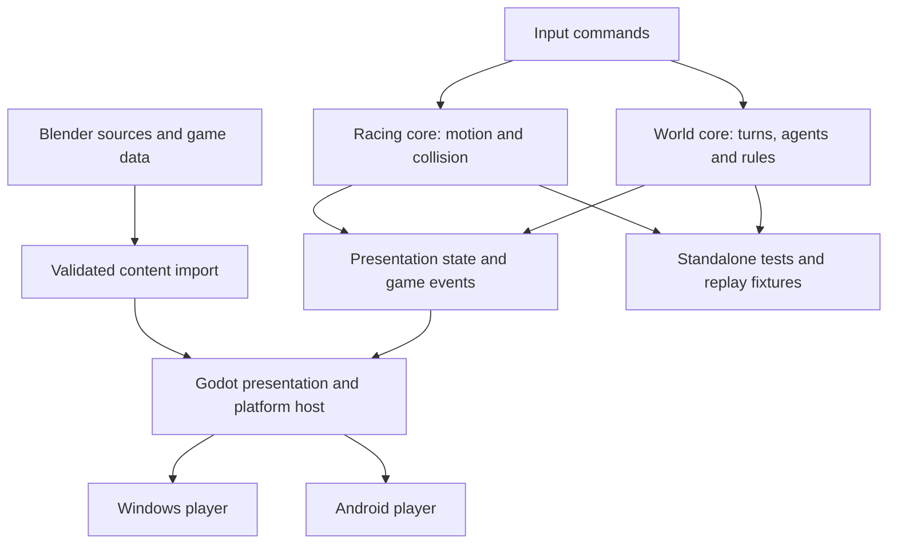

# Choosing a long-term platform for Automatou and the racing game

**Recommendation: Godot .NET with C# for the long-term shared platform, keeping the game rules and simulation code independent of Godot. Unity is the strongest alternative, particularly if dependable near-term Android delivery outweighs engine ownership. A custom C++/Vulkan/DX12 platform is technically viable but is not justified by the current requirements or performance evidence.**

Assessment date: **September 24, 2026**, America/Los_Angeles. This is a repository-informed engineering assessment, supported by current official documentation. Confidence is **moderate** in Godot over Unity, and **high** in using an existing engine over building a complete native platform for these particular games.

You clarified that shipping efficiency, performance/control, and long-term ownership all matter, and that the intended scale and visuals do not exclude any option. Consequently, this report does not assume an enormous population, photorealistic racer, or technical requirement that forces a particular engine. Android is an eventual target; Windows x64 is the immediate target. Consoles are outside scope.

## 1. The decision in practical terms

I would standardize new shared development around **Godot 4.7.2 .NET / C#**, using a pinned stable release and ordinary C# libraries for the rules of each game. I would retain the Unity racer as the behavioral reference while validating a small playable Godot slice. I would validate a real ARM64 Android export early, before making the migration expensive.

The reasons are specific to your projects:

1. **Your simulator already uses this approach.** Automatou2 has a Godot presentation layer around a largely independent C# simulation. Moving it to Unity would require replacing UI integration and addressing real language/API compatibility differences.
2. **Your racer is more portable than “racing game” initially suggests.** ZoomTracks is a custom 2D simulation with an overhead 2.5D presentation, rather than a game built around Unity vehicle physics or advanced rendering. Its Blender content tools and important collision code can survive an engine change.
3. **Godot gives you meaningful ownership without requiring you to build every platform service.** Source inspection, engine patches, native extensions, and the right to retain and rebuild editor/export versions are available under an open-source license. Both engines can pin versions; reproducible builds were not tested here.
4. **Modern C# is useful to your actual codebase and AI workflow.** Automatou uses newer C# syntax and .NET APIs that the existing Unity 6.3 project cannot simply import unchanged.
5. **Nothing inspected establishes a game-level performance or latency deficit that demands a custom renderer.** Your own latency work argues against that leap.

This is a preference for a long-term compromise, not a claim that Godot dominates every category. **Unity has the stronger case for minimizing immediate racing-game disruption and C# mobile deployment risk.** Its mature editor, platform tools, profiling, and optional optimization stack are substantial advantages. If Android must become a dependable release target soon, I would change the recommendation to Unity unless a Godot Android slice has already passed representative testing.

The tie-break is a judgment: for a long-lived personal platform with eventual mobile support, I give the ownership and current .NET-workflow benefits enough weight to accept bounded migration and mobile validation work. You did not specify that exchange rate. The repository evidence does **not** establish that Godot has lower total migration cost or faster overall shipping. Both current game frontends are small enough that consolidating on Unity is also credible; source availability is the most durable distinction, while today's language-version gap may shrink.

Godot C# Android support is officially **experimental** in the pinned 4.7 documentation. Official Godot 4 C# web export is unavailable. These are the largest qualifications to the recommendation, not minor footnotes. [Godot C# platform support](https://docs.godotengine.org/en/4.7/tutorials/scripting/c_sharp/index.html).

**The commitment I recommend is to a platform and architecture, not to one graphics API, an engine fork, or an immutable version forever.** Use the engine's supported backends and upgrade deliberately when required. Preserve portable domain code and source assets so that changing course remains possible without maintaining three complete games in parallel.

### What would change my recommendation?

| Situation                                                                                 | Preferred decision                      | Reason                                                                                           |
| ----------------------------------------------------------------------------------------- | --------------------------------------- | ------------------------------------------------------------------------------------------------ |
| Current brief: Windows first, eventual Android, modest visuals, ownership matters         | Godot .NET / C#                         | Best balance of existing simulator fit, ownership, and sufficient game tooling.                  |
| Android becomes a firm near-term shipping commitment and Godot export is still unresolved | Unity                                   | More established C# mobile path and fewer runtime/export unknowns.                               |
| Browser delivery becomes an important target while retaining C#                           | Unity                                   | Godot 4's official C# deployment does not include the web.                                       |
| Finishing the current racer as quickly as possible takes precedence                       | Stay with Unity for that release        | The working integration and content path already exist there.                                    |
| Full ability to modify and redistribute the engine is non-negotiable                      | Godot                                   | Unity's ordinary license does not provide comparable rights.                                     |
| Building graphics/runtime technology becomes a major goal in its own right                | C++ with a portable graphics layer      | The engineering investment itself becomes part of the desired outcome.                           |
| A measured engine limitation survives algorithm, configuration, and extension fixes       | Reconsider the specific subsystem first | A bottleneck may justify a native library or engine patch without replacing the entire platform. |

These are sensitivity cases, not instructions to keep switching engines. With your present priorities I would choose Godot, perform the bounded validation described later, and then stop open-ended engine comparisons.

## 2. What was actually inspected

The research covered source, project configuration, relevant technical documentation, content pipelines, tests, and existing measurement reports in the three requested repositories. It also inspected this Godot checkout and checked current official platform and licensing documentation. No game or engine was built or launched, no new Android export was made, and no fresh comparative runtime benchmark was performed.

Four available historical Unity/Godot PresentMon captures were recalculated from their raw CSV files. The calculation and hashes are preserved in [RecheckExistingLatency.ps1](C:/Users/k/Repository/External/godot/MyAnalysis/RecheckExistingLatency.ps1) and [RecheckedExistingLatency.json](C:/Users/k/Repository/External/godot/MyAnalysis/RecheckedExistingLatency.json). The Godot captures were referenced by the existing latency report and reside in the neighboring VsyncStutterTest repository. They were read as supporting evidence; this was not a separate broad repository audit.

| Repository/component                            | Observed state                                                                                                                        | Meaning for the decision                                                                  |
| ----------------------------------------------- | ------------------------------------------------------------------------------------------------------------------------------------- | ----------------------------------------------------------------------------------------- |
| Automatou2                                      | Godot C# application; engine-independent simulation code and separate contract/program libraries; hex world, turns, agents, editor UI | Real existing Godot investment, with portable logic.                                      |
| Automatou1 and RectangularGridMotion            | Earlier architecture and focused motion experiment                                                                                    | Useful design history and algorithm evidence; not equivalent competing shipped platforms. |
| ZoomTracks                                      | Unity 6000.3.24f1, URP 17.3, custom motion/collision, content tools and tests                                                         | Real existing Unity integration; strongest racing reference.                              |
| Veehiicuul Godot C#                             | Learning port with about 40 runtime source files; intentional startup exception; scenes/assets/editor tools not fully migrated        | Substantial code translation does not establish a working game port.                      |
| Veehiicuul GDScript / named racing DX12 folders | Placeholders                                                                                                                          | No basis for estimating a completed alternative's quality from these folders.             |
| 3dTestScene_CppDx12                             | Focused native presentation experiment with simplified scene content                                                                  | Valuable timing/rendering laboratory, not a complete equivalent of either game.           |
| This Godot engine checkout                      | Commit `30caae98b79ec7e75e5f893290a51b4048eaa141`, 4.8.0-dev                                                                          | Architectural evidence, not the stable 4.7.2 runtime used in the projects.                |

Detailed file/line evidence and uncertainties are in [AutomatouAssessment.md](C:/Users/k/Repository/External/godot/MyAnalysis/AutomatouAssessment.md), [ZoomTracksAssessment.md](C:/Users/k/Repository/External/godot/MyAnalysis/ZoomTracksAssessment.md), [VeehiicuulAssessment.md](C:/Users/k/Repository/External/godot/MyAnalysis/VeehiicuulAssessment.md), and [GodotSourceAssessment.md](C:/Users/k/Repository/External/godot/MyAnalysis/GodotSourceAssessment.md).

**Version discipline matters.** The official Godot archive lists 4.7.2 stable, released August 18, 2026. Unity 6.6 is a current supported update release, while your racer uses 6.3 LTS, supported through December 2027. This report uses 6.3 as the conservative Unity production baseline rather than assuming that every newer or preview capability is already available in your project. [Godot release archive](https://godotengine.org/download/archive/), [Unity 6.6 announcement](https://discussions.unity.com/t/unity-6-6-is-now-available/1735357), [Unity support policy](https://unity.com/releases/unity-6/support).

## 3. The options are packages of responsibilities

Godot and Unity are engines. C++ is a language; Vulkan and Direct3D 12 are graphics APIs. The third choice therefore means owning a custom game framework/runtime plus a renderer, while selecting libraries and building tools around them.

Both existing engines already contain native code and modern graphics backends. Choosing C# gameplay in either engine does not mean its renderer is implemented in C#, and choosing DX12 does not select a faster gameplay language. CPU simulation, graphics submission, GPU workload, input scheduling, and presentation are different layers.

| Dimension                         | Godot .NET / C#                                    | Unity / C#                                                      | Custom C++ / Vulkan or DX12                                              |
| --------------------------------- | -------------------------------------------------- | --------------------------------------------------------------- | ------------------------------------------------------------------------ |
| Fit to stated scale and visuals   | Suitable                                           | Suitable                                                        | Suitable                                                                 |
| Immediate simulator continuity    | Strongest                                          | Requires frontend and compatibility work                        | Requires substantial rewrite/integration                                 |
| Immediate racer continuity        | Requires completion of the port                    | Strongest                                                       | Most missing game infrastructure                                         |
| Control over your game algorithms | High                                               | High                                                            | Highest                                                                  |
| Control over engine internals     | Full source and modification rights                | Limited under ordinary licensing                                | Full for code you own; dependencies remain                               |
| Typical iteration                 | C# build, scene/editor, command-line export        | Strong editor tooling; import/compile/reload pipeline           | Fast for a small runtime, more toolchain and tooling work as scope grows |
| C# library fit today              | Close to existing modern .NET code                 | Pinned 6.3 profile requires adaptation                          | Reuse requires an interop/runtime strategy or rewrite                    |
| CPU optimization routes           | Better algorithms/data, workers, native extensions | Better algorithms/data, Jobs/Burst, optional ECS/native plugins | Direct data layout, SIMD, jobs, allocators                               |
| Android burden                    | Engine handles much; C# maturity must be validated | Strong established tooling; project adaptation still required   | Own lifecycle, packaging, device integration, graphics and QA            |
| Web with current C# logic         | Official Godot 4 path unavailable                  | Supported route, with browser/AOT constraints                   | Requires a browser backend/toolchain, not native DX12/Vulkan export      |
| UI, text, content, audio          | Included engine systems                            | Included systems and broad ecosystem                            | Select/integrate libraries or implement the needed subset                |
| Ownership and reproducibility     | Strong, including editor/runtime source            | Own your game, depend on proprietary engine availability/terms  | Strong code ownership, high personal maintenance burden                  |
| Main long-term risk               | Mobile/runtime gaps and self-supported engine work | Vendor, package, subscription and upgrade dependence            | Infrastructure consumes game-development attention                       |

These are engineering judgments grounded in the inspected architecture, not measured benchmark rankings. There is no defensible universal score such as “Unity performance 8/10” for your games. Equal concern for several priorities also does not provide numerical exchange rates between a day of migration work, a licensing dependency, and a millisecond of latency.

### Why specifically Godot C#, rather than treating all Godot projects alike?

Godot with GDScript is a valid fourth combination within the engine choice. It has close editor integration and avoids the C#-specific export restrictions; its official browser route uses the Compatibility renderer. Typed GDScript can support disciplined development. It is not inherently unsuitable for these games. [Godot language/platform distinction](https://docs.godotengine.org/en/4.7/tutorials/scripting/c_sharp/index.html), [renderer targets](https://docs.godotengine.org/en/4.7/tutorials/rendering/renderers.html).

I prefer C# here because your tested algorithms, simulation contracts, standalone harnesses and current applications already use it. Rewriting those cores in GDScript to obtain a different export path exchanges deployment risk for rewrite and validation work. Keeping a C# core while adding GDScript presentation does not remove the C# runtime requirement. A GDScript host with a native C++ core is another valid design, but requires a real native port, per-target extension builds and testing. It is not the same low-migration recommendation as Godot .NET.

Use GDScript if its development experience or supported targets become worth that transition, not because choosing Godot requires it. Conversely, use C++ for a demonstrated kernel or preferred domain implementation without assuming that this also requires writing the renderer.

## 4. Your racing game

### The actual game changes the usual engine comparison

ZoomTracks describes a static 2D world with a three-quarter overhead appearance and an optional unlit 3D vehicle. The current design does not require elevation, a full 3D vehicle physics stack, dynamic lighting, or shadows. Its gameplay uses custom C# motion and collision rather than WheelCollider. About 40 gameplay C# files comprise roughly 3,534 physical lines, including approximately 1,300 lines in the collision detector. These counts describe the inspected source subset, not total game effort.

Consequently, tire libraries, AAA rendering features, terrain streaming, and commercial vehicle packages should not dominate this decision. Unity's advantage is the existing working integration. The portable game-specific logic reduces the cost of moving to Godot because it need not be rebuilt around a different physics engine. Keeping that logic under your control is equally possible when remaining in Unity.

Your standalone collision harness already compiles the same detector source under .NET 10. That supports portability of that subsystem. It does **not** prove all racer code is portable or that Unity itself runs on .NET 10.

### What moving to Godot would preserve and replace

**Preserve:** the behavior specification, collision algorithm, control-response mathematics, Blender source assets and TrackBuilder tools, portable track data where its schema permits, and regression fixtures. Prefer preserving behavior through replay/test cases rather than judging a port solely by how similar its source looks.

**Replace or adapt:** Unity lifecycle methods, scene/prefab wiring, camera projection and coordinate conventions, input mappings, materials/shaders, imported resources, UI, serialization/file access, export scripts, and editor integrations. Asset source data may transfer while material and scene behavior still needs reconstruction. Audit third-party asset licenses before transferring any licensed content; no complete asset-license audit was performed here.

The existing Godot port intentionally throws at startup and omits essential integration. It is a useful starting reference, not evidence that migration is nearly complete. A source translation can compile while having different timing, steering feel, collision tolerances, or coordinate conventions.

### What staying in Unity would preserve

It preserves the entire current gameplay/presentation/content integration and avoids recreating tools that already work. For getting this racer into players' hands soon, that is a serious advantage. It would be reasonable to finish one Unity release even if Godot becomes the platform for subsequent projects; the cost is temporarily maintaining two engine workflows.

If you insist on consolidating immediately, my long-term preference remains Godot, but **the racer is where the consolidation cost is paid**. Do not describe that cost as eliminated by AI or by the existence of the translated C# files.

### If the racer later becomes a realistic 3D simulator

Reassess the vehicle model separately from the renderer. Suspension contacts, tire forces, friction transitions, numerical integration, collision behavior, fixed-step rate, and calibration data determine handling. Godot's own VehicleBody3D documentation warns about its limitations for realistic vehicles; native Jolt integration does not remove the need to validate the vehicle controller. The warning is visible in [the source documentation](C:/Users/k/Repository/External/godot/doc/classes/VehicleBody3D.xml:10).

Unity supplies useful physics infrastructure, but purchasing or using a controller still requires tuning and validation. A custom C++ vehicle model can also sit inside either engine. None of these future possibilities makes a complete custom renderer necessary today.

## 5. Your world simulator

Automatou2 is currently a **2D turn-based hex world builder/simulator**, with agent kernels, world data, actions, perception, and presentation separated to a useful degree. The inspected editor has a 20,000-cell authoring cap; a reference encounter uses 816 cells (34 × 24) and 28 units, with a control for 1–8 turns per second. Those are current application settings/examples, not engine capacity limits or promises about the final game.

The important prospective costs are in the algorithms: terrain surveys clone map data, perception scans entities, some lookups are linear, movement conflicts compare pairs, and successful moves can rebuild occupancy. Whether these are worth changing depends on profiling at your intended workload. They are not evidence that Godot's renderer limits the simulator.

Replacing C# with C++ while retaining avoidable repeated work changes constants; it does not remove the repeated work. Likewise, putting the same algorithms into Unity ECS is not automatically an improvement. First measure turn stages, allocations, pathfinding, perception and presentation separately. Optimize the dominant operations while keeping their semantics testable.

The current architecture also avoids the simplistic “one scene node per logical thing” approach for the simulation. Preserve that property. Use the engine to display and interact with state, while the simulation owns its authoritative world.

### The Unity migration has a real .NET issue

Automatou declares .NET 10 and C# 14. Inspection found actual modern constructs including collection expressions, primary constructors, required members, record structs and file-scoped namespaces, plus APIs such as PriorityQueue and MinBy. Declaring C# 14 does not mean C# 14-only syntax is required; the observed incompatibilities already arise from earlier post-C#9 features and newer APIs.

Your Unity 6.3 baseline uses C# 9 and .NET Standard 2.1/.NET Framework compatibility profiles. Porting the simulator there means adapting the source/API surface, producing compatible library builds, or adopting a different verified runtime path. A `net10.0` DLL is not a drop-in solution. [Unity 6.3 compiler](https://docs.unity3d.com/6000.3/Documentation/Manual/csharp-compiler.html), [Unity 6.3 .NET compatibility](https://docs.unity3d.com/6000.3/Documentation/Manual/dotnet-profile-support.html).

This is version-specific, not a prediction that Unity will remain on that baseline forever. Unity 6.7 **beta** documentation describes experimental MSBuild compilation and an opt-in .NET 10 path. The page explicitly says the MSBuild feature is unsuitable for production use. This is a reason to recheck future stable releases, not to count the existing migration problem as solved. [Unity experimental MSBuild documentation](https://docs.unity.com/en-us/engine/6000.7/manual/scripting/compilation-and-code-reload/script-compilation/msbuild).

### Determinism, saves and simulation speed

For this game, an independently testable turn model is more valuable than a promise that a graphics API is fast. Explicit ordering, seeded randomness, stable entity identifiers, specified integer overflow behavior, and regression snapshots make runs explainable. Integer coordinates alone do not guarantee deterministic behavior if iteration order, randomness, parallel scheduling, or floating-point rules remain uncontrolled.

Keep save data and replays expressed in your domain model rather than serialized engine scene graphs. Maintain compatibility only where a released product or deliberate replay requirement calls for it; the existing repository instructions explicitly avoid carrying compatibility between every development commit. Version changes can invalidate development fixtures intentionally.

A standalone C# core can support tests, accelerated simulation runs, diagnostics and eventually a server without needing the rendering window. If later profiling identifies a truly expensive kernel, move that bounded computation to optimized C# or a native library before migrating the whole application.

## 6. Performance, latency and memory

### What the existing measurements do and do not show

Your September 17 latency report contains runs under a reported external NVIDIA 100 FPS cap, with VSync and G-SYNC disabled. The driver-setting labels below are user-reported conditions from that report. Recalculation of available raw captures gives the following means for **PresentMon's input-to-display association metric**:

| Existing run                         | Mean milliseconds | P95 milliseconds | Valid input samples | Treatment                                                       |
| ------------------------------------ | ----------------- | ---------------- | ------------------- | --------------------------------------------------------------- |
| Unity, NVIDIA Low Latency Mode Off   | 9.583             | 10.154           | 1,696               | Entire recorded interval                                        |
| Unity, NVIDIA Low Latency Mode Ultra | 9.506             | 10.105           | 2,653               | Entire recorded interval                                        |
| Godot, NVIDIA Low Latency Mode Off   | 9.508             | 10.202           | 3,792               | First and last five seconds excluded, matching the prior report |
| Godot, NVIDIA Low Latency Mode Ultra | 9.591             | 10.130           | 3,086               | Same trimming rule                                              |

The historical report places the corresponding C++ means in the same neighborhood, around 9.44–9.55 ms. Its relevant raw September 17 C++ captures were not found in the inspected tree, so those values were **not independently recomputed**. The Godot recordings used a separate **Godot 4.6.3 VsyncStutterTest application**, not the newer racing port or InputLatency_Godot scaffold. The available September 11 native throughput captures are different evidence and must not be substituted for that missing comparison. See the [Veehiicuul assessment](C:/Users/k/Repository/External/godot/MyAnalysis/VeehiicuulAssessment.md) for source paths, caveats and exact report references.

These values do not measure physical button-to-photon latency, do not isolate gamepad handling, and do not compare the same complete game scene. Durations, coverage and trimming differ. A fraction-of-a-millisecond ordering among these runs is not a sound basis for choosing an engine. Their defensible implication is narrower: **this experiment does not establish a meaningful latency advantage that requires replacing an existing engine.**

The steady-state table also does not erase startup behavior: the existing Godot report records startup outliers above 600 ms and 1,400 ms. Cold-start and first-use stalls need their own acceptance test. Different hardware is identified across the September 11 native archive and later engine logs, adding another reason not to combine those dates into a normalized engine ranking.

The native test's thousands of frames per second are useful for studying overhead in that small workload. They do not demonstrate a comparable speedup with the full game, equivalent rendering, asset loading, UI and input behavior enabled. Report throughput as throughput, and presentation timing as presentation timing.

### The quantities to separate

| Quantity                     | What it answers                                      | Why engine-name comparisons are insufficient                              |
| ---------------------------- | ---------------------------------------------------- | ------------------------------------------------------------------------- |
| CPU simulation time          | How costly are rules, movement, AI and queries?      | Algorithms, data layout and allocation can dominate.                      |
| CPU frame/submission time    | How expensive is preparing and submitting the scene? | Object count, batching and interop matter.                                |
| GPU time                     | How expensive are the actual pixels and effects?     | Resolution, overdraw, shaders and bandwidth matter.                       |
| Frame-time tails             | How often do visible stalls occur?                   | GC, loading, compilation, synchronization and OS activity all contribute. |
| Input-to-visible-response    | How long until an action appears on screen?          | Sampling, simulation timing, queues, refresh and scanout all contribute.  |
| Sustained mobile performance | Does the experience remain smooth after warming up?  | Thermal and power constraints can reverse a cold-run result.              |

At 60 Hz a frame interval is about 16.67 ms; at 120 Hz it is 8.33 ms. An additional occupied queued frame can matter more than a small CPU optimization; configured queue capacity alone does not prove that delay exists. Fixed simulation intervals and interpolation can also affect how quickly input becomes visible. Therefore compare configurations at equal refresh, quality, resolution and simulation behavior before attributing a difference to the engine.

Vsync off and uncapped rendering are legitimate controlled-test configurations. They are not a universal shipping policy, especially on Android. Android's display pipeline can accumulate queued frames, and a suitable frame-pacing policy can improve both smoothness and latency. [Android frame pacing](https://developer.android.com/games/sdk/frame-pacing).

### C#, garbage collection and native code

C# can sustain responsive games when hot loops avoid unnecessary allocations, use appropriate structures, and minimize engine-boundary traffic. It can also stutter if a simulation allocates heavily every tick. C++ gives explicit memory control but introduces lifetime, allocator and synchronization mistakes of its own. It does not guarantee good frame pacing or cache behavior.

In Godot, use ordinary .NET collections for internal simulation calculations and batch presentation changes where useful. Godot collection wrappers incur interop costs; this is documented and avoidable in pure C# code. [Godot C# collections](https://docs.godotengine.org/en/4.7/tutorials/scripting/c_sharp/c_sharp_collections.html).

Unity's Jobs and Burst offer a strong CPU optimization path. Burst operates on a supported subset of C#; adding an attribute to an arbitrary managed object graph is not enough. Full Entities/ECS adoption is optional, and Jobs/Burst can be used without moving the whole game to ECS. Your current racing gameplay has not adopted those paths even though some related packages are present transitively. [Burst documentation](https://docs.unity3d.com/Packages/com.unity.burst@1.8/manual/index.html), [Unity Jobs](https://docs.unity3d.com/6000.3/Documentation/Manual/job-system.html), [Entities](https://docs.unity3d.com/Packages/com.unity.entities@1.4/manual/index.html).

Godot offers worker computation, lower-level servers and native extensions, but not a drop-in equivalent of the complete Unity Jobs/Burst/Entities workflow. That is a Unity strength. For your stated scale it is an option to retain, not a requirement that outweighs all other considerations.

Large world coordinates, large populations and large visual scenes are separate problems. Double precision addresses coordinate precision, not AI throughput. GPU compute is useful for suitable parallel work, but can introduce transfer/synchronization costs and mobile portability issues; neither game currently demonstrates a requirement for it.

## 7. Windows, Android and other accessible platforms

### Platform support is not the same as a finished port

| Target        | Godot .NET / C#                                                                            | Unity / C#                                                                               | Custom C++ graphics platform                                                                  |
| ------------- | ------------------------------------------------------------------------------------------ | ---------------------------------------------------------------------------------------- | --------------------------------------------------------------------------------------------- |
| Windows x64   | Good immediate fit; Vulkan/DX12 or Compatibility as appropriate                            | Good immediate fit; established player and graphics choices                              | Current DX12 prototype fits Windows; substantial game systems remain                          |
| Android ARM64 | Export supported, officially experimental for C#; validate actual dependencies and devices | Established Android player; validate IL2CPP, data loading, controls and quality settings | Vulkan is the appropriate native graphics direction; desktop DX12 code cannot export directly |
| Linux desktop | Engine export path; test file casing, native libraries and input                           | Engine player path; test equivalent concerns                                             | Vulkan plus platform/input/audio/build integration                                            |
| Steam Deck    | Treat as Linux/Proton and controller/display QA, not console certification                 | Same practical approach                                                                  | Vulkan/portable platform code or a tested compatibility path; no automatic guarantee          |
| macOS         | Export path exists; signing, native dependencies and Apple hardware QA remain              | Supported player; signing, architecture and hardware QA remain                           | Metal backend or a tested Vulkan portability implementation; OS integration remains           |
| iOS           | C# support experimental; macOS export requirement                                          | Established build path, with Apple tooling/signing requirements                          | Apple tooling plus renderer/platform integration                                              |
| Browser       | No official Godot 4 C# export                                                              | Viable C# deployment path with browser limitations                                       | Needs WebAssembly plus a browser-compatible renderer/platform layer                           |

The native alternatives in this table describe work you could do, not backends already implemented in Veehiicuul. Vulkan is a cross-platform graphics API, but it does not supply windowing, input, audio, storage, app lifecycle, stores or packaging. On Apple platforms, MoltenVK implements a Vulkan portability subset over Metal, so extension/feature differences still need checking. [Android Vulkan overview](https://developer.android.com/games/develop/vulkan/overview), [MoltenVK](https://github.com/KhronosGroup/MoltenVK).

Windows and Android are the sensible first validation pair. Linux/Steam Deck is a reasonable next extension if controller support and dependencies cooperate. macOS is plausible with access to Apple testing/signing; iOS carries additional tooling and, for Godot C#, maturity concerns. A browser release would materially change the Godot C# recommendation rather than being another export checkbox.

### Concrete Android work already visible in your repositories

**Unity racer:** current asset loading rewrites separators to Windows backslashes and uses ordinary file reads on StreamingAssets. Android packaged assets require an appropriate loading path. Driving is gamepad-dependent; normal phone use needs a deliberate control design. Its `targetFrameRate=-1` desktop policy maps to a 30 FPS Android default under Unity's documented behavior. Runtime settings also impose 8x MSAA and full render scale despite the presence of a mobile pipeline asset. These are application choices, not reasons Unity cannot support Android. [Unity assessment and source links](C:/Users/k/Repository/External/godot/MyAnalysis/ZoomTracksAssessment.md).

**Godot projects:** Windows-specific exports, x64 build assumptions, desktop texture/settings choices, and launcher policies must be separated from runtime requirements. The desktop .NET SDK being available is not proof that the Android workload, export templates, runtime libraries and third-party packages all work together. Use a release export on a physical ARM64 device, and test the real simulation and packaged resources. [Godot Android export documentation](https://docs.godotengine.org/en/4.7/tutorials/export/exporting_for_android.html).

**Custom C++:** the current native code uses Win32, DXGI/D3D12, Windows image loading and desktop presentation policies. Android needs a platform shell, lifecycle/surface recreation, input handling, asset/storage APIs, a Vulkan renderer or abstraction layer, native-library packaging and device testing. This is broader than translating HLSL or replacing `Present()`.

All three paths need pause/resume, touch/controller interaction, aspect ratios and safe areas, save paths, audio behavior, memory pressure, sustainable frame rates and heat testing. Backend support does not promise that a high-end Windows visual preset is appropriate for a phone. Godot's Compatibility/Mobile choices and Unity's URP provide useful starting points. Neither requires choosing the heaviest renderer for these games. [Godot renderer comparison](https://docs.godotengine.org/en/4.7/tutorials/rendering/renderers.html), [Unity 6.3 Android compatibility](https://docs.unity3d.com/6000.3/Documentation/Manual/android-requirements-and-compatibility.html).

Android's changing packaging and native-library requirements also apply to engine-based games. For example, validate 16 KB page-size compatibility for the final application and all native dependencies, not only the main engine binary. Prefer current official requirements over old migration advice. [Android page-size guidance](https://developer.android.com/guide/practices/page-sizes).

For long-term mobile maintenance, keep a working export regularly rather than deferring all platform work until Windows is finished. That does not mean building a polished phone UI immediately; it means detecting architectural and dependency problems while they are inexpensive to fix.

## 8. Solo development with AI assistance

The follow-up [AI development comparison](C:/Users/k/Repository/External/godot/MyAnalysis/AiDevelopmentComparison.md) expands this section across five levels of delegation, with additional repository evidence and Unity's newer official CLI/Pipeline tooling. It distinguishes the overall platform recommendation from AI-specific productivity, which has not been comparatively measured.

The important productivity measure is **time to a verified game change**, including integration, tests, visual inspection and fixing regressions. Code-generation volume is a poor substitute.

### Godot

Godot's source, text-based scenes/resources, conventional C# project files, and command-line exports suit an AI-assisted workflow. An assistant can inspect the implementation behind an API when behavior is unclear, add a narrow reproduction, and help prepare a patch. That is useful practical control even if you never maintain a fork.

Costs remain: scene ownership and import semantics still matter; code must use the APIs of the pinned version; generated C# examples can accidentally mix Godot versions or GDScript conventions. Source access does not mean every renderer bug is cheap to understand or safely fix. Keep engine changes minimal and prefer a supported configuration before taking on a permanent fork.

### Unity

Unity can also support repeatable AI-assisted development through ordinary source control, editor scripts, command-line builds, tests, packages and diagnostic tools. Its profiler and content/editor ecosystem can save more time than a language-level convenience. It would be wrong to describe Unity as inherently GUI-only or unsuitable for AI.

The weaknesses are the amount of serialized editor state, asset GUID/importer relationships, API and package-version differences, and restricted access to native engine internals. Prefer scripted editor operations and small inspectable changes to large blind rewrites of serialized scenes. Treat generated project files as tooling outputs where Unity owns them; changing one is not necessarily changing the authoritative player build configuration.

Your current project does not depend heavily on an asset-store gameplay framework. Therefore the ecosystem's value is mainly **future optionality and tooling**, rather than a large current switching penalty. Paid plugins can save substantial work, but also add version and maintenance dependencies; evaluate those individually.

### Custom C++

AI is useful for implementing platform adapters, repetitive graphics setup, tests, build scripts and documentation. A deliberately tiny renderer can be simpler to reason about than a general engine. Your existing native project demonstrates that this is a serious possibility, not an unrealistic exercise.

The expensive part is maintaining a correct whole: memory ownership, GPU resource lifetimes, queue synchronization, resize/recreation, driver differences, input scheduling, package content, diagnostics, UI/text, and recovery from device/platform events. A plausible implementation may pass one machine's tests while failing another. More generated code increases the surface you must verify.

For a solo developer, review and integration capacity becomes the bottleneck before code production does. Owning a custom platform can be worthwhile when its narrowness consistently saves work. Here, supporting both games and Android makes that benefit unproven, while existing engines already handle much of the surrounding machinery.

### Workflow worth standardizing whichever engine wins

Keep simulation code testable without the editor, with recorded inputs and deterministic fixtures where required. Keep content source and engine-specific imports separate. Automate import/build/export and emit concise machine-readable results plus inspectable screenshots or traces. Use version-specific documentation and pinned dependencies. Ask AI to change bounded subsystems and verify behavior, rather than generate an entire replacement engine at once.

A useful acceptance task for the platform trial is a small real feature: add a track property that affects both simulation and presentation, update a UI control, save/load it, and export both platforms. Measure how much manual recovery is needed. That reveals more about your solo-plus-AI workflow than an empty-scene FPS test.

### Future game features

If multiplayer becomes a requirement, separately define authoritative state, tick/turn scheduling, prediction or rollback, serialization and desynchronization tests. Engine networking facilities and services can reduce implementation work, but do not make your custom simulation deterministic automatically. No networking requirement was supplied, so a hypothetical multiplayer ecosystem does not decide this recommendation.

Similarly, distinguish developer-authored automaton programs from arbitrary player-supplied executable mods. The current simulator's C# contract is an architectural boundary, not an isolation mechanism. Data-driven content and behavior configuration can often travel across targets more easily than loading arbitrary desktop code. This is a future product choice to assess when requested, not a reason to replace the current engine now.

UI layout, text, accessibility, localization and audio are easy to underestimate because they contribute little to an empty-scene performance chart. Both engines supply systems you can build on; a custom platform must select and integrate its needed equivalents. The simulator's inspector/world editor makes this especially relevant. Focus future tool/plugin purchases on demonstrated gaps rather than assuming either ecosystem eliminates integration work.

## 9. Ownership, licensing and total cost

**Godot:** the engine's MIT license grants broad use/modification/distribution rights, with required notices; your game need not become open source. Bundled dependencies and assets still carry their own terms. The major economic costs are your time, plugins/services you choose, testing devices and maintenance. [Godot license](C:/Users/k/Repository/External/godot/LICENSE.txt:4), [license compliance guide](https://docs.godotengine.org/en/4.7/about/complying_with_licenses.html).

**Unity:** current Personal eligibility is tied to a $200,000 trailing-12-month financial threshold, with details differing between individuals, entities and client work. It is not simply a threshold for one game's profit. Unity's current terms state no royalty, revenue share or runtime fee for Unity 6 and earlier, subject to the stated subscription and eligibility conditions. Subscription prices and eligibility can still change as described in the terms. [Unity Editor terms](https://unity.com/legal/editor-terms-of-service/software). Eligible Unity Personal is free and covers the stated Windows/Android targets; Pro is not automatically required. [Unity plans](https://unity.com/products).

The checked pricing page lists Pro from **US$2,310 per year** and a **US$210 monthly** option. These are the page's listed alternatives, before region/tax/contract differences; multiplying the monthly rate does not produce the annual-plan price. Source modification rights are not equivalent to Godot's: Unity lists read-only source access and separately priced adaptation offerings under relevant plans. [Unity pricing](https://unity.com/products).

**Custom C++:** there is no single “C++ engine license.” You own your code but must track compiler/SDK/library, font, codec, asset and distribution terms. Using open-source dependencies can preserve strong ownership while reducing development burden. Writing the renderer yourself does not remove GPU drivers, operating systems, Android SDKs, app-store requirements or third-party maintenance dependencies.

### A simple cost model

Use **cash expenditure + development time + maintenance time + the cost of delayed releases**. The latter terms can dominate engine subscription costs.

For illustration only, five years at today's $2,310 annual Pro price would be $11,550 for one seat, assuming paid eligibility or choice throughout and no price changes. At an illustrative $50/hour value for your time, $2,310 equals about 46 hours per year. An extra 300 hours of framework work would represent $15,000 at that assumed value. These are arithmetic scenarios, not estimates of your income, your migration time, or future Unity pricing.

This cuts both ways. Avoiding an engine subscription is a weak reason to build infrastructure you do not otherwise want. Conversely, predictable rights, source availability and independence have value that a subscription comparison cannot fully price. If you expect many years of small games using a common personal workflow, Godot's ownership advantage compounds even when it is not the fastest route to this month's feature.

### Preserve a reproducible development environment

Archive permitted editor/export installers, exact dependency versions, build scripts and source assets. Record why an engine patch exists and keep it minimal. Revalidate export SDKs when platform requirements change. Godot's open source makes retaining and rebuilding a version possible; it does not guarantee free support forever. Unity offers an LTS cadence, but a long-term platform choice still requires tested upgrades. [Godot release policy](https://docs.godotengine.org/en/4.7/about/release_policy.html), [Unity LTS support](https://unity.com/releases/unity-6/support).

## 10. If you nevertheless choose native C++

The strongest native case is a small, deliberately constrained runtime where almost all general-purpose engine features would go unused, the asset path is already controlled, and direct scheduling/presentation control is a core requirement. Your static racer partly fits that description. A content pipeline centered on Blender and structured data also makes native work more plausible than it would be for a large editor-authored game.

However, the comparison must include the simulator's UI/editor and the second platform. You need not build a full Unity competitor, but you do need every player-facing and developer-facing service that these games actually use. Count importing and validating assets, text and UI, input, audio, persistence, diagnostics, packaging, device lifecycle, testing and upgrades as part of the platform.

### Vulkan versus DX12

| Native strategy                                         | Advantages                                                                      | Costs for your brief                                                                             |
| ------------------------------------------------------- | ------------------------------------------------------------------------------- | ------------------------------------------------------------------------------------------------ |
| DX12 only                                               | Reuses existing experiment; direct Windows integration and presentation control | No native Android path; portable architecture must still be designed                             |
| Vulkan first                                            | One graphics API can serve Windows, Android and Linux                           | Device/driver differences, platform shells and feature baselines still need work                 |
| DX12 and Vulkan immediately                             | Broad Windows choices and Android-capable renderer                              | Two backends, synchronization/resource models and validation surfaces before the games need them |
| Established graphics abstraction over selected backends | Reduces low-level backend duplication                                           | Dependency ownership, abstraction limits, upgrades and non-rendering game systems remain         |

**If custom native is selected, I would start with a portable platform boundary and one Vulkan-capable backend for Windows plus Android, retaining the current DX12 work as a reference.** Alternatively, select an established abstraction after evaluating its exact supported platforms and license. Do not implement two modern backends just to preserve theoretical choice.

The existing native code is Windows-specific, so this recommendation is a new implementation direction, not a description of its current portability. HLSL versus GLSL/SPIR-V is only one part of the work; resource binding, synchronization, capabilities, shader variants and presentation need a coherent cross-platform design.

DX12 explicitly makes the application responsible for synchronization and resource lifetime/management. That control is the attraction and the maintenance obligation. Vulkan likewise belongs at the graphics layer rather than serving as a complete engine. [Microsoft's DX12 responsibilities](https://learn.microsoft.com/en-us/windows/win32/direct3d12/important-changes-from-directx-11-to-directx-12).

A more economical way to use C++ is to build one portable simulation/geometry library and expose a coarse interface to the chosen engine. Exchange arrays or batches rather than making a native call per tiny operation. Godot can load native code through GDExtension; Unity supports native plugins, including Android library integration. Each target still needs its own native build and ABI validation. [GDExtension](https://docs.godotengine.org/en/4.7/engine_details/engine_api/gdextension/what_is_gdextension.html), [Unity Android native plugins](https://docs.unity.com/en-us/engine/6000.6/manual/platform-specific/android/developing/plugins-for/plugin-types/native-plugins/introducing).

There is no current evidence that you need even that step. It is a preserved option, not a new task to create preemptively.

## 11. The architecture I would commit to

Use one primary engine, two game-specific domain cores, and small explicit boundaries. Share infrastructure only where both games actually need it; avoid designing a universal game engine as an abstraction layer above Godot.

The domain cores own rules, identifiers, world/track representation and state transitions. They do not import scene nodes, engine UI controls or graphics APIs. Engine adapters handle input events, cameras, visual resources, audio, UI and platform storage. Conversion costs and synchronization boundaries should be visible rather than scattered through algorithms.

For the racer, define the intended time-integration contract and test it before “improving” the port. The present constant-delta setting advances a fixed amount once per rendered update; it is not an accumulator-driven fixed-step simulation. Changing that may be desirable, but it is a behavior change to validate in its own right. The detector's pose-based query also warrants high-speed/timestep tests if tunneling becomes relevant.

For Automatou, retain the turn-oriented model and plain data. Profile granular synchronous logging separately; the existing launcher uses a Debug configuration and logging can materially affect timing. Neither should be mistaken for a production-runtime comparison.

Choose renderer and driver presets by target and evidence. On Windows, test the necessary Godot renderer on both Vulkan and DX12 if either driver exhibits a problem. On Android, use an appropriate mobile configuration. A policy requiring Forward+, DX12, disabled fallback and uncapped rendering was written for specific existing Windows projects; it is not a general limitation of Godot or a suitable universal platform commitment.

Do not adopt double-precision builds, an engine fork, full ECS, a custom allocator, or GPU simulation until a concrete requirement justifies the extra maintenance. Your stated scale lets the first implementation stay straightforward.

## 12. A bounded validation before full consolidation

This assessment is complete, but the evidence cannot certify a runtime that has not been built on the target devices. The following is a proposed follow-on experiment, not work claimed to have been performed here. Its purpose is to resolve the few remaining decision risks without building three complete games.

Set a **fixed exploration budget**, for example ten focused development days, with the understanding that this is a stopping rule rather than an estimate that the work will fit. Concentrate on Godot, with the existing Unity player as a reference. Start Android early so that a critical export obstacle appears before the rest of the migration.

| Check                      | Small representative workload                                 | Evidence required                                                                               |
| -------------------------- | ------------------------------------------------------------- | ----------------------------------------------------------------------------------------------- |
| Godot Android viability    | Real C# rules plus packaged assets on an ARM64 phone          | Release export starts, loads data, accepts intended input, suspends/resumes and saves correctly |
| Racer parity               | One representative track, one car, existing collision tests   | Same coordinate mapping and collision results; expected framing, controls and reset behavior    |
| Simulator fit              | Existing encounter plus a realistic upper workload you choose | Turn-stage timings, allocations, stable behavior and responsive presentation                    |
| Windows responsiveness     | Same visible input response and quality on the same machine   | Frame-time distribution and repeatable input-response comparison at chosen display settings     |
| Sustained Android behavior | Representative play for at least 20–30 minutes                | Stable chosen frame pacing, acceptable memory/temperature behavior and no lifecycle failures    |
| Content workflow           | Make a track change and a small gameplay/UI feature           | Reproducible import and standalone builds without undocumented manual repair                    |

For a default experiment, 120 FPS Windows racing and 60 FPS Android are reasonable **trial targets**, not requirements you supplied or guaranteed outcomes. Substitute your actual display/device targets. A simulator running eight turns per second has 125 ms per turn on average. A 50 ms turn would leave throughput headroom, but would already cause a visible stall on the current synchronous main-thread path—roughly three 60 Hz frame intervals. Measure frame-time tails separately; lower turn cost or use properly isolated worker computation and bounded presentation updates if needed. Do not turn these examples into permanent requirements without deciding the actual desired experience.

### Measurement protocol

Use release players rather than comparing a Debug simulator, an editor-hosted game and an optimized native executable. Record engine patch, build options, device, GPU/driver, display refresh, resolution, quality, input device, cap/vsync/VRR settings, scene, and instrumentation. Disable detailed synchronous logging for clean runs and collect diagnostics separately.

Measure the same workload and run order more than once. Use at least several repeated runs, with a warm-up period, and retain the raw data. Report median/p95/p99 frame and simulation times, allocations and major outliers; do not treat every adjacent frame as an independent statistical experiment. Keep cold startup, first-use asset/shader stalls and steady state separate.

For responsiveness, pair internal timestamps with an actual visible response. If a few milliseconds would decide the platform, use an appropriate high-speed camera or input/optical measurement setup and report its time resolution. Software PresentMon fields alone do not establish physical gamepad-to-photon latency. Avoid adopting a platform on a difference smaller than the repeatability or resolution of the test.

Test the chosen Android floor device and at least one materially different GPU/device family if feasible. Include packaged data, controller/touch, orientation/aspect handling, pause/resume, save paths and native dependencies. Store/packaging checks complement device tests; neither substitutes for the other.

### Decision rule at the end

**Commit to Godot** if the representative Windows experience is acceptable, Android deployment works on the selected devices without an open-ended runtime workaround, and completing the racing adapters fits a maintenance burden you accept. Keep Unity as an archived reference rather than an indefinitely synchronized second implementation.

**Commit to Unity** if the Godot C# Android path remains unreliable for required devices/dependencies, browser delivery becomes important, or the actual racing migration burden outweighs the ownership/runtime benefits. Preserve the simulator's conceptual core while adapting its C# syntax/APIs and Godot frontend. The existing simulator is small enough that this is a credible fallback; it is not an engine rewrite.

**Choose custom C++ for these games only with a stronger justification:** an important measured limitation persists in the engine-based options and the native solution fixes that same workload, or owning and developing runtime technology becomes a major objective in itself. In either case, accept ownership of the missing game/platform services. A small renderer's uncapped throughput alone does not establish a game-shipping advantage.

The most useful lock-in for you is **Godot as the default production host, C# as the main game language, owned domain data and tests as the durable investment, and native code as an optional targeted tool**. That combines substantial control with an engine-sized body of solved infrastructure, while leaving a specific, evidence-based route to Unity if mobile validation changes the balance.

## Reading and evidence files

- [Automatou assessment](C:/Users/k/Repository/External/godot/MyAnalysis/AutomatouAssessment.md): simulation architecture, concrete algorithms, runtime compatibility and source anchors.
- [ZoomTracks assessment](C:/Users/k/Repository/External/godot/MyAnalysis/ZoomTracksAssessment.md): racer implementation, content/tests, Unity fit and Android adaptation.
- [Veehiicuul assessment](C:/Users/k/Repository/External/godot/MyAnalysis/VeehiicuulAssessment.md): port maturity, native prototype, latency evidence and measurement limits.
- [Godot source assessment](C:/Users/k/Repository/External/godot/MyAnalysis/GodotSourceAssessment.md): engine architecture inspected locally, separated from stable-release claims.
- [Latency recalculation script](C:/Users/k/Repository/External/godot/MyAnalysis/RecheckExistingLatency.ps1) and [results with capture hashes](C:/Users/k/Repository/External/godot/MyAnalysis/RecheckedExistingLatency.json).

Official sources are linked beside the claims they support. Recommendations, migration-cost comparisons and suggested validation budgets are engineering judgments; no unseen runtime behavior or future roadmap item is counted as demonstrated performance.
